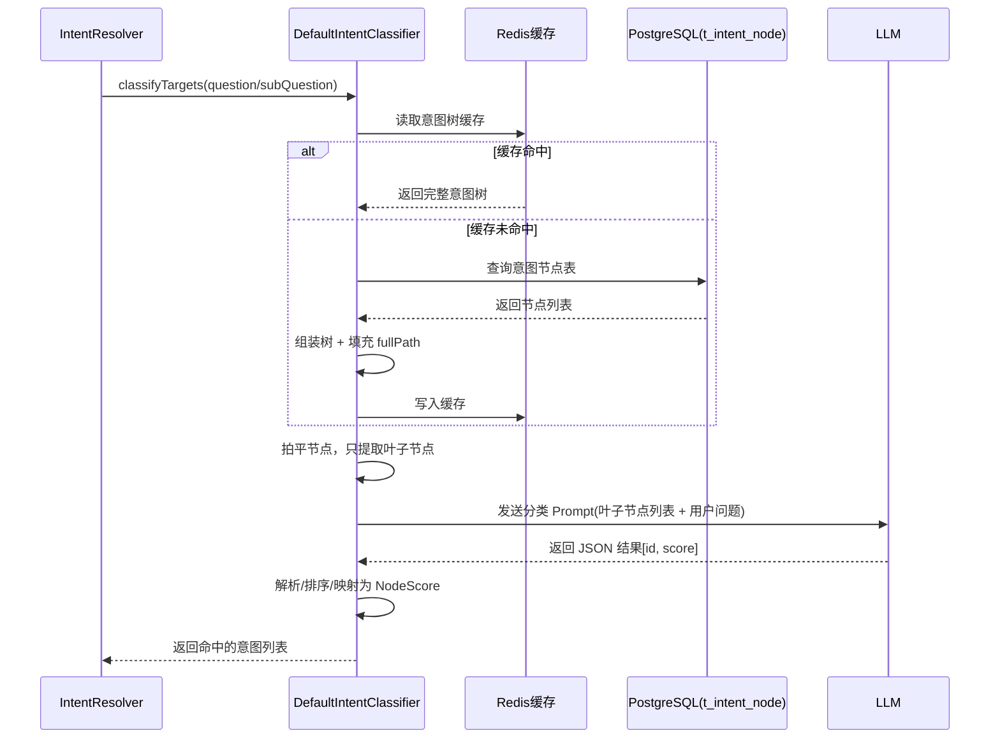
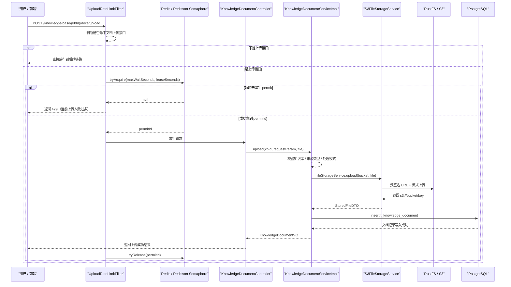

# Ragent 项目 RAG 全链路学习手册

> 目标：这份文档不是“简单介绍项目”，而是给你一条**从完全不熟悉，到能独立讲清、调试、扩展整个项目**的学习路线。  
> 阅读方式建议：**先按“学习路径”顺序看，再按“调用链”反复对照代码走一遍**。

---

## 1. 先用一句话理解这个项目

这个项目是一个基于 Spring Boot 的企业级 RAG 平台，核心能力包括：

1. 用户登录后，通过前端发起对话；
2. 后端对问题做记忆拼接、问题改写、意图识别；
3. 再决定走知识库检索、MCP 工具调用，或者纯系统回答；
4. 将检索结果和工具结果组装成 Prompt；
5. 通过统一的模型路由层调用大模型流式输出；
6. 同时把会话、摘要、反馈、Trace、知识库、向量、摄取流水线等全部持久化。

你可以把它理解成：

**“一个带知识库、带意图树、带工具调用、带模型路由、带会话记忆、带文档摄取流水线、带后台管理界面的完整 RAG 应用平台。”**

---

## 2. 项目模块总览

根工程是 Maven 聚合工程，入口在根目录 `pom.xml`，共 4 个后端模块，外加 1 个前端目录。

### 2.1 模块划分

| 模块 | 作用 | 你应该怎么理解 |
| --- | --- | --- |
| `bootstrap` | 主业务应用 | 绝大多数你关心的 Controller / Service / RAG / Knowledge / Ingestion 都在这里 |
| `framework` | 基础设施层 | 公共结果封装、上下文、MyBatis-Plus、MQ 包装、幂等、Trace、Web 通用能力 |
| `infra-ai` | AI 统一抽象层 | 大模型聊天、Embedding、Rerank、模型选择、故障切换、厂商适配都在这里 |
| `mcp-server` | 独立 MCP 服务 | 以 JSON-RPC 形式暴露工具接口，供主应用通过 MCP 调度 |
| `frontend` | React/Vite 前端 | 聊天页、管理后台、登录页、知识库管理、摄取流水线设计页 |

### 2.2 主程序入口

- 主后端启动类：`bootstrap/src/main/java/com/nageoffer/ai/ragent/RagentApplication.java`
- MCP 独立服务入口：`mcp-server/src/main/java/com/nageoffer/ai/ragent/mcp/MCPServerApplication.java`

### 2.3 `bootstrap` 下的核心业务包

| 包 | 作用 |
| --- | --- |
| `admin` | 控制台仪表盘 |
| `core` | 文档解析、分块、通用内容处理 |
| `ingestion` | 摄取流水线引擎、节点、任务、Pipeline 管理 |
| `knowledge` | 知识库、文档、Chunk、调度、文档入库 |
| `rag` | 对话主链路、记忆、改写、意图、检索、Prompt、Trace |
| `user` | 登录、用户、权限上下文 |

### 2.4 如果你只关心后端，建议这样看

你这次明确说了**不关注前端逻辑**，那可以把前端只当成一个“HTTP/SSE 请求发起器”，后面阅读时重点放在下面 4 层：

1. **控制入口层**：Controller + AOP + Interceptor  
2. **业务编排层**：Service / Core / Engine  
3. **基础设施层**：framework / infra-ai / MQ / Redis / S3 / 向量库  
4. **存储层**：Mapper + PostgreSQL + pgvector / Milvus

你后面真正要掌握的，是下面这条后端统一套路：

```text
Controller
  -> Service / Core Orchestrator
  -> DAO / Mapper / External Middleware
  -> Async(MQ / ThreadPool / Schedule)
  -> DB / Vector Store / Object Store
```

### 2.5 后端模块依赖关系

如果从“依赖方向”理解整个后端，建议你记成这张图：

```text
bootstrap（业务编排）
  ├── 依赖 framework（通用基础能力）
  ├── 依赖 infra-ai（模型与 AI 抽象）
  ├── 访问 PostgreSQL / Redis / RocketMQ / RustFS / Milvus
  └── 调用 mcp-server（工具服务）

framework（基础能力）
  ├── 提供 Web 结果封装、上下文、数据库配置
  ├── 提供 MQ 生产者抽象
  └── 提供 Trace / 幂等 / 公共异常

infra-ai（模型能力）
  ├── 读取 ai.* 配置
  ├── 挑选模型候选
  ├── 管理健康状态与故障切换
  └── 屏蔽不同模型供应商差异
```

### 2.6 后端每层分别放什么

| 层级 | 典型类 | 作用 |
| --- | --- | --- |
| Web 层 | `AuthController`、`RAGChatController`、`KnowledgeDocumentController` | 提供 REST/SSE 接口 |
| 切面/拦截层 | `SaTokenConfig`、`ChatRateLimitAspect`、`RagTraceAspect` | 登录、限流、Trace、上下文注入 |
| 编排层 | `RAGChatServiceImpl`、`KnowledgeDocumentServiceImpl`、`IngestionEngine` | 组织完整业务流程 |
| 领域能力层 | `IntentResolver`、`RetrievalEngine`、`RAGPromptService` | 处理 RAG 子问题 |
| 基础设施适配层 | `RoutingLLMService`、`S3FileStorageService`、`PgRetrieverService` | 对接模型、S3、向量检索 |
| 持久化层 | `*Mapper`、`Jdbc*Store`、`VectorStoreService` | 数据落库与读取 |

---

## 3. 先建立整体架构图

### 3.1 运行时架构

```text
React/Vite 前端
   │
   ├── /auth/login, /chat, /admin/*
   ▼
Spring Boot 主服务（9090, /api/ragent）
   │
   ├── user：登录/鉴权/用户
   ├── rag：聊天、记忆、改写、意图、检索、Prompt、Trace
   ├── knowledge：知识库、文档、Chunk、调度
   ├── ingestion：Pipeline 引擎、任务、节点
   └── admin：后台概览
   │
   ├── PostgreSQL：业务表 + pgvector 向量表
   ├── Redis / Redisson：缓存、限流、分布式锁、信号量
   ├── RocketMQ：异步文档分块、异步反馈等
   ├── RustFS(S3)：原始文档对象存储
   ├── Milvus（可选）：向量库替代 pgvector
   ├── MCP Server（9099）：工具调用
   └── 外部/本地模型：百炼、SiliconFlow、Ollama
```

### 3.2 最重要的三条主线

这个项目建议你始终围绕三条主线去理解：

1. **在线问答链路**：用户发消息 -> RAG 检索 -> 模型回答 -> SSE 回流 -> 会话落库  
2. **知识入库链路**：上传文档 -> 解析/分块/向量化 -> Chunk 入库 -> 检索可用  
3. **配置与治理链路**：意图树 / Query Mapping / Trace / 限流 / 调度 / 模型路由

---

## 4. 启动顺序与启动后系统是怎么“活起来”的

### 4.1 后端主服务启动后会发生什么

从 `RagentApplication` 开始，你要关注三件事：

1. `@SpringBootApplication`：加载所有业务 Bean；
2. `@EnableScheduling`：启用定时任务，知识库定时刷新会用到；
3. `@MapperScan`：扫描 MyBatis Mapper，数据库访问层生效。

### 4.2 启动阶段关键初始化

你要重点留意这些启动时就会装配/初始化的能力：

- `SaTokenConfig`：注册登录拦截、演示模式拦截、用户上下文拦截；
- `DataBaseConfiguration`：MyBatis-Plus 分页、自动填充字段；
- `RocketMQAutoConfiguration`：消息发送包装；
- `ThreadPoolExecutorConfig`：RAG 检索、意图分类、记忆摘要、SSE 流式任务等线程池；
- `QueryTermMappingService`：`@PostConstruct` 时会把启用的词映射规则加载到内存；
- `AIModelProperties` + `RoutingLLMService`：构造模型路由与降级体系；
- `RestFSS3Config`：创建访问 RustFS 的 `S3Client` / `S3Presigner`。

### 4.3 MCP 服务启动后会发生什么

独立 MCP 服务在 `mcp-server` 模块中启动，端口 `9099`，配置文件为：

- `mcp-server/src/main/resources/application.yml`

它暴露 `/mcp` 接口，通过 `MCPEndpoint -> MCPDispatcher -> MCPToolRegistry -> MCPToolExecutor` 完成 JSON-RPC 调度。

### 4.4 主服务启动后，后端关键 Bean 是怎么分层装配的

这一部分很重要，因为它决定你阅读源码时应该沿着什么依赖方向看。

#### 第一层：Web 与安全入口

- `SaTokenConfig`：注册登录校验拦截器；
- `UserContextInterceptor`：把当前登录用户写入 `UserContext`；
- `DemoModeInterceptor`：演示模式只读控制；
- 各业务 `Controller`：对外暴露 REST / SSE 接口。

#### 第二层：通用基础设施

- `DataBaseConfiguration`：MyBatis-Plus 分页插件 + `MetaObjectHandler` 自动填充；
- `RocketMQAutoConfiguration`：把 `RocketMQTemplate` 封装为统一 `MessageQueueProducer`；
- `RestFSS3Config`：创建 `S3Client` 与 `S3Presigner`；
- `ThreadPoolExecutorConfig`：注册所有异步线程池。

#### 第三层：业务编排器

- 聊天总控：`RAGChatServiceImpl`
- 文档总控：`KnowledgeDocumentServiceImpl`
- 摄取总控：`IngestionTaskServiceImpl`、`IngestionEngine`
- 后台配置总控：各 `*AdminService` / `*QueryService`

#### 第四层：领域能力组件

- 记忆：`DefaultConversationMemoryService`
- 改写：`MultiQuestionRewriteService`
- 意图：`IntentResolver`、`DefaultIntentClassifier`
- 检索：`RetrievalEngine`、`MultiChannelRetrievalEngine`
- Prompt：`RAGPromptService`
- 模型路由：`RoutingLLMService`

#### 第五层：持久化与中间件适配

- PostgreSQL：`Mapper`、`Jdbc*Store`
- 向量库：`VectorStoreService` / `RetrieverService`
- 对象存储：`S3FileStorageService`
- MQ：`KnowledgeDocumentChunkConsumer`、`MessageFeedbackConsumer`
- 调度：`KnowledgeDocumentScheduleJob`

---

## 5. 配置文件怎么读

主配置文件：

- `bootstrap/src/main/resources/application.yaml`

### 5.1 最关键配置项

| 配置 | 作用 | 对应代码含义 |
| --- | --- | --- |
| `server.port=9090` | 主服务端口 | 前端代理的目标地址 |
| `server.servlet.context-path=/api/ragent` | 统一上下文路径 | 所有接口都会挂在这个前缀下 |
| `spring.datasource.*` | PostgreSQL 连接 | MyBatis / JdbcTemplate / pgvector 都依赖它 |
| `spring.data.redis.*` | Redis 连接 | 缓存、锁、限流、会话辅助 |
| `rocketmq.name-server` | RocketMQ 地址 | 文档分块任务、反馈异步消息 |
| `milvus.uri` | Milvus 地址 | `rag.vector.type=milvus` 时使用 |
| `rag.vector.type=pg` | 向量后端类型 | 默认使用 PostgreSQL + pgvector |
| `rag.default.dimension=1536` | 默认向量维度 | Embedding 模型、向量表、向量空间要一致 |
| `rag.query-rewrite.*` | 问题改写开关与历史长度 | 改写链路是否启用 |
| `rag.rate-limit.global.*` | 聊天并发控制 | `ChatRateLimitAspect` / `ChatQueueLimiter` 使用 |
| `rag.memory.*` | 会话记忆参数 | 历史保留轮数、摘要压缩阈值等 |
| `rag.knowledge.schedule.*` | 文档定时刷新 | 定时拉取远程文件再分块 |
| `rag.mcp.servers` | MCP 服务列表 | RAG 检索中的工具调用来源 |
| `rag.search.channels.*` | 检索通道参数 | 全局向量检索、意图定向检索阈值 |
| `rag.trace.*` | Trace 开关 | 链路追踪 |
| `ai.providers.*` | 各模型供应商地址与 key | 百炼 / SiliconFlow / Ollama |
| `ai.chat.*` | 聊天模型候选 | 统一路由与 fallback |
| `ai.embedding.*` | 向量模型候选 | 文档入库、检索向量化 |
| `ai.rerank.*` | 重排模型候选 | 检索后排序 |
| `rustfs.*` | S3 兼容对象存储 | 文档原始文件上传与读取 |
| `sa-token.*` | 登录态配置 | 登录 token、并发策略 |

### 5.2 你一定要形成的配置认知

这个项目不是“代码写死的 RAG”，而是**高度配置驱动**：

- 检索后端可以在 `pg` 和 `milvus` 间切换；
- 模型供应商可以在百炼 / SiliconFlow / Ollama 间切换；
- 是否开启 Query Rewrite、Memory Summary、Trace、Rate Limit 都可配置；
- 知识入库既可以走普通 chunk 模式，也可以走 ingestion pipeline 模式。

### 5.3 每组配置最终绑定到哪些后端类

这一节是纯后端视角，非常值得你对照代码看。

| 配置前缀 | 绑定/使用类 | 后端作用 |
| --- | --- | --- |
| `rag.default.*` | `RAGDefaultProperties` | 默认向量空间名、维度、距离度量 |
| `rag.query-rewrite.*` | `RAGConfigProperties` | 问题改写开关、历史消息截取长度 |
| `rag.memory.*` | `MemoryProperties` | 记忆保留轮数、摘要阈值、标题长度 |
| `rag.rate-limit.global.*` | `RAGRateLimitProperties` | 聊天全局并发、排队等待、lease 时间 |
| `rag.knowledge.schedule.*` | `KnowledgeScheduleProperties` | 文档定时扫描、锁时长、批量扫描数 |
| `rag.trace.*` | `RagTraceProperties` | Trace 开关、错误长度截断 |
| `ai.*` | `AIModelProperties` | 模型供应商、聊天/embedding/rerank 候选列表 |
| `rustfs.*` | `RestFSS3Config` | S3 客户端、预签名上传 |
| `spring.datasource.*` | Spring DataSource + MyBatis | PostgreSQL 主库连接 |
| `spring.data.redis.*` | Redisson / Redis | 缓存、锁、限流、信号量 |
| `rocketmq.*` | RocketMQTemplate / MQ Producer | 异步任务消息发送 |

### 5.4 线程池配置与业务的对应关系

`ThreadPoolExecutorConfig` 不只是“随便建几个线程池”，而是按业务隔离职责：

| 线程池 Bean | 使用场景 |
| --- | --- |
| `mcpBatchThreadPoolExecutor` | MCP 工具批量并行调用 |
| `ragContextThreadPoolExecutor` | 子问题级上下文构建 |
| `ragRetrievalThreadPoolExecutor` | 多检索通道并行执行 |
| `ragInnerRetrievalThreadPoolExecutor` | 检索内部更细粒度并行 |
| `intentClassifyThreadPoolExecutor` | 多子问题意图分类 |
| `memorySummaryThreadPoolExecutor` | 异步会话摘要压缩 |
| `modelStreamExecutor` | 模型流式输出处理 |
| `chatEntryExecutor` | 聊天入口排队后的正式执行 |
| `knowledgeChunkExecutor` | 文档分块 / 定时刷新任务 |

并且这些线程池都被 `TtlExecutors` 包装过，作用是：

- 在线程切换时继续传递 ThreadLocal 上下文；
- 例如保留用户上下文、Trace 上下文；
- 避免异步线程里丢失链路信息。

---

## 6. 前端入口与登录流程

> 如果你现在只关心后端，这一节你可以只看 `6.2 ~ 6.5`，把前端页面层直接略过。

### 6.1 前端入口

先看路由：

- `frontend/src/router.tsx`

你会看到主要页面：

- `/login`
- `/chat`
- `/chat/:sessionId`
- `/admin/dashboard`
- `/admin/knowledge`
- `/admin/intent-tree`
- `/admin/ingestion`
- `/admin/traces`
- `/admin/settings`

### 6.2 登录流程

建议你从这里开始做第一次代码阅读：

1. `frontend/src/pages/LoginPage.tsx`
2. `frontend/src/services/authService.ts`
3. `bootstrap/src/main/java/com/nageoffer/ai/ragent/user/controller/AuthController.java`
4. `bootstrap/src/main/java/com/nageoffer/ai/ragent/user/service/impl/AuthServiceImpl.java`
5. `bootstrap/src/main/java/com/nageoffer/ai/ragent/user/config/SaTokenConfig.java`

### 6.3 登录调用链

```text
LoginPage
  -> authService.login("/auth/login")
  -> AuthController.login()
  -> AuthServiceImpl.login()
  -> UserMapper.selectOne(username)
  -> StpUtil.login(loginId)
  -> 返回 token / role / avatar
```

### 6.4 鉴权机制

`SaTokenConfig` 做了三层事情：

1. `SaInterceptor`：除 `/auth/**`、`/error` 外默认都要登录；
2. `DemoModeInterceptor`：演示环境下控制只读；
3. `UserContextInterceptor`：把当前用户写入 `UserContext`，后面所有业务都依赖它。

### 6.5 默认登录账号

初始化数据脚本：

- `resources/database/init_data_pg.sql`

其中默认插入了 `admin/admin/admin` 这样的管理员账号，所以前端登录页默认值能直接登录，是因为**数据库初始化脚本已经提前插入用户了**。

---

## 7. 从不熟悉到掌握整个项目的推荐学习路径

这里给你一条最实用的阅读顺序。不要一上来就看所有类，会很容易乱。

### 第 1 阶段：先建立“系统外形”

先看这些文件：

1. `pom.xml`
2. `bootstrap/src/main/resources/application.yaml`
3. `frontend/src/router.tsx`
4. `bootstrap/src/main/java/com/nageoffer/ai/ragent/RagentApplication.java`
5. `mcp-server/src/main/java/com/nageoffer/ai/ragent/mcp/MCPServerApplication.java`

这一阶段只回答 4 个问题：

- 系统有哪些模块？
- 后端主入口是什么？
- MCP 是不是独立服务？
- 前端主要页面和后端主要资源有哪些？

### 第 2 阶段：先打通“登录 + 会话列表 + 聊天页”

按这个顺序看：

1. `frontend/src/pages/LoginPage.tsx`
2. `frontend/src/services/authService.ts`
3. `bootstrap/.../AuthController.java`
4. `bootstrap/.../AuthServiceImpl.java`
5. `frontend/src/pages/ChatPage.tsx`
6. `frontend/src/stores/chatStore.ts`
7. `bootstrap/.../ConversationController.java`
8. `bootstrap/.../ConversationServiceImpl.java`

这一阶段的目标是理解：

- 用户如何登录；
- 前端如何拿会话列表；
- 新建对话与旧对话切换是怎么做的；
- 会话标题为什么会自动生成。

如果只站在后端视角，这一阶段你只需要盯住：

1. `AuthController -> AuthServiceImpl -> UserMapper`
2. `SaTokenConfig -> UserContextInterceptor`
3. `ConversationController -> ConversationServiceImpl`
4. `ConversationMessageService`

### 第 3 阶段：只盯住“聊天主链路”

这是整个项目最核心的部分。一定按这个顺序看：

1. `frontend/src/stores/chatStore.ts`
2. `bootstrap/src/main/java/com/nageoffer/ai/ragent/rag/controller/RAGChatController.java`
3. `bootstrap/src/main/java/com/nageoffer/ai/ragent/rag/aop/ChatRateLimitAspect.java`
4. `bootstrap/src/main/java/com/nageoffer/ai/ragent/rag/aop/ChatQueueLimiter.java`
5. `bootstrap/src/main/java/com/nageoffer/ai/ragent/rag/service/impl/RAGChatServiceImpl.java`
6. `bootstrap/src/main/java/com/nageoffer/ai/ragent/rag/service/handler/StreamCallbackFactory.java`
7. `bootstrap/src/main/java/com/nageoffer/ai/ragent/rag/service/handler/StreamChatEventHandler.java`

你的目标不是记细节，而是先画出一条总链路：

**请求入口 -> 限流排队 -> 记忆加载 -> 改写 -> 意图 -> 检索/MCP -> Prompt -> LLM -> SSE -> 落库**

### 第 4 阶段：拆开理解“改写 / 意图 / 检索”

顺序建议：

1. `MultiQuestionRewriteService`
2. `QueryTermMappingService`
3. `IntentResolver`
4. `DefaultIntentClassifier`
5. `RetrievalEngine`
6. `MultiChannelRetrievalEngine`
7. `IntentDirectedSearchChannel`
8. `VectorGlobalSearchChannel`
9. `DeduplicationPostProcessor`
10. `RerankPostProcessor`

### 第 5 阶段：理解“Prompt 和模型路由”

顺序建议：

1. `RAGPromptService`
2. `PromptTemplateLoader`
3. `RoutingLLMService`
4. `ModelSelector`
5. 各 provider 的 `ChatClient`
6. Embedding / Rerank 相关 Service

### 第 6 阶段：理解“知识库入库链路”

按这个顺序：

1. `KnowledgeBaseController` / `KnowledgeBaseServiceImpl`
2. `KnowledgeDocumentController`
3. `KnowledgeDocumentServiceImpl`
4. `KnowledgeDocumentChunkConsumer`
5. `DocumentParserSelector`
6. `ChunkingStrategyFactory`
7. `ChunkEmbeddingService`
8. `VectorStoreService` / `PgVectorStoreService`
9. `KnowledgeChunkServiceImpl`

### 第 7 阶段：理解“Pipeline 摄取引擎”

顺序建议：

1. `IngestionPipelineController`
2. `IngestionTaskController`
3. `IngestionPipelineServiceImpl`
4. `IngestionTaskServiceImpl`
5. `IngestionEngine`
6. `FetcherNode`
7. `ParserNode`
8. `ChunkerNode`
9. `EnhancerNode`
10. `EnricherNode`
11. `IndexerNode`

### 第 8 阶段：理解“治理能力”

最后看这些：

1. `IntentTreeController` / `IntentTreeService`
2. `QueryTermMappingController` / `QueryTermMappingAdminService`
3. `RagTraceController` / Trace 相关 service/aspect
4. `RAGSettingsController`
5. `KnowledgeDocumentScheduleJob`
6. `MessageFeedbackServiceImpl` + `MessageFeedbackConsumer`

---

## 8. 在线问答主链路：完整调用链逐层拆解

这是你最应该反复看的部分。

### 8.1 前端发起聊天

前端关键入口：

- `frontend/src/pages/ChatPage.tsx`
- `frontend/src/stores/chatStore.ts`

`ChatPage` 本身主要负责页面层，它把真正的聊天状态与 SSE 处理交给 `chatStore`。

#### 发送消息时的前端链路

```text
ChatInput
  -> useChatStore.sendMessage(content)
  -> 构造 query(question, conversationId, deepThinking)
  -> 请求 /rag/v3/chat
  -> 监听 SSE 事件：
       meta / message / thinking / finish / cancel / done / title / error
```

#### 前端在聊天时做了什么

`chatStore` 会先本地插入两条消息：

1. 一条用户消息；
2. 一条空的 assistant 消息占位。

然后它用 SSE 持续把服务端返回的 delta 写回这条 assistant 消息。

它同时还处理：

- 会话 ID 回填；
- taskId 保存；
- 取消生成；
- 自动更新会话标题；
- 点赞/点踩；
- 深度思考 UI 状态。

### 8.2 后端聊天入口

后端入口类：

- `bootstrap/src/main/java/com/nageoffer/ai/ragent/rag/controller/RAGChatController.java`

关键接口：

- `GET /rag/v3/chat`
- `POST /rag/v3/stop`

#### `/rag/v3/chat` 调用链

```text
RAGChatController.chat()
  -> RAGChatService.streamChat()
  -> RAGChatServiceImpl.streamChat()
```

但这条链真正执行前，还有两层横切逻辑：

1. `@IdempotentSubmit`：防止重复提交；
2. `@ChatRateLimit`：聊天限流和排队。

### 8.3 限流与排队

关键类：

- `ChatRateLimitAspect`
- `ChatQueueLimiter`

#### 这部分在做什么

它不是简单地“拒绝并发”，而是做了一个**全局聊天并发控制 + 等待队列**：

- 使用 Redisson semaphore 控制同时执行的聊天数量；
- 使用 Redis 有序集合记录排队顺序；
- 配合 Lua 脚本实现原子化排队 / 出队逻辑；
- 如果等待超时则直接返回失败；
- 如果开启 Trace，会在聊天一进来时就创建链路 run。

### 8.4 `RAGChatServiceImpl`：整个聊天编排总控

核心类：

- `bootstrap/src/main/java/com/nageoffer/ai/ragent/rag/service/impl/RAGChatServiceImpl.java`

你要把它当成“总导演类”。

#### 它的主流程

`streamChat(question, conversationId, deepThinking, emitter)` 大致分成这些阶段：

1. 生成/确定 `conversationId`；
2. 生成/确定 `taskId`；
3. 创建流式回调处理器 `StreamCallback`；
4. 从会话记忆中加载历史并追加当前用户问题；
5. 做 Query Rewrite + 子问题拆分；
6. 做意图识别；
7. 判断是否存在歧义，需要先追问用户；
8. 判断是否全部属于 system-only 意图；
9. 否则进入 KB/MCP 检索；
10. 组装 Prompt；
11. 调用 `LLMService` 流式输出；
12. 把可取消句柄绑定到 `StreamTaskManager`。

#### 从依赖注入角度理解 `RAGChatServiceImpl`

这一步特别建议你打开类定义，把构造注入的每个字段都当成一个子系统：

| 依赖 | 在聊天中的职责 |
| --- | --- |
| `LLMService` | 最终模型聊天/流式聊天 |
| `RAGPromptService` | 根据检索结果构建最终 messages |
| `PromptTemplateLoader` | 加载系统 prompt / 场景 prompt |
| `ConversationMemoryService` | 读取和写入会话记忆 |
| `StreamTaskManager` | 绑定/取消流式任务 |
| `IntentGuidanceService` | 判断是否需要澄清追问 |
| `StreamCallbackFactory` | 创建 SSE 事件处理器 |
| `QueryRewriteService` | 改写与拆分问题 |
| `IntentResolver` | 识别意图并合并意图组 |
| `RetrievalEngine` | 执行 KB / MCP 检索 |

只要你能把这 10 个依赖讲清楚，`RAGChatServiceImpl` 就基本掌握了。

#### 聊天主链路的后端时序图

```text
RAGChatController
  -> ChatRateLimitAspect
  -> RAGChatServiceImpl
     -> ConversationMemoryService
     -> QueryRewriteService
     -> IntentResolver
     -> IntentGuidanceService
     -> RetrievalEngine
        -> MultiChannelRetrievalEngine
        -> MCPToolRegistry / MCPToolExecutor
     -> RAGPromptService
     -> LLMService(RoutingLLMService)
     -> StreamChatEventHandler
        -> ConversationMemoryService.append
        -> ConversationService.createOrUpdate
```

### 8.5 会话记忆链路

核心类：

- `DefaultConversationMemoryService`
- `JdbcConversationMemoryStore`
- `JdbcConversationMemorySummaryService`
- `ConversationServiceImpl`
- `ConversationGroupServiceImpl`

#### 记忆读取时发生了什么

`memoryService.loadAndAppend(...)` 会做两件事：

1. 加载历史消息；
2. 把本次用户问题先追加到会话上下文里。

其中“历史消息”不是无脑全量加载，而是会综合：

- 最近若干轮消息；
- 会话摘要；
- 当前用户与会话归属。

#### 这部分会落到哪些后端存储

这条链路最终会落到三类表：

| 表 | 用途 |
| --- | --- |
| `t_conversation` | 会话主记录、标题、最后活跃时间 |
| `t_message` | 每一轮 user / assistant 消息 |
| `t_conversation_summary` | 长对话压缩后的摘要 |

也就是说，记忆系统不是一张表，而是**会话主表 + 消息表 + 摘要表**的组合。

#### 会话标题是怎么生成的

`ConversationServiceImpl.createOrUpdate(...)` 在发现会话不存在时，会调用 `generateTitleFromQuestion(question)`：

```text
ConversationServiceImpl.createOrUpdate()
  -> generateTitleFromQuestion()
  -> PromptTemplateLoader.render(CONVERSATION_TITLE_PROMPT_PATH)
  -> LLMService.chat()
  -> 将生成结果写入 t_conversation.title
```

所以标题不是前端生成，也不是数据库默认值，而是后端第一次建会话时通过模型生成。

#### 为什么需要摘要

如果历史消息过长，直接把所有轮次塞给模型会导致：

- token 太高；
- 上下文过长；
- 历史噪音太多。

所以 `JdbcConversationMemorySummaryService` 会在满足阈值时异步压缩摘要，并把摘要写回数据库。

#### 摘要链路

```text
assistant 消息完成
  -> memoryService.append(...)
  -> 触发摘要判断
  -> Redisson 分布式锁防止重复压缩
  -> 调用 LLMService 生成摘要
  -> 落表 t_conversation_summary
```

### 8.6 Query Rewrite：问题改写与多问拆分

核心类：

- `MultiQuestionRewriteService`
- `QueryTermMappingService`
- `QueryTermMappingController`

#### 具体流程

```text
原问题
  -> QueryTermMappingService.normalize()
  -> 如果关闭 rewrite：走规则拆分
  -> 如果开启 rewrite：
       PromptTemplateLoader 加载改写提示词
       调用 LLMService
       解析 JSON 结果
       得到 rewrite + sub_questions
```

`QueryTermMappingService` 本质上是“词汇归一化层”：

- 启动时从 `t_query_term_mapping` 加载启用规则；
- 会按“优先级高在前、源词更长在前”排序缓存；
- 先把别名、缩写、业务术语做标准化；
- 再交给 LLM 改写。

这里有一个很容易忽略、但非常关键的后端细节：  
它在 `@PostConstruct` 阶段就把规则加载进内存缓存，而不是每次查询都查库。这样做的目的是：

- 降低聊天主链路数据库压力；
- 保证归一化步骤足够快；
- 避免短词先替换打断长词匹配。

### 8.7 意图识别链路

核心类：

- `IntentResolver`
- `DefaultIntentClassifier`
- `IntentTreeCacheManager`
- `IntentTreeFactory`
- `IntentTreeController`

#### 完整链路


```text
RewriteResult.subQuestions
  -> IntentResolver.resolve()
  -> 对每个子问题并行调用 DefaultIntentClassifier
  -> 读取意图树（优先 Redis，回源 DB）
  -> 构造分类 Prompt
  -> 调用 LLMService
  -> 解析 JSON 数组(id, score)
  -> 得到每个子问题对应的 NodeScore 列表
```

`IntentResolver` 除了分类，还会：

- 限制总意图数量；
- 合并 MCP 与 KB 意图；
- 判断是否 `allSystemOnly`；
- 为后续 Prompt 和检索准备 `IntentGroup`。

#### `DefaultIntentClassifier` 的后端实现要点

它不是把树一层层递归问模型，而是：

1. 先从 Redis 读意图树缓存；
2. 缓存没有时回源数据库 `t_intent_node`；
3. 把整棵树拍平成叶子节点列表；
4. 为每个叶子节点构造：
   - `id`
   - `fullPath`
   - `description`
   - `examples`
   - `type(KB / MCP / SYSTEM)`
5. 把这些叶子节点一次性喂给模型做打分；
6. 解析 JSON 返回的 `id + score`；
7. 再映射回内部 `IntentNode`。

这意味着意图识别的核心并不是硬编码 if-else，而是：

- **数据库配置意图树**
- **缓存意图树**
- **用 LLM 做语义分类**
- **再把分类结果映射回后端节点对象**

#### 意图分类工作原理（对应你给的流程图）

你这张图和当前后端实现是基本一致的，可以把它理解成下面 4 个阶段：

##### 第一阶段：`IntentResolver` 发起分类请求

`IntentResolver.resolve(rewriteResult)` 不直接自己分类，而是：

1. 先拿 `RewriteResult.subQuestions`；
2. 如果没有子问题，就退化为只分类 `rewrittenQuestion`；
3. 对每个子问题并行提交分类任务到 `intentClassifyThreadPoolExecutor`；
4. 每个任务内部实际调用 `DefaultIntentClassifier.classifyTargets(question)`。

也就是说，**并行发生在“子问题级别”**，不是一个问题只走一次分类器。

##### 第二阶段：`DefaultIntentClassifier` 加载意图树

这个阶段对应你图里的“加载意图树”。

后端实际逻辑是：

```text
DefaultIntentClassifier.loadIntentTreeData()
  -> IntentTreeCacheManager.getIntentTreeFromCache()
  -> 如果 Redis 命中：直接返回整棵树
  -> 如果 Redis 未命中：
       -> 查询 t_intent_node
       -> 组装 parent/children 树结构
       -> 填充 fullPath
       -> 写回 Redis 缓存
```

这里有两个关键点：

1. **缓存的是整棵意图树，不是单个节点**；
2. **数据库里存的是扁平节点表，运行时再组装成树**。

##### 第三阶段：只取叶子节点参与 LLM 分类

这一步非常关键，也是很多人第一次看代码时最容易忽略的点。

分类器不会把整棵树的所有节点都丢给模型，而是会：

1. 把意图树拍平；
2. 过滤出 `leafNodes`；
3. 只让模型在这些叶子节点里打分。

这样做的好处是：

- 降低 Prompt 长度；
- 避免“父节点”和“子节点”同时命中造成语义重叠；
- 让分类结果直接落在最终可执行的意图节点上。

##### 第四阶段：构造分类 Prompt，调用 LLM，解析 JSON

分类 Prompt 不是只传“节点名字”，而是会把每个叶子节点的关键信息都拼进去，包括：

- `id`
- `fullPath`
- `description`
- `examples`
- `type`（KB / MCP / SYSTEM）
- `toolId`（如果是 MCP 节点）

然后：

```text
question
  + intent leaf node list
  -> LLMService.chat()
  -> 返回 JSON 数组
  -> 解析为 NodeScore 列表
  -> 按 score 从高到低排序
```

返回结果的典型格式类似：

```json
[
  { "id": "oa_intro", "score": 0.91 },
  { "id": "oa_process", "score": 0.62 }
]
```

#### 对应流程图的后端时序版

下面这段 Mermaid 可以直接放在 Markdown 里，对应你那张图：



#### 分数阈值和数量限制在后端哪里控制

这里还要补上两个“收口规则”：

##### 1）最低分阈值

`IntentResolver.classifyIntents(question)` 会在分类结果出来后再做一次过滤：

- 使用常量 `RAGConstant.INTENT_MIN_SCORE`
- 当前值是 `0.35`

也就是：

**LLM 可以返回很多节点，但最终只有分数 >= 0.35 的节点才会进入后续链路。**

##### 2）最大意图数量

还会再受 `RAGConstant.MAX_INTENT_COUNT` 限制，当前值是 `3`。

这一步的后端目的很明确：

- 防止一个问题挂太多意图；
- 防止后面拉太多知识集合，导致检索成本爆炸；
- 保证 Prompt 上下文可控。

#### 多子问题场景下，意图分类是怎么合并的

如果一个用户问题被改写阶段拆成多个子问题，那么后端不会把所有分类结果无脑拼接，而是会：

1. 每个子问题先独立分类；
2. 每个子问题至少保留一个最高分意图；
3. 如果总意图数超限，再按全局分数高低补充剩余名额；
4. 最后再重建为 `List<SubQuestionIntent>`。

这意味着它的策略不是简单 topN，而是：

**先保证每个子问题都有代表意图，再做全局压缩。**

#### 意图分类结果为什么这么重要

因为后端后面至少有 4 个关键决策都依赖它：

1. 是否需要先做歧义澄清；
2. 是否属于 `SYSTEM`，从而走 system-only 回答；
3. 是否命中 `MCP`，从而触发工具调用；
4. 是否命中 `KB`，从而决定检索哪些 collection 和 topK。

所以意图分类在这个项目里不是“附加功能”，而是整个 RAG 编排里的**核心路由器**。

#### 意图节点和意图树到底是什么

这一块你可以先把它当成“RAG 的语义路由配置中心”。

##### 1）意图节点是什么

后端运行时对象：

- `bootstrap/src/main/java/com/nageoffer/ai/ragent/rag/core/intent/IntentNode.java`

数据库实体：

- `bootstrap/src/main/java/com/nageoffer/ai/ragent/rag/dao/entity/IntentNodeDO.java`

一个意图节点，本质上不是单纯的“标签”，而是一个同时包含：

- 语义描述；
- 分类样例；
- 树层级关系；
- 知识库路由信息；
- MCP 工具信息；
- Prompt 信息；
- 启停状态；

的后端配置单元。

##### 2）意图节点有哪些关键字段

| 字段 | 含义 | 后端作用 |
| --- | --- | --- |
| `intentCode` / `id` | 唯一业务标识 | LLM 分类命中的就是它 |
| `name` | 节点名称 | 后台树展示、人工识别 |
| `description` | 语义描述 | 提供给 LLM 做分类依据 |
| `examples` | 示例问题 | 提高分类准确率 |
| `level` | 层级 | 组成树结构 |
| `parentCode` / `parentId` | 父节点标识 | 组树 |
| `kind` | 节点类型 | 决定后续走 KB / SYSTEM / MCP |
| `kbId` | 知识库 ID | KB 节点关联知识库 |
| `collectionName` | collection 名称 | 检索时定向搜索 |
| `topK` | 节点级 TopK | 覆盖全局检索数量 |
| `mcpToolId` | MCP 工具 ID | MCP 节点时决定调用哪个工具 |
| `promptSnippet` | 短提示片段 | Prompt 增强 |
| `promptTemplate` | 完整 Prompt 模板 | system-only 或特定场景回答 |
| `paramPromptTemplate` | MCP 参数抽取模板 | 工具参数提取时使用 |
| `enabled` | 是否启用 | 决定节点是否参与分类与路由 |
| `sortOrder` | 排序 | 后台树展示顺序 |

##### 3）意图树是什么

意图树不是单独一张“树表”，而是：

> `t_intent_node` 这张扁平表，在运行时按 `parentCode -> intentCode` 关系组装出来的一棵树。

也就是：

- 数据库存储：扁平节点；
- 运行时使用：树结构；
- Redis 缓存：整棵树；
- 后台展示：树形 VO。

##### 4）树的层级是怎样的

当前后端层级枚举在：

- `bootstrap/src/main/java/com/nageoffer/ai/ragent/rag/enums/IntentLevel.java`

共 3 层：

- `DOMAIN(0)`：领域层
- `CATEGORY(1)`：分类层
- `TOPIC(2)`：主题层

你可以把它理解成：

```text
DOMAIN
  └── CATEGORY
        └── TOPIC
```

比如：

```text
业务系统
  └── OA系统
        ├── 系统介绍
        └── 审批流程

中间件
  └── Redis
        ├── 基本概念
        └── 常见问题
```

##### 5）为什么叶子节点最重要

`IntentNode.isLeaf()` 的逻辑就是“没有 children 的节点”。

在这个项目里，叶子节点最重要，因为：

1. **只有叶子节点参与 LLM 分类打分**
2. **只有叶子节点真正挂具体执行目标**

也就是说：

- 父节点更像目录；
- 叶子节点才是最终可执行路由单元。

##### 6）意图节点按类型分几种

节点类型枚举在：

- `bootstrap/src/main/java/com/nageoffer/ai/ragent/rag/enums/IntentKind.java`

共有 3 种：

###### `KB`

- 知识库型节点；
- 命中后会走 RAG 检索；
- 主要影响 `collectionName`、`topK`、Prompt。

###### `SYSTEM`

- 系统交互型节点；
- 比如欢迎语、自我介绍、纯系统回答；
- 命中后可能完全不走知识库。

###### `MCP`

- 工具型节点；
- 命中后会根据 `mcpToolId` 调用 MCP 工具；
- `paramPromptTemplate` 会参与参数抽取。

##### 7）意图树在后端里有哪几种形态

| 形态 | 对应类 | 用途 |
| --- | --- | --- |
| 持久化形态 | `IntentNodeDO` | 存 `t_intent_node` |
| 运行时形态 | `IntentNode` | 分类、检索、Prompt 路由 |
| 展示形态 | `IntentNodeTreeVO` | 后台树展示 |

##### 8）后端是怎么把数据库节点组装成树的

关键类：

- `IntentTreeServiceImpl`
- `DefaultIntentClassifier`

它们都做了类似的事：

```text
查询 t_intent_node
  -> 按 parentCode 分组
  -> 找 root 节点
  -> 递归 build children
  -> 形成完整意图树
```

`IntentTreeServiceImpl.getFullTree()` 更偏展示用途；  
`DefaultIntentClassifier.loadIntentTreeFromDB()` 更偏分类运行时用途。

##### 9）为什么意图树不是硬编码在 Java 里

因为它本质上属于“业务语义配置”，而不是固定程序逻辑。

放在数据库里有几个好处：

- 可以在后台动态增删改；
- 不用每改一个业务问题域就发版；
- 可以按知识库、Prompt、工具灵活绑定；
- 更适合后续持续扩展。

##### 10）一句话记住它们的关系

你可以直接这样记：

> **意图节点 = 一个可执行语义路由单元；意图树 = 这些路由单元按业务层级组织起来的结构化语义目录。**

### 8.8 歧义引导链路

核心类：

- `IntentGuidanceService`
- `GuidanceDecision`

如果系统判断当前问题过于模糊或缺少关键限定条件，它不会直接检索，而是先返回一个澄清问题给用户。

### 8.9 检索引擎：KB 与 MCP 的汇合点

核心类：

- `RetrievalEngine`
- `MultiChannelRetrievalEngine`
- `IntentDirectedSearchChannel`
- `VectorGlobalSearchChannel`
- `DeduplicationPostProcessor`
- `RerankPostProcessor`

#### 处理一个子问题时的逻辑

```text
SubQuestionIntent
  -> filterKbIntents()
  -> filterMcpIntents()
  -> retrieveAndRerank()
  -> executeMcpAndMerge()
  -> 生成该子问题的 kbContext / mcpContext
```

#### 为什么要有多通道检索

`MultiChannelRetrievalEngine` 支持不同策略并行：

- `IntentDirectedSearchChannel`：根据意图节点定向查指定知识集合；
- `VectorGlobalSearchChannel`：当意图不明确或置信度偏低时做全局兜底搜索。

然后再经过：

1. `DeduplicationPostProcessor`：去重；
2. `RerankPostProcessor`：重排。

#### `MultiChannelRetrievalEngine` 的后端职责拆解

它在代码层面明确分成两个阶段：

##### 第一阶段：并行执行所有启用的 SearchChannel

- 先构造 `SearchContext`；
- 过滤 `isEnabled(context)` 为真的通道；
- 按优先级排序；
- 用 `ragRetrievalThreadPoolExecutor` 并行调用 `channel.search(context)`；
- 每个通道返回 `SearchChannelResult`；
- 即使某个通道失败，也不会中断整个链路。

##### 第二阶段：串行执行后处理器链

- 初始输入是所有通道 chunk 的合并结果；
- 后处理器按 `getOrder()` 顺序执行；
- 典型动作是去重、截断、重排；
- 某个后处理器异常时只跳过该处理器，不让整条链路失败。

这说明后端在检索链路上的设计目标是：

- **并行提高召回**
- **串行保证加工顺序**
- **局部失败不拖垮整体**

### 8.10 KB 检索底层：到底查的是谁

底层抽象：

- `VectorStoreService`
- `VectorStoreAdmin`
- `PgVectorStoreService`
- `PgVectorStoreAdmin`
- `MilvusVectorStoreService`
- `MilvusVectorStoreAdmin`
- `PgRetrieverService`
- `MilvusRetrieverService`

当前配置默认：

```yaml
rag:
  vector:
    type: pg
```

所以默认走 PostgreSQL + pgvector：

- Chunk 文本落在业务表 `t_knowledge_chunk`
- 向量落在 `t_knowledge_vector`
- 检索时由 `PgRetrieverService` 通过 SQL + pgvector 相似度查询返回结果

### 8.11 MCP 工具调用链路

主应用侧关键类：

- `MCPToolRegistry`
- `MCPParameterExtractor`
- `MCPToolExecutor`
- `RetrievalEngine`

独立服务侧关键类：

- `MCPEndpoint`
- `MCPDispatcher`

#### 调用链

```text
意图树节点配置 mcp_tool_id
  -> RetrievalEngine.buildMcpRequest()
  -> MCPParameterExtractor 根据问题抽取参数
  -> 找到对应 MCPToolExecutor
  -> 调用 MCP 服务 / 本地执行器
  -> 返回 MCPResponse
  -> ContextFormatter.formatMcpContext()
  -> 进入最终 Prompt
```

### 8.12 Prompt 组装

核心类：

- `RAGPromptService`
- `PromptTemplateLoader`
- `PromptContext`

检索完成后，系统会根据场景选择不同 Prompt 模板：

- 仅知识库场景；
- 仅 MCP 场景；
- MCP + KB 混合场景。

`PromptContext` 里会放入：

- 改写后的问题；
- 多个子问题；
- 知识库上下文；
- MCP 工具结果上下文；
- 命中的 KB 意图；
- 命中的 MCP 意图；
- 按意图分组的 chunks。

#### `RAGPromptService` 真正在后端做的不是“拼字符串”，而是“规划消息结构”

它会先根据上下文判断场景：

- `KB_ONLY`
- `MCP_ONLY`
- `MIXED`

然后决定：

1. 用哪个基础 Prompt 模板；
2. MCP 结果是放成 `system` 证据，还是 KB 内容放成 `user` 证据；
3. 历史消息是否带入；
4. 多子问题场景下是否把用户问题重新编号组织。

所以你可以把它理解成：

**Prompt 规划器 + Message List 生成器**，而不是简单模板渲染器。

### 8.13 模型路由层

核心类：

- `RoutingLLMService`
- `ModelSelector`
- `ModelRoutingExecutor`
- `ModelHealthStore`
- `AIModelProperties`

厂商适配类包括：

- `BaiLianChatClient`
- `SiliconFlowChatClient`
- `OllamaChatClient`

这层把“用哪个模型”从业务层里解耦出来，支持：

- 候选模型；
- 优先级；
- 健康状态；
- 熔断与恢复；
- thinking 能力选择。

#### `AIModelProperties` + `ModelSelector` + `RoutingLLMService` 的后端协作方式

你可以把这三层理解成：

##### 第 1 层：配置层

`AIModelProperties` 负责把配置文件里的：

- providers
- chat candidates
- embedding candidates
- rerank candidates
- selection
- stream

全部绑定成内存配置对象。

##### 第 2 层：候选选择层

`ModelSelector` 负责：

- 过滤未启用模型；
- deep thinking 场景过滤 `supportsThinking=true`；
- 按“首选模型 + priority”排序；
- 剔除健康状态不可用的模型；
- 产出 `ModelTarget` 列表。

##### 第 3 层：执行与 fallback 层

`RoutingLLMService` 负责：

- 按候选列表逐个尝试；
- 普通 chat 走 `executeWithFallback`；
- stream chat 会做“首包探测”；
- 如果首包超时 / 无内容 / 启动失败，则自动切换下一个模型；
- 成功时标记 `healthStore.markSuccess`；
- 失败时标记 `healthStore.markFailure`。

所以这套后端模型层的关键词是：

**配置驱动 + 候选排序 + 健康检查 + 自动切换**

### 8.14 SSE 回传与消息落库

核心类：

- `StreamCallbackFactory`
- `StreamChatEventHandler`
- `StreamTaskManager`

`StreamChatEventHandler` 负责：

- 把元信息通过 SSE 发回前端；
- 把 message delta 一段段推给前端；
- 把 thinking delta 单独推给前端；
- 在完成时把完整 assistant 消息持久化；
- 必要时生成会话标题；
- 把 `messageId`、`taskId`、`conversationId` 回传给前端。

#### 站在后端看，SSE 回调处理器还承担了“收口职责”

所谓“收口”，就是所有流式回答在最后都要收敛到它这里统一完成：

1. 把碎片化 delta 组装成完整答案；
2. 把思考内容和正式回答区分开；
3. 在完成时统一落库；
4. 统一触发会话标题更新；
5. 统一触发记忆写入和后续摘要压缩判断。

这使得前面不管模型供应商怎么变化，最终落库口都只有一个，后端一致性更容易保证。

#### 取消生成

```text
前端 stopTask(taskId)
  -> POST /rag/v3/stop
  -> RAGChatController.stop()
  -> RAGChatServiceImpl.stopTask()
  -> StreamTaskManager.cancel(taskId)
  -> 取消流式句柄
```

---

## 9. 知识库链路：从创建知识库到可被检索

这一块建议和聊天链路并行学，因为它决定“RAG 的 R 从哪里来”。

### 9.1 知识库创建链路

入口：

- `KnowledgeBaseController`
- `KnowledgeBaseServiceImpl`

#### 调用链

```text
POST /knowledge-base
  -> KnowledgeBaseController.createKnowledgeBase()
  -> KnowledgeBaseServiceImpl.create()
  -> KnowledgeBaseMapper.insert()
  -> S3Client.createBucket(bucket)
  -> VectorStoreAdmin.ensureVectorSpace()
```

它不仅插入一条业务记录，还会：

1. 创建 RustFS bucket；
2. 初始化向量空间。

### 9.2 文档上传链路

入口：

- `KnowledgeDocumentController`
- `KnowledgeDocumentServiceImpl.upload(...)`

#### 调用链

```text
POST /knowledge-base/{kbId}/docs/upload
  -> KnowledgeDocumentController.upload()
  -> KnowledgeDocumentServiceImpl.upload()
  -> 校验知识库/来源类型
  -> FileStorageService 存原始文件
  -> 插入 t_knowledge_document
```

上传阶段主要完成：

- 文件存储；
- 文档元数据落库；
- 记录处理模式（chunk / pipeline）；
- 记录来源（file / url）；
- 记录 chunk 配置或 pipelineId。

#### `S3FileStorageService` 的后端实现细节

这部分值得单独看一下，因为它不是最朴素的 SDK 直接上传：

- 提供 `S3Client` 用于读、删、兜底上传；
- 提供 `S3Presigner` 生成预签名 URL；
- 主上传路径会优先使用**预签名 URL + `HttpURLConnection` 流式上传**；
- 这样做的目的，是尽量避免大文件上传时把整个 payload 缓冲在 JVM 堆内存里；
- 文件类型检测会借助 Tika 做 MIME 识别；
- 存储后的地址统一转成 `s3://bucket/key` 形式回写数据库。

也就是说，原始文档对象存储这一层，后端是做过内存占用优化的。

#### 9.2.1 文件上传分布式限流是怎么做的

这一段非常值得单独看，因为它不是“Controller 里写个 if 判断”的单机限流，而是一个**基于 Redis / Redisson 信号量的分布式并发控制**。

核心类：

- `UploadRateLimitFilter`
- `RagSemaphoreProperties`
- `SemaphoreInitializer`
- `KnowledgeDocumentController`
- `KnowledgeDocumentServiceImpl`
- `S3FileStorageService`

核心配置：

```yaml
spring:
  servlet:
    multipart:
      max-file-size: 50MB
      max-request-size: 100MB

rag:
  semaphore:
    document-upload:
      name: rag:document:upload
      max-concurrent: 10
      max-wait-seconds: 5
      lease-seconds: 300
```

你可以把它理解成：

1. **Spring multipart 配置**负责“文件大小上限”；
2. **Redis 信号量**负责“同时允许多少个上传请求正在处理”；
3. 二者解决的是两类完全不同的问题。

也就是说：

- `max-file-size` / `max-request-size`：防止单个请求过大；
- `max-concurrent`：防止同一时间太多上传一起打进来；
- `max-wait-seconds`：防止请求无限排队；
- `lease-seconds`：防止服务异常后 permit 永远不释放。

#### 9.2.2 为什么它是“分布式”限流

因为 permit 不是存在某一台应用实例内存里，而是存在 Redis 中。

只要多个后端实例都连接的是同一个 Redis，并且都使用同一个信号量名：

- `rag:document:upload`

那么：

- A 机器抢到 3 个 permit；
- B 机器抢到 4 个 permit；
- C 机器抢到 3 个 permit；

此时整个集群的上传并发就已经达到上限 10，后续任何一台机器再收到上传请求，都要继续等待或直接返回 `429`。

这就是它的“分布式”本质：**限流状态是共享的，不是单机私有的。**

#### 9.2.3 为什么要放在 Filter，而不是放在 Controller

这个设计点很关键。

上传限流不是在 `KnowledgeDocumentController.upload()` 里做的，而是在 `UploadRateLimitFilter` 里做的，并且这个 Filter 优先级非常高。

原因是：  
**它想在 multipart 真正开始解析之前，就把超出并发的请求挡掉。**

这样做的价值有三个：

1. 避免大量上传请求先把临时文件、流解析、Servlet 容器资源占满；
2. 避免请求已经进入业务层后才发现并发太高，造成无意义的 CPU / IO 消耗；
3. 把“是否允许进入上传流程”这个动作前置到 Web 入口层。

换句话说，这个 Filter 的目标不是校验业务参数，而是保护整个上传链路的系统资源。

#### 9.2.4 上传分布式限流的执行流程

完整链路可以拆成下面几步：

1. 服务启动时，`SemaphoreInitializer` 根据配置初始化 `rag:document:upload` 信号量；
2. 用户发起 `POST /knowledge-base/{kbId}/docs/upload`；
3. `UploadRateLimitFilter` 判断当前请求是否是知识库文档上传接口；
4. 如果不是上传接口，直接放行；
5. 如果是上传接口，则向 Redis 中的 `RPermitExpirableSemaphore` 申请 permit；
6. 在 `max-wait-seconds` 内申请成功，则放行进入 Controller；
7. 进入 `KnowledgeDocumentServiceImpl.upload()`；
8. 执行知识库校验、来源校验、processMode 解析；
9. 调用 `FileStorageService` / `S3FileStorageService` 将原始文件写入 RustFS（S3 兼容存储）；
10. 插入 `t_knowledge_document`，记录文件地址、类型、大小、处理模式等元数据；
11. 请求结束后，Filter 在 `finally` 中释放 permit；
12. 如果服务在处理中异常退出，permit 也会在 `lease-seconds` 到期后自动失效，避免死锁。

这里你要特别注意两个点：

- 这个限流控制的是**“上传请求处理并发数”**，不是控制“上传速度”；
- 它控制的是**知识库文档上传接口**，不是整个项目所有文件接口。

目前这个 Filter 只匹配：

```text
POST /knowledge-base/{kbId}/docs/upload
```

所以像：

- `/ingestion/tasks/upload`

并不在这个 Filter 的直接控制范围内。

#### 9.2.5 时序图：上传请求 -> Redis 信号量 -> 存储 -> 落库



#### 9.2.6 这套设计到底解决了什么问题

它主要解决的是下面这几个后端问题：

**1. 避免上传把服务打爆**

如果没有这层信号量，100 个用户同时传文件，哪怕每个文件都不大，也可能同时占用：

- Tomcat 请求线程；
- multipart 解析资源；
- 临时文件；
- S3 上传连接；
- JVM 堆外 / 堆内 buffer；
- 数据库连接。

而现在它用一个全局 permit 数，把“同时进入上传处理区的请求数”卡死在一个可控上限内。

**2. 避免节点宕机后 permit 泄漏**

它不是普通 semaphore，而是 `RPermitExpirableSemaphore`。  
permit 有租期，到了 `lease-seconds` 会自动过期。

这意味着：

- 正常结束：`finally` 主动释放；
- 异常退出：靠 lease 自动回收。

所以它天然比“只加锁、不兜底释放”的实现更稳。

**3. 把资源保护前置到最靠前的位置**

它拦在 Filter 层，而不是 Service 层。  
这意味着很多“根本不该进来的上传请求”会在非常早的阶段就被拒绝掉。

**4. 让多实例部署时仍然可控**

如果以后把这个项目部署成：

- 2 台应用实例；
- 4 台应用实例；
- 或者更多副本；

上传限流逻辑都不需要重写，因为 Redis 中的信号量天然就是集群共享的。

#### 9.2.7 你要把它和这几个概念区分开

很多人第一次看这里会把几个能力混在一起，需要分开理解：

1. **上传大小限制**  
   Spring multipart 配置负责，超出后抛 `MaxUploadSizeExceededException`。

2. **上传并发限制**  
   `UploadRateLimitFilter + Redis Semaphore` 负责，超出后直接返回 `429`。

3. **文件真正存储**  
   `S3FileStorageService` 负责，把文件写到 RustFS / S3。

4. **文档业务记录落库**  
   `KnowledgeDocumentServiceImpl.upload()` 负责，把元数据写入 `t_knowledge_document`。

5. **文档分块 / 向量化**  
   不是上传时同步完成，而是后续再走 chunk / pipeline 流程。

所以“上传成功”只代表：

- 原始文件已经存储；
- 文档记录已经创建。

它**不等于**：

- 已经完成分块；
- 已经写入向量库；
- 已经可检索。

### 9.3 启动分块链路：为什么要走 MQ

入口：

- `POST /knowledge-base/docs/{docId}/chunk`

  

调用链：

```text
KnowledgeDocumentController.startChunk()
  -> KnowledgeDocumentServiceImpl.startChunk()
  -> RocketMQ 事务消息 sendInTransaction()
  -> 更新文档状态为 RUNNING
  -> upsert schedule
  -> KnowledgeDocumentChunkConsumer 消费
  -> KnowledgeDocumentServiceImpl.executeChunk()
```

这样设计的原因是分块、embedding、落向量都比较重，异步更适合：

- 提升接口响应速度；
- 做失败重试；
- 保留执行日志；
- 避免长事务卡住前端请求。

#### 这条异步链路的后端关键点

`KnowledgeDocumentChunkConsumer` 在消费 MQ 时会先恢复 `UserContext`：

```text
MQ Message
  -> 取出 operator
  -> UserContext.set(LoginUser)
  -> documentService.executeChunk(docId)
  -> finally 清理 UserContext
```

这样做的意义是：

- 异步线程里仍然能拿到“是谁触发的操作”；
- `createdBy` / `updatedBy` 等审计字段还能正确写入；
- 和同步请求链路保持一致的上下文语义。

### 9.4 普通分块模式（chunk 模式）

关键方法：

- `KnowledgeDocumentServiceImpl.runChunkProcess(...)`

#### 完整流程

```text
打开对象存储文件流
  -> DocumentParserSelector 选择解析器
  -> Tika 提取文本
  -> ChunkingStrategyFactory 选择分块策略
  -> ChunkingStrategy.chunk()
  -> ChunkEmbeddingService.embed()
  -> persistChunksAndVectorsAtomically()
```

`persistChunksAndVectorsAtomically()` 会在事务中同时：

- 清理旧 chunk；
- 批量写入新 chunk；
- 删除旧向量；
- 写入新向量；
- 更新文档状态和 chunk 数量。

### 9.5 Pipeline 模式（pipeline 模式）

关键方法：

- `KnowledgeDocumentServiceImpl.runPipelineProcess(...)`
- `IngestionEngine.execute(...)`

普通模式是固定链路：

**解析 -> 分块 -> embedding -> 写入**

而 pipeline 模式是可配置链：

**抓取 -> 解析 -> 增强 -> 分块 -> enrich -> 索引**

所以 pipeline 更像一个可编排的数据处理流。

### 9.6 摄取引擎 `IngestionEngine`

核心类：

- `IngestionEngine`

它本质上是一个基于节点链的轻量工作流引擎，负责：

1. 构建 `nodeId -> NodeConfig` 映射；
2. 校验 pipeline 是否有非法引用或环；
3. 找到起始节点；
4. 沿 `nextNodeId` 链式执行；
5. 判断节点条件是否满足；
6. 记录每个节点执行日志；
7. 汇总最终状态到 `IngestionContext`。

### 9.7 各类 Pipeline 节点具体做什么

#### `FetcherNode`

- 根据 `SourceType` 获取原始内容；
- 如果上下文里已有 `rawBytes` 可以直接跳过。

#### `ParserNode`

- 根据 MIME / 文件名识别文档类型；
- 使用 `DocumentParserSelector` 选解析器；
- 默认走 Tika；
- 输出 `rawText` 与 `StructuredDocument`。

#### `EnhancerNode`

- 对文档级文本做增强；
- 可调用 LLM 做：
  - 上下文增强；
  - 关键词抽取；
  - 问题生成；
  - 元数据抽取。

#### `ChunkerNode`

- 按指定 chunk 策略切分文本；
- 调 `ChunkEmbeddingService` 为 chunks 生成 embedding；
- 把结果写入 `context.chunks`。

#### `EnricherNode`

- 对每个 chunk 再做 LLM enrich；
- 补 `keywords`、`summary`、`metadata` 等。

#### `IndexerNode`

- 保证向量空间存在；
- 校验 embedding；
- 调 `VectorStoreService` 落库；
- 可以通过 `skipIndexerWrite` 只产出 chunk 不真正写向量库。

### 9.8 Chunk 手工管理链路

入口：

- `KnowledgeChunkController`
- `KnowledgeChunkServiceImpl`

支持：

- 查询 chunk；
- 新增 chunk；
- 修改 chunk；
- 删除 chunk；
- 启用/禁用 chunk；
- 批量启用/禁用。

这里的关键理解是：**chunk 内容一旦变化，对应向量也必须同步变化**。  
所以：

- 新增 chunk 会同步 embedding；
- 修改 chunk 会重新 embedding；
- 删除 chunk 会删除对应向量。

### 9.9 文档定时刷新链路


关键类：

- `KnowledgeDocumentScheduleJob`
- `KnowledgeDocumentScheduleService`
- `CronScheduleHelper`

这条链路用于支持远程文档的持续同步，核心流程是：

- 扫描到期 schedule；
- 加锁；
- 检查远程资源是否变化；
- 若变化则重新触发分块；
- 把结果写入 schedule 执行记录表。

#### 定时同步完整时序图总结

这张图可以理解为“远程文档自动刷新”的完整闭环。它不是简单地定时执行一个任务，而是分成了三个阶段：任务发现、变更检测、执行刷新。

完整链路从 `Cron` 触发开始：

1. `Cron` 定时触发调度任务。
2. 阶段一：任务发现。
3. 阶段二：变更检测。
4. 阶段三：执行刷新。
5. 刷新完成后进入 `Done`。

##### 阶段一：任务发现

这个阶段的目标是找出“现在应该被同步”的文档任务。

主要动作是：

- 定时扫描待执行的任务；
- 尝试抢占任务锁，也就是数据层面的租约锁；
- 抢锁成功后才允许继续处理；
- 抢锁失败说明其他节点已经拿到了任务，本节点直接跳过。

这里的关键点是：**多实例部署时，同一个任务只能有一个节点持有 lease 并继续执行**。

如果没有这层锁，在多节点环境下，每个节点的定时任务都会扫描到同一条 schedule，最终可能导致同一份文档被多个节点重复同步、重复分块、重复写向量。

所以阶段一解决的是：

- 哪些任务到期了；
- 谁有资格执行；
- 多节点下如何避免重复执行。

##### 阶段二：变更检测

抢锁成功后，并不是立刻重新分块，而是先判断远程文档有没有变化。

主要动作是：

- 启动刷新线程；
- 重新加载文档和校验配置；
- 抓取远程文件并检查是否变化；
- 尝试抢占文档运行权；
- 如果没有变化，或者文档已经被其他任务占用，则直接跳过。

这一阶段的核心思想是：**先判断是否真的需要刷新，再决定是否进入重处理流程**。

如果远程文件没有变化，就没有必要重新解析、重新分块、重新生成向量。这样可以节省大量资源，尤其是 Embedding 调用和向量库写入成本。

这一阶段通常会依赖远程文件的变化判断信息，例如：

- `ETag`
- `Last-Modified`
- 文件内容哈希

所以阶段二解决的是：

- 远程文档是否真的变了；
- 当前文档是否允许被刷新；
- 没变或被占用时如何快速跳过。

##### 阶段三：执行刷新

只有检测到远程文档发生变化后，才进入真正的刷新阶段。

主要动作是：

- 上传新文件到对象存储；
- 执行分块和 Embedding；
- 切换文档文件元数据；
- 更新调度状态和执行记录；
- 按阶段清理旧文件和旧数据。

这里有一个非常关键的点：**只有分块成功后，才切换文档元数据**。

这个设计是为了保证线上文档的可用性。假设远程文件已经下载了，但后续分块或向量化失败，如果过早切换元数据，可能会让文档指向一份还没有成功入库的新文件，造成检索不可用或数据不一致。

因此刷新阶段更像是一次“安全切换”：

1. 先把新文件准备好；
2. 再完成分块和向量化；
3. 最后确认成功后，才把文档元数据切到新版本；
4. 如果中途失败，就丢弃临时结果，清理现场，并记录失败状态。

##### 失败与跳过逻辑

这条链路里有三类“不会继续向下走”的情况：

- 任务锁抢占失败：说明别的节点正在处理，本节点跳过；
- 远程文档无变化：没有必要刷新，直接跳过；
- 文档运行权抢占失败：说明文档正在被其他流程处理，本次跳过。

真正的失败通常发生在执行刷新阶段，例如：

- 新文件上传失败；
- 分块失败；
- Embedding 调用失败；
- 向量写入失败。

失败后系统要做补偿：

- 清理临时文件或临时数据；
- 记录执行状态；
- 保留旧文档数据不被破坏；
- 等待下一轮定时任务或人工重试。

##### 这条链路的核心价值

定时同步机制解决的是远程知识源持续更新的问题。

它的设计重点不是“定时跑一下”这么简单，而是同时保证：

- 多节点部署下任务不会重复执行；
- 远程文档没变化时不会浪费处理资源；
- 只有新版本处理成功后才切换线上数据；
- 失败时能清理现场并记录状态；
- 文档、对象存储、chunk、向量数据之间保持最终一致。

一句话总结：

**知识库定时同步 = Cron 触发 + schedule 抢锁 + 远程变更检测 + 文档运行权控制 + 新版本刷新 + 成功后元数据切换 + 失败补偿。**

#### `KnowledgeDocumentScheduleJob` 的后端设计要点

它实际上做了两类任务：

##### 1）恢复异常卡死的 RUNNING 文档

- 定时扫描运行过久的文档；
- 超过 `runningTimeoutMinutes` 阈值则重置为 `FAILED`；
- 防止进程崩溃、线程中断后文档永远卡在 RUNNING。

##### 2）正常扫描待刷新的 schedule

- 查 `nextRunTime <= now` 且锁已过期的 schedule；
- 批量限制由 `batchSize` 控制；
- 通过 `ScheduleLockManager` 先抢锁；
- 把真正处理任务提交给 `knowledgeChunkExecutor`。

所以定时刷新链路不是“单线程 cron 直接跑完”，而是：

**扫描 -> 抢锁 -> 投递线程池 -> 刷新处理器执行**

---

## 10. 数据模型：你至少要认识这些表

数据库脚本：

- `resources/database/schema_pg.sql`

### 10.1 用户与会话

| 表 | 用途 |
| --- | --- |
| `t_user` | 系统用户 |
| `t_conversation` | 会话列表 |
| `t_conversation_summary` | 会话摘要 |
| `t_message` | 对话消息 |
| `t_message_feedback` | 消息反馈 |

### 10.2 RAG 治理配置

| 表 | 用途 |
| --- | --- |
| `t_sample_question` | 首页示例问题 |
| `t_intent_node` | 意图树节点 |
| `t_query_term_mapping` | 术语归一化映射 |
| `t_rag_trace_run` | Trace 主链路 |
| `t_rag_trace_node` | Trace 节点 |

### 10.3 知识库与文档

| 表 | 用途 |
| --- | --- |
| `t_knowledge_base` | 知识库 |
| `t_knowledge_document` | 文档元信息 |
| `t_knowledge_chunk` | 文档分块 |
| `t_knowledge_document_chunk_log` | 分块执行日志 |
| `t_knowledge_document_schedule` | 定时刷新计划 |
| `t_knowledge_document_schedule_exec` | 定时刷新执行记录 |
| `t_knowledge_vector` | pgvector 向量表 |

### 10.4 摄取流水线

| 表 | 用途 |
| --- | --- |
| `t_ingestion_pipeline` | Pipeline 主表 |
| `t_ingestion_pipeline_node` | Pipeline 节点定义 |
| `t_ingestion_task` | 摄取任务 |
| `t_ingestion_task_node` | 任务节点执行记录 |

---

## 11. 管理后台接口清单与调用链入口

这一节不是展开每个 service 内部所有 SQL，而是帮你建立“接口入口地图”。

### 11.1 用户与认证

| 接口 | 入口类 | 主要调用链 |
| --- | --- | --- |
| `POST /auth/login` | `AuthController` | `AuthServiceImpl -> UserMapper -> StpUtil.login` |
| `POST /auth/logout` | `AuthController` | `AuthServiceImpl.logout -> StpUtil.logout` |
| `GET /user/me` | `UserController` | `UserContext.requireUser` |
| `GET /users` | `UserController` | `UserService.pageQuery` |
| `POST /users` | `UserController` | `UserService.create` |
| `PUT /users/{id}` | `UserController` | `UserService.update` |
| `DELETE /users/{id}` | `UserController` | `UserService.delete` |
| `PUT /user/password` | `UserController` | `UserService.changePassword` |

### 11.2 会话与聊天

| 接口 | 入口类 | 主要调用链 |
| --- | --- | --- |
| `GET /rag/v3/chat` | `RAGChatController` | `ChatRateLimitAspect -> RAGChatServiceImpl` |
| `POST /rag/v3/stop` | `RAGChatController` | `RAGChatServiceImpl.stopTask -> StreamTaskManager` |
| `GET /conversations` | `ConversationController` | `ConversationService.listByUserId` |
| `PUT /conversations/{conversationId}` | `ConversationController` | `ConversationService.rename` |
| `DELETE /conversations/{conversationId}` | `ConversationController` | `ConversationService.delete` |
| `GET /conversations/{conversationId}/messages` | `ConversationController` | `ConversationMessageService.listMessages` |
| `POST /conversations/messages/{messageId}/feedback` | `MessageFeedbackController` | `MessageFeedbackService.submitFeedbackAsync -> MQ` |

### 11.3 RAG 配置治理

| 接口 | 入口类 | 主要调用链 |
| --- | --- | --- |
| `GET /rag/settings` | `RAGSettingsController` | 汇总 `RAG*Properties` + `AIModelProperties` |
| `GET /rag/traces/runs` | `RagTraceController` | `RagTraceQueryService.pageRuns` |
| `GET /rag/traces/runs/{traceId}` | `RagTraceController` | `RagTraceQueryService.detail` |
| `GET /rag/traces/runs/{traceId}/nodes` | `RagTraceController` | `RagTraceQueryService.listNodes` |
| `GET /rag/sample-questions` | `SampleQuestionController` | `SampleQuestionService.listRandomQuestions` |
| `GET/POST/PUT/DELETE /sample-questions*` | `SampleQuestionController` | `SampleQuestionService` CRUD |
| `GET/POST/PUT/DELETE /mappings*` | `QueryTermMappingController` | `QueryTermMappingAdminService` CRUD |
| `GET/POST/PUT/DELETE /intent-tree*` | `IntentTreeController` | `IntentTreeService` CRUD / batch 操作 |

### 11.4 知识库与文档

| 接口 | 入口类 | 主要调用链 |
| --- | --- | --- |
| `POST /knowledge-base` | `KnowledgeBaseController` | `KnowledgeBaseServiceImpl.create -> S3Client + VectorStoreAdmin` |
| `PUT /knowledge-base/{kbId}` | `KnowledgeBaseController` | `KnowledgeBaseService.rename` |
| `DELETE /knowledge-base/{kbId}` | `KnowledgeBaseController` | `KnowledgeBaseService.delete` |
| `GET /knowledge-base/{kbId}` | `KnowledgeBaseController` | `KnowledgeBaseService.queryById` |
| `GET /knowledge-base` | `KnowledgeBaseController` | `KnowledgeBaseService.pageQuery` |
| `GET /knowledge-base/chunk-strategies` | `KnowledgeBaseController` | 读取 `ChunkingMode` 枚举 |
| `POST /knowledge-base/{kbId}/docs/upload` | `KnowledgeDocumentController` | `KnowledgeDocumentService.upload` |
| `POST /knowledge-base/docs/{docId}/chunk` | `KnowledgeDocumentController` | `KnowledgeDocumentService.startChunk -> RocketMQ` |
| `DELETE /knowledge-base/docs/{docId}` | `KnowledgeDocumentController` | `KnowledgeDocumentService.delete` |
| `GET /knowledge-base/docs/{docId}` | `KnowledgeDocumentController` | `KnowledgeDocumentService.get` |
| `PUT /knowledge-base/docs/{docId}` | `KnowledgeDocumentController` | `KnowledgeDocumentService.update` |
| `GET /knowledge-base/{kbId}/docs` | `KnowledgeDocumentController` | `KnowledgeDocumentService.page` |
| `GET /knowledge-base/docs/search` | `KnowledgeDocumentController` | `KnowledgeDocumentService.search` |
| `PATCH /knowledge-base/docs/{docId}/enable` | `KnowledgeDocumentController` | `KnowledgeDocumentService.enable` |
| `GET /knowledge-base/docs/{docId}/chunk-logs` | `KnowledgeDocumentController` | `KnowledgeDocumentService.getChunkLogs` |

### 11.5 Chunk 管理

| 接口 | 入口类 | 主要调用链 |
| --- | --- | --- |
| `GET /knowledge-base/docs/{docId}/chunks` | `KnowledgeChunkController` | `KnowledgeChunkService.pageQuery` |
| `POST /knowledge-base/docs/{docId}/chunks` | `KnowledgeChunkController` | `KnowledgeChunkService.create -> Embedding -> VectorStoreService` |
| `PUT /knowledge-base/docs/{docId}/chunks/{chunkId}` | `KnowledgeChunkController` | `KnowledgeChunkService.update -> 重算向量` |
| `DELETE /knowledge-base/docs/{docId}/chunks/{chunkId}` | `KnowledgeChunkController` | `KnowledgeChunkService.delete -> 删除向量` |
| `PATCH /knowledge-base/docs/{docId}/chunks/{chunkId}/enable` | `KnowledgeChunkController` | `KnowledgeChunkService.enableChunk` |
| `PATCH /knowledge-base/docs/{docId}/chunks/batch-enable` | `KnowledgeChunkController` | `KnowledgeChunkService.batchToggleEnabled` |

### 11.6 摄取流水线

| 接口 | 入口类 | 主要调用链 |
| --- | --- | --- |
| `POST /ingestion/pipelines` | `IngestionPipelineController` | `IngestionPipelineService.create` |
| `PUT /ingestion/pipelines/{id}` | `IngestionPipelineController` | `IngestionPipelineService.update` |
| `GET /ingestion/pipelines/{id}` | `IngestionPipelineController` | `IngestionPipelineService.get` |
| `GET /ingestion/pipelines` | `IngestionPipelineController` | `IngestionPipelineService.page` |
| `DELETE /ingestion/pipelines/{id}` | `IngestionPipelineController` | `IngestionPipelineService.delete` |
| `POST /ingestion/tasks` | `IngestionTaskController` | `IngestionTaskService.execute -> IngestionEngine.execute` |
| `POST /ingestion/tasks/upload` | `IngestionTaskController` | `IngestionTaskService.upload -> IngestionEngine.execute` |
| `GET /ingestion/tasks/{id}` | `IngestionTaskController` | `IngestionTaskService.get` |
| `GET /ingestion/tasks/{id}/nodes` | `IngestionTaskController` | `IngestionTaskService.listNodes` |
| `GET /ingestion/tasks` | `IngestionTaskController` | `IngestionTaskService.page` |

### 11.7 仪表盘与 MCP

| 接口 | 入口类 | 主要调用链 |
| --- | --- | --- |
| `GET /admin/dashboard/overview` | `DashboardController` | `DashboardService.loadOverview` |
| `GET /admin/dashboard/performance` | `DashboardController` | `DashboardService.loadPerformance` |
| `GET /admin/dashboard/trends` | `DashboardController` | `DashboardService.loadTrends` |
| `POST /mcp` | `MCPEndpoint` | `MCPDispatcher.dispatch -> tools/list / tools/call` |

### 11.8 如果你要按“接口 -> 调用链”排查后端问题，建议优先从这些入口下手

#### 场景 1：聊天回答不对 / 不走知识库

按这条链排查：

```text
RAGChatController
  -> RAGChatServiceImpl
  -> QueryRewriteService
  -> IntentResolver
  -> RetrievalEngine
  -> RAGPromptService
  -> RoutingLLMService
```

#### 场景 2：文档上传成功，但检索不到

按这条链排查：

```text
KnowledgeDocumentController.upload
  -> KnowledgeDocumentServiceImpl.upload
  -> KnowledgeDocumentServiceImpl.startChunk
  -> KnowledgeDocumentChunkConsumer
  -> runChunkProcess / runPipelineProcess
  -> KnowledgeChunkService / VectorStoreService
```

#### 场景 3：意图树配了但没有生效

按这条链排查：

```text
IntentTreeController / DB t_intent_node
  -> IntentTreeCacheManager
  -> DefaultIntentClassifier.loadIntentTreeData
  -> classifyTargets
  -> IntentResolver
```

#### 场景 4：消息点赞点踩没落库

按这条链排查：

```text
MessageFeedbackController
  -> MessageFeedbackServiceImpl.submitFeedbackAsync
  -> RocketMQ topic
  -> MessageFeedbackConsumer
  -> MessageFeedbackServiceImpl.submitFeedbackByEvent
  -> t_message_feedback
```

---

## 12. 中间件在项目里分别干什么

### 12.1 PostgreSQL

承担两类职责：

1. **业务主存储**：用户、会话、知识库、文档、Chunk、Trace、Pipeline 等；
2. **向量存储**：默认使用 `t_knowledge_vector` + pgvector 承载向量检索。

业务文本与向量是分离存储的：

- 文本业务表：`t_knowledge_chunk`
- 向量表：`t_knowledge_vector`

### 12.2 Redis / Redisson

主要承担：

- 聊天并发信号量；
- 排队控制；
- 分布式锁；
- 意图树/配置缓存；
- 上下文辅助。

在具体后端实现里，你会看到它至少出现在这些地方：

- `ChatQueueLimiter`：全局聊天并发控制；
- `JdbcConversationMemorySummaryService`：摘要压缩锁；
- `IntentTreeCacheManager`：意图树缓存；
- schedule 锁相关组件：文档定时刷新抢锁。

### 12.3 RocketMQ

主要用于异步解耦：

- 文档分块任务异步化；
- 消息反馈异步持久化。

`framework` 模块里的 `RocketMQAutoConfiguration` 做了一层抽象，把底层 `RocketMQTemplate` 封装成统一的 `MessageQueueProducer`，这样业务层只面向统一生产者接口，不直接写底层模板调用。

### 12.4 RustFS（S3 兼容）

作用：

- 存原始上传文件；
- 后续分块时重新读取原始文件流；
- 知识库对应 bucket。

对应后端关键类：

- `RestFSS3Config`
- `S3FileStorageService`
- `KnowledgeBaseServiceImpl`
- `KnowledgeDocumentServiceImpl`

### 12.5 Milvus

不是默认必选，但可以替代 pgvector 作为向量存储后端。

对应后端关键类：

- `MilvusVectorStoreService`
- `MilvusVectorStoreAdmin`
- `MilvusRetrieverService`

### 12.6 Sa-Token

承担：

- 登录态；
- token 生成；
- 角色校验；
- 当前用户身份读取。

### 12.7 Apache Tika

负责文档解析：

- PDF；
- Word；
- Excel；
- Markdown；
- Text；
- 其他常见办公文档。

### 12.8 OkHttp

用于：

- 模型供应商 HTTP 调用；
- MCP / 外部服务调用；
- 远程资源请求等。

---

## 13. Trace、幂等、限流这些“看起来不是业务，实际上很重要”的能力

### 13.1 Trace

关键类：

- `RagTraceAspect`
- `RagTraceController`

作用：

- 为聊天主链路记录 root run；
- 为关键步骤记录 trace node；
- 后台页面可以查看每一次链路和节点耗时。

#### Trace 在后端里是怎么织入进去的

`RagTraceAspect` 提供两种注解切点：

1. `@RagTraceRoot`：记录一条完整链路 run；
2. `@RagTraceNode`：记录链路中的一个子节点。

执行逻辑是：

```text
进入方法
  -> 生成 traceId / nodeId
  -> 写 RUNNING 记录
  -> 执行业务方法
  -> 成功则写 SUCCESS
  -> 异常则写 ERROR + 截断后的错误消息
```

所以 Trace 不是靠日志关键字搜索，而是**结构化落表**，后端可以直接做链路查询与节点明细查询。

### 13.2 幂等

`RAGChatController` 上的 `@IdempotentSubmit` 用于防止重复提交同一类请求，避免用户连点按钮导致多次聊天任务并发进入。

### 13.3 全局聊天限流

`ChatRateLimitAspect` + `ChatQueueLimiter` 构成了面向聊天资源的统一并发控制层。

这部分和普通 Web 限流的区别在于：  
它控制的是**聊天执行资源**，而不是简单的“每秒请求数”。因此更适合大模型这种耗时、昂贵、流式的后端任务。

---

## 14. 如果你要真正掌握这个项目，建议你这样“动手验证”

### 14.1 第一轮：只验证登录和聊天

你应该验证：

1. 登录是否成功；
2. `/conversations` 是否返回列表；
3. `/rag/v3/chat` 是否能持续收到 SSE；
4. 回复完成后数据库里是否出现新 `t_message` 记录；
5. 超过阈值后是否生成 `t_conversation_summary`。

建议同时对照代码：`RAGChatController -> RAGChatServiceImpl -> StreamChatEventHandler -> DefaultConversationMemoryService`

### 14.2 第二轮：只验证文档入库

你应该验证：

1. 创建知识库；
2. 上传文档；
3. 触发 chunk；
4. 看 `t_knowledge_document_chunk_log`；
5. 看 `t_knowledge_chunk`；
6. 看 `t_knowledge_vector`；
7. 再回到聊天页验证能否检索到该文档内容。

建议同时对照代码：`KnowledgeDocumentServiceImpl -> KnowledgeDocumentChunkConsumer -> KnowledgeChunkServiceImpl -> PgVectorStoreService`

### 14.3 第三轮：只验证意图与治理

你应该验证：

1. 创建意图树节点；
2. 配置某个节点关联知识库 collection；
3. 配置 QueryTermMapping；
4. 重新提问；
5. 观察 Trace 中是否命中该意图；
6. 看检索结果是否变化。

建议同时对照代码：`QueryTermMappingService -> IntentResolver -> MultiChannelRetrievalEngine -> RagTraceAspect`

### 14.4 第四轮：只验证 Pipeline

你应该验证：

1. 在后台新建 pipeline；
2. 配 `fetch -> parse -> chunk -> enrich -> index`；
3. 运行 ingestion task；
4. 查看节点日志；
5. 检查 chunk/metadata/vector 是否如预期写入。

建议同时对照代码：`IngestionTaskServiceImpl -> IngestionEngine -> ParserNode/ChunkerNode/EnricherNode/IndexerNode`

---

## 15. 最后给你一个“真正掌握”的判断标准

如果你已经能够独立回答下面这些问题，就说明你对项目已经比较熟了：

1. 聊天请求从前端到后端第一层入口是什么？
2. 为什么聊天要先做 Query Rewrite 再做 Intent？
3. system-only 意图和 KB/MCP 意图的区别是什么？
4. 文档上传后为什么不是同步分块？
5. `t_knowledge_chunk` 和 `t_knowledge_vector` 的关系是什么？
6. 为什么修改 chunk 要重新算 embedding？
7. QueryTermMapping 对检索质量的意义是什么？
8. 为什么既有普通 chunk 模式，又有 pipeline 模式？
9. Trace、限流、幂等分别解决什么问题？
10. 如果要把向量后端从 pg 换成 Milvus，需要改哪些地方？

如果这些你都能讲清楚，那你已经不是“会跑项目”，而是**能维护、能调试、能扩展这个项目**了。

---

## 16. 最后给你的最短阅读清单（如果你时间不多）

如果你只想用最少时间建立全局理解，就看下面这 20 个点：

1. `pom.xml`
2. `bootstrap/src/main/resources/application.yaml`
3. `frontend/src/router.tsx`
4. `frontend/src/stores/chatStore.ts`
5. `RAGChatController`
6. `RAGChatServiceImpl`
7. `DefaultConversationMemoryService`
8. `MultiQuestionRewriteService`
9. `QueryTermMappingService`
10. `IntentResolver`
11. `DefaultIntentClassifier`
12. `RetrievalEngine`
13. `MultiChannelRetrievalEngine`
14. `RAGPromptService`
15. `RoutingLLMService`
16. `StreamChatEventHandler`
17. `KnowledgeDocumentServiceImpl`
18. `KnowledgeChunkServiceImpl`
19. `IngestionEngine`
20. `schema_pg.sql`

---

## 16.5 只从后端掌握项目的精读顺序

如果你完全不想分心前端，我建议你按下面顺序啃后端源码：

### 第一步：先看“系统骨架”

1. `bootstrap/src/main/resources/application.yaml`
2. `RagentApplication`
3. `SaTokenConfig`
4. `DataBaseConfiguration`
5. `RocketMQAutoConfiguration`
6. `ThreadPoolExecutorConfig`

### 第二步：看“聊天主骨架”

1. `RAGChatController`
2. `ChatRateLimitAspect`
3. `ChatQueueLimiter`
4. `RAGChatServiceImpl`
5. `StreamChatEventHandler`

### 第三步：把聊天拆成 5 个后端子系统

1. 记忆：`DefaultConversationMemoryService`
2. 改写：`MultiQuestionRewriteService`
3. 意图：`IntentResolver`、`DefaultIntentClassifier`
4. 检索：`RetrievalEngine`、`MultiChannelRetrievalEngine`
5. 生成：`RAGPromptService`、`RoutingLLMService`

### 第四步：看“知识库入库”

1. `KnowledgeBaseServiceImpl`
2. `KnowledgeDocumentServiceImpl`
3. `KnowledgeDocumentChunkConsumer`
4. `KnowledgeChunkServiceImpl`
5. `PgVectorStoreService` / `PgRetrieverService`

### 第五步：看“Pipeline 引擎”

1. `IngestionPipelineServiceImpl`
2. `IngestionTaskServiceImpl`
3. `IngestionEngine`
4. `ParserNode`
5. `ChunkerNode`
6. `EnhancerNode`
7. `EnricherNode`
8. `IndexerNode`

### 第六步：看“治理和运维能力”

1. `IntentTreeController` / `IntentTreeService`
2. `QueryTermMappingController` / `QueryTermMappingService`
3. `RagTraceAspect`
4. `KnowledgeDocumentScheduleJob`
5. `MessageFeedbackServiceImpl`

如果你按这个顺序走，后端理解会比“按目录从上往下扫”高效很多。

---

## 17. 一句话总结整套项目设计思想

这个项目的设计不是“把大模型接口接上就完了”，而是把 RAG 真正做成了一套平台：

- **入口层**：前端 + 登录 + 会话；
- **编排层**：聊天总控；
- **理解层**：术语映射 + 改写 + 意图；
- **检索层**：多通道知识检索 + MCP 工具；
- **生成层**：Prompt + 模型路由；
- **存储层**：会话、知识、向量、对象存储；
- **治理层**：Trace、限流、幂等、调度、后台配置。

你后面不管是排错、扩功能、换模型、换向量库、接新数据源，基本都能在这套结构里找到明确落点。
