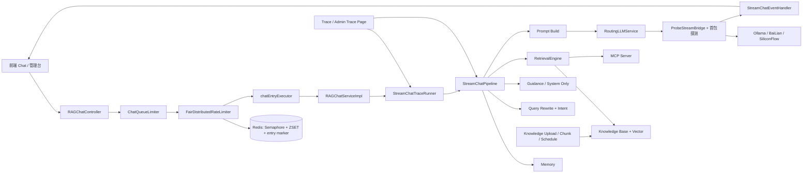

# Ragent 全项目串联总览

这是一份把项目从前端、主链路、知识库、MCP、AI 基础层到 Trace 全部串起来的总图。读完这份，基本就能回答“一个问题是怎么从界面走到模型、再走回页面”的完整故事。

如果你想按阅读顺序往下钻，可以把这篇当作总地图，再配着看 [StreamChatPipeline完整链路深度解析](D:/develop/RAgent/ragent/StreamChatPipeline完整链路深度解析.md) 和 [全链路追踪](D:/develop/RAgent/ragent/全链路追踪.md)：前者看一条请求怎么跑，后者看这条请求怎么被完整记录下来。

这版总览更偏“主链路复盘”：我把一次请求从前端发起、后端排队、Redis 抢许可、AI 基础层首包探测、八个 pipeline 阶段、流式输出、取消收口，最后释放许可的路径重新串了一遍。

## 1. 模块边界先看清

| 模块 | 角色 |
| --- | --- |
| `frontend` | 聊天页、知识库页、Trace 页、配置页 |
| `bootstrap` | 业务编排层，承载 RAG、知识库、调度、控制器 |
| `infra-ai` | 模型基础层，负责路由、熔断、Embedding、Rerank、流式探测 |
| `framework` | 通用基座，负责异常、幂等、上下文、SSE、MQ 等横切能力 |
| `mcp-server` | 独立 MCP 工具服务，对外暴露标准工具协议 |

一句话：`framework` 提供地基，`infra-ai` 提供模型能力，`bootstrap` 组织业务流程，`mcp-server` 提供外部工具，`frontend` 把这一切接到人眼前。

## 2. 整体总图



## 3. 一次问答怎么穿过整个项目

以“OA 系统怎么申请年假？”为例，这条链路是最典型的主线。

### 3.1 前端先发起请求

前端聊天页发起 `GET /rag/v3/chat`，把 `question`、可选的 `conversationId` 和 `deepThinking` 送到后端。`RAGChatController.chat(...)` 上还挂着 `@IdempotentSubmit`，所以同一用户不会把“正在处理中的对话”重复点两遍。

### 3.2 Controller 只是入口，真正先接住的是 SSE 句柄

`RAGChatController` 里先创建 `SseEmitter`，再把它交给 `RAGChatServiceImpl.streamChat(...)`。这一步先把“向前端持续推消息的管道”建立好，后面不管是正常回答、澄清引导、系统直答还是限流拒绝，都能沿着同一条 SSE 通道收尾。

### 3.3 业务服务先分配会话和任务 ID

`RAGChatServiceImpl.streamChat(...)` 会先：

1. 生成 `actualConversationId`
2. 生成新的 `taskId`
3. 通过 `StreamCallbackFactory.createChatEventHandler(...)` new 出 `StreamChatEventHandler`
4. 构造 `StreamChatContext`
5. 把 `callback`、`conversationId`、`taskId`、`userId`、`deepThinking` 装进去

这里最关键的一点是：**`StreamChatEventHandler` 一创建就会立即初始化**，它会先发 `META` 事件，再把这条任务登记进 `StreamTaskManager`。

### 3.4 请求先进入队列限流，不是直接进主链路

`RAGChatServiceImpl` 组装完 `StreamChatContext` 之后，不会立刻执行 `StreamChatPipeline`，而是先交给 `ChatQueueLimiter.enqueue(...)`。

`ChatQueueLimiter` 这层做的事很像门卫：

| 动作 | 作用 |
| --- | --- |
| 检查全局限流开关 | 决定直通还是进入公平排队 |
| 绑定 `cancelBinder` | 让 SSE 结束、超时、异常都能反向取消排队请求 |
| 把请求交给 `FairDistributedRateLimiter` | 真正走 Redis 队列和许可竞争 |

如果限流没开，它会直接把任务丢给 `chatEntryExecutor`；如果限流开着，就进入下面这一段 Redis 排队逻辑。

### 3.5 Redis 先记排队凭证，再做公平抢占

`FairDistributedRateLimiter.acquire(...)` 会给这条请求创建一个 `Ticket`，然后按顺序做四件事：

1. 写 `entry` 存活标记，避免刚入队就被误判成僵尸
2. 用自增 `seq` 写入 ZSET 队列
3. 检查 `availablePermits()`
4. 通过 Lua 脚本判断自己是不是队头窗口内的存活请求

这里的 Redis 结构是分工明确的：

| 结构 | 作用 |
| --- | --- |
| `RPermitExpirableSemaphore` | 集群总并发坑位 |
| ZSET | 排队顺序 |
| `RAtomicLong` | 生成全局单调递增 seq |
| `RBucket + TTL` | 证明这个等待者还活着 |
| `RTopic` | 许可释放后的跨节点唤醒 |

Lua claim 成功后，它才会真正调用 `tryAcquirePermit()` 去拿一个可过期许可。拿到许可以后，`ticket.grant(permitId)` 才会把请求正式放行。

如果这一轮没拿到许可，Ticket 不会直接消失，它会继续留在队列里等下一轮轮询，或者等别的节点释放 permit 之后被 `RTopic` 唤醒再抢一次。

### 3.6 真正放行后，才进入 Trace 和业务执行

`ticket.grant(permitId)` 成功后，会把任务交给 `chatEntryExecutor`。这一步不是直接跑业务，而是先进入 `StreamChatTraceRunner.run(...)`：

1. 创建 `traceId`
2. 写一条 `RUNNING` 的 trace run
3. 把 `traceId` 和 `taskId` 写进 `RagTraceContext`
4. 执行真正的业务逻辑
5. 成功写 `SUCCESS`
6. 失败写 `ERROR`
7. 最后清理上下文

所以从工程上看，这条链路是：**先拿 Redis 许可，再开 trace，再进主链路。**

### 3.7 `StreamChatPipeline` 的八个阶段开始跑

主流水线固定是这八步：

```text
loadMemory -> rewriteQuery -> resolveIntents -> handleGuidance -> handleSystemOnly -> retrieve -> handleEmptyRetrieval -> streamRagResponse
```

每一步职责都很窄：

| 阶段 | 作用 |
| --- | --- |
| `loadMemory` | 把历史加载出来，并把当前用户问题写进记忆 |
| `rewriteQuery` | 把口语化问法改写成更适合检索的表达 |
| `resolveIntents` | 给子问题做意图识别和打分 |
| `handleGuidance` | 歧义太大时先澄清，不贸然检索 |
| `handleSystemOnly` | 纯系统问题直接直答，不走 KB/MCP |
| `retrieve` | 执行 KB 检索和 MCP 调用 |
| `handleEmptyRetrieval` | 没证据就兜底结束，不胡答 |
| `streamRagResponse` | 组装 Prompt，调用大模型流式输出 |

这条链路里，**记忆、改写、意图、引导、系统直答、检索、兜底、生成** 每一步都只做自己的事。

### 3.8 上下文是怎么组装出来的

`streamRagResponse(...)` 里会先把前面所有阶段的结果收拢成 `PromptContext`：

| 字段 | 来源 |
| --- | --- |
| `question` | 改写后的主问题 |
| `mcpContext` | MCP 工具返回的动态数据 |
| `kbContext` | 知识库召回的文档证据 |
| `mcpIntents` | 命中的 MCP 意图 |
| `kbIntents` | 命中的 KB 意图 |
| `intentChunks` | 意图和 chunk 的映射 |

然后 `RAGPromptService.buildStructuredMessages(...)` 会把它变成最终的消息序列，通常是：

1. system prompt
2. MCP 证据
3. KB 证据
4. 历史对话
5. 当前问题 / 子问题

也就是说，模型看到的不是散乱字符串，而是一份结构化的上下文包。

### 3.9 AI 基础层开始做首包探测和取消句柄

`streamRagResponse(...)` 最后调用的是 `llmService.streamChat(chatRequest, callback)`，这里进入的是 `infra-ai` 的 `RoutingLLMService.streamChat(...)`，不是直接打某一家模型。

这一步有三个很关键的动作：

1. `ModelSelector` 先按配置选候选模型
2. `ModelHealthStore` 先把已经熔断或半开中正在试探的模型过滤掉
3. `RoutingLLMService` 再给每个候选套上 `ProbeStreamBridge` 做首包探测

当某个候选真正开始流式输出时：

| 动作 | 作用 |
| --- | --- |
| `client.streamChat(...)` | 交给具体 provider 客户端执行 |
| `StreamAsyncExecutor.submit(...)` | 把读流任务扔到 `modelStreamExecutor` |
| `ProbeStreamBridge.awaitFirstPacket(...)` | 等首包，确认这路流真活着 |
| 成功后 `return handle` | 把取消句柄返回给上层 |
| 失败后 `handle.cancel()` | 立即切下一个候选 |

所以首包探测不是“等模型说完再决定”，而是**先确认首包正常，再把缓冲提交给真正的 SSE 回调**。

### 3.10 这三家 provider 怎么被统一起来

当前配置里，`ai.providers` 里主要是这三家：

| provider | 作用 |
| --- | --- |
| `ollama` | 本地模型接入 |
| `bailian` | 百炼 / DashScope 接入 |
| `siliconflow` | SiliconFlow 接入 |

它们在代码里对应的是三个 `ChatClient` Bean：

| 类 | 作用 |
| --- | --- |
| `OllamaChatClient` | Ollama 的 Chat / Stream 实现 |
| `BaiLianChatClient` | 百炼的 Chat / Stream 实现 |
| `SiliconFlowChatClient` | SiliconFlow 的 Chat / Stream 实现 |

这三个类都继承自 `AbstractOpenAIStyleChatClient`，所以同步请求、流式请求、读取 SSE、取消句柄构造这些通用逻辑都在基类里，子类只补 provider 差异。

### 3.11 “三台熔断”其实是按 modelId 管的健康状态

`ModelHealthStore` 不是按大类 provider 做一把总锁，而是按 `modelId` 管健康：

- `CLOSED`：正常
- `OPEN`：熔断中
- `HALF_OPEN`：半开试探中

`ModelSelector` 会先按配置把候选模型排好，再把 `isUnavailable(modelId)` 的候选过滤掉；`ModelRoutingExecutor` 在真正调用前还会再做一次 `allowCall(modelId)`。失败就 `markFailure`，成功就 `markSuccess`。

所以你可以把它理解成：

**不是三家 provider 只有一个熔断器，而是每个候选模型都有自己的健康状态，三家 provider 只是当前最主要的接入来源。**

### 3.12 流式输出真正到前端时，已经被探测和绑定好了

一旦 `RoutingLLMService` 首包探测成功，它会把真正的 `StreamCancellationHandle` 返回给上层。`StreamChatPipeline` 随后会调用：

```text
taskManager.bindHandle(ctx.getTaskId(), handle)
```

这一步把 AI 基础层返回的取消句柄，绑回到 `StreamTaskManager` 里的本地任务信息上。之后：

- 用户点停止，`taskManager.cancel(taskId)` 可以直接触发 `handle.cancel()`
- 如果取消先到了，后面 `bindHandle(...)` 也会发现已取消并立即执行 `handle.cancel()`

这就是“取消句柄”真正接上去的地方。

### 3.13 SSE 事件怎么一步步推给前端

`StreamChatEventHandler` 会把模型增量转成前端能直接消费的事件流：

| 回调 | 对前端的影响 |
| --- | --- |
| `onThinking` | 发 `MESSAGE(think)` |
| `onContent` | 发 `MESSAGE(response)` |
| `onComplete` | 发 `FINISH + DONE` |
| `onError` | 发失败收尾 |

如果模型成功完整结束：

1. 当前回答会写回记忆库
2. `FINISH` 会带上 `messageId` 和标题
3. `DONE` 会告诉前端这一轮流结束了
4. `taskManager.unregister(taskId)` 会清掉本地任务痕迹

如果用户中途点停止：

1. `StreamTaskManager.cancel(taskId)` 会先写 Redis cancel 标记
2. 再广播 topic
3. 如果本地任务已经注册，就直接取消句柄并发 `CANCEL + DONE`
4. 如果本地任务还没注册，等后面 `register()` 进来时再查 Redis cancel 标记兜底

### 3.14 最后释放的不是一个资源，而是两类资源

这条链路结束后，系统会分别释放两类东西：

| 资源 | 释放位置 |
| --- | --- |
| 流式任务控制面 | `StreamTaskManager.unregister(taskId)` |
| Redis 信号量许可 | `FairDistributedRateLimiter.Ticket` 的 `finally` |

也就是说：

- `unregister()` 负责把本地 `StreamTaskInfo` 和 Redis cancel key 清掉
- `permit` 负责在真正执行完以后，通过 `Ticket.grant(...)` 包装的 `finally` 自动归还

这两层别混在一起看。一个是任务记录清理，一个是并发坑位归还。

### 3.15 这一轮请求的完整闭环

把上面所有步骤连起来，完整闭环就是：

```text
前端发起请求
-> Controller 建立 SSE
-> Service 生成 taskId / conversationId
-> StreamChatEventHandler 先注册任务
-> ChatQueueLimiter 排队
-> FairDistributedRateLimiter 写 ZSET / entry marker / Semaphore
-> Lua claim 队头窗口
-> 拿到 Redis permit
-> chatEntryExecutor 放行
-> StreamChatTraceRunner 写 trace
-> StreamChatPipeline 跑 8 个阶段
-> RetrievalEngine 组 KB / MCP 证据
-> RAGPromptService 组上下文
-> RoutingLLMService 做首包探测
-> ModelHealthStore 管熔断与恢复
-> StreamAsyncExecutor 异步读流
-> StreamChatEventHandler 推 SSE 给前端
-> 回写记忆
-> unregister 清理任务
-> 释放 permit
-> 前端拿到 DONE
```

## 4. 知识库是怎么进入主链路的

知识库这部分决定了模型到底“有无证据可答”。

### 4.1 先创建知识库

`KnowledgeBaseController` 负责创建、重命名、删除和查询知识库。

创建时还会同步：

1. S3 / 对象存储 bucket
2. 向量空间

### 4.2 再上传文档

`KnowledgeDocumentController.upload(...)` 负责把文件或 URL 文档放入系统。

这里先经过上传限流，再做文件落盘、文档主表写入，但不会立刻分块。

### 4.3 开始分块

`startChunk(docId)` 走的是事务消息：

1. 请求先发半消息。
2. 本地事务把文档状态改成 `RUNNING`。
3. 同步 schedule 信息。
4. 消息正式提交后，异步 Consumer 开始真正分块。

### 4.4 Consumer 真正执行分块

`KnowledgeDocumentChunkConsumer` 收到消息后，恢复用户上下文，再调用 `executeChunk(docId)`。

分块成功后，会把新 Chunk 和向量一起写入，并更新文档 `chunkCount` 和分块日志。

### 4.5 定时刷新也走同一套链路

URL 文档还有定时同步链路：

1. `KnowledgeDocumentScheduleJob` 扫描 schedule 表。
2. `ScheduleLockManager` 抢锁。
3. `ScheduleRefreshProcessor` 拉取远程文件变化。
4. 变化后重新上传、重新分块、重新写向量。

这条链路的设计重点是：

| 设计点 | 作用 |
| --- | --- |
| lease lock | 防止多实例重复执行 |
| heartbeat | 防止长任务锁过期 |
| Phase | 精确控制收尾和文件清理 |
| 状态修复 | 处理 RUNNING 卡死 |

### 4.6 文档和 Chunk 还能被手工维护

这部分对应你前面的两份总结：

| 层级 | 接口能力 |
| --- | --- |
| 文档级 | 删除、更新、启用/禁用、分块日志 |
| Chunk 级 | 分页、新增、更新、删除、启用/禁用、批量启停 |

核心原则很简单：

1. 文档级管整篇生命周期。
2. Chunk 级管局部修正。
3. 向量库必须跟着一起变。

## 5. AI 基础层怎么把模型能力统一起来

这层决定了项目不是“写死某一家模型 API”，而是“统一模型能力后再路由”。

### 5.1 Chat 路由的真实样子

`RoutingLLMService` 对外虽然只暴露 `LLMService`，但内部会把一次 Chat 调用拆成四步：

1. `ModelSelector` 先选候选
2. `ModelHealthStore` 先过滤掉已经熔断或半开在飞的模型
3. `ModelRoutingExecutor` 再做同步故障转移
4. 流式场景额外加上 `ProbeStreamBridge` 首包探测

你可以把它理解成：

**业务层只说“我要回答”，AI 基础层负责决定“先让谁答、谁坏了、谁先探一口、谁能继续”。**

### 5.2 这三家 provider 怎么统一进来

当前配置里，`ai.providers` 主要有三家：

| provider | 作用 |
| --- | --- |
| `ollama` | 本地推理服务 |
| `bailian` | 百炼 / DashScope |
| `siliconflow` | SiliconFlow |

而 `ai.chat / ai.embedding / ai.rerank` 里配置的不是 provider 本身，而是一组模型候选：

| 能力 | 候选示例 |
| --- | --- |
| Chat | `qwen-plus`、`qwen3-max`、`glm-4.7`、`qwen3-local` |
| Embedding | `qwen-emb-8b`、`qwen-emb-local` |
| Rerank | `qwen3-rerank`、`rerank-noop` |

`ModelSelector` 会先按 `defaultModel`、`deepThinkingModel`、`priority`、`supportsThinking` 排序，再把健康状态不对的候选过滤掉，最后交给执行器。

### 5.3 三台“熔断”其实是按 modelId 管健康

`ModelHealthStore` 是这层的断路器核心，状态只有三种：

| 状态 | 含义 |
| --- | --- |
| `CLOSED` | 正常可用 |
| `OPEN` | 熔断中，暂时不放行 |
| `HALF_OPEN` | 半开试探中，只允许少量探测请求 |

失败累计到阈值后就会 `OPEN`，到期后自动转 `HALF_OPEN`，成功就回到 `CLOSED`。

所以你前面说的“三台熔断”，更准确一点应该理解成：

**当前项目里有三家 provider 接入，真正被熔断管理的是每个候选 modelId 的健康状态。**

### 5.4 首包探测和取消句柄是怎么接起来的

流式调用里最关键的不是“能不能发起请求”，而是“首包是不是正常到来”。所以 `RoutingLLMService.streamChat(...)` 会这样做：

1. 选出候选模型
2. 对每个候选先检查 `allowCall(modelId)`
3. 生成 `ProbeStreamBridge`
4. 调用具体 `ChatClient.streamChat(...)`
5. 等首包结果
6. 成功就 `markSuccess` 并返回 `StreamCancellationHandle`
7. 失败就 `markFailure`，立刻 `handle.cancel()`，切下一个候选

`ProbeStreamBridge` 的作用是先缓存首阶段事件，等确认首包正常后再把缓冲提交给真正的 `StreamCallback`。这样前端不会拿到半截脏流。

而取消句柄来自 `StreamAsyncExecutor` + `StreamCancellationHandles`：

- `StreamAsyncExecutor.submit(...)` 把阻塞读流任务丢到 `modelStreamExecutor`
- `StreamCancellationHandles.fromOkHttp(...)` 包装出一个能取消 `Call` 的句柄
- `StreamChatPipeline` 再把这个句柄绑定回 `StreamTaskManager`

这就是“前端点停止后能真的停掉”的底层抓手。

### 5.5 为什么这一层重要

因为它把“模型不可用”从业务层剥离出去了。

业务层只知道自己在调用 `LLMService / EmbeddingService / RerankService`，不关心底层到底走了哪家供应商、是否熔断、是否切换、是否首包探测成功。

这层一旦稳定，前面的 `StreamChatPipeline` 就可以专心做记忆、改写、意图、检索和 Prompt 组装，不用被供应商细节打断。

## 6. MCP 是怎么接进来的

MCP 这条线负责把外部工具能力标准化。

### 6.1 服务端

`mcp-server` 只干一件事：把工具包装成标准 MCP 协议。

`MCPDispatcher` 处理三类请求：

| 方法 | 作用 |
| --- | --- |
| `initialize` | 建立握手 |
| `tools/list` | 列出工具 |
| `tools/call` | 执行工具 |

工具本身通过注册表自动发现，不需要手工写死映射。

### 6.2 客户端

`bootstrap` 里的 `HttpMCPClient` 会连接 `mcp-server`，拿到工具列表，再通过 `RemoteMCPToolExecutor` 封装成可路由的工具执行器。

### 6.3 检索阶段怎么用 MCP

`RetrievalEngine` 在意图识别后，会把命中的 MCP 意图拆出来并行调用。

然后 `ContextFormatter` 会把返回结果格式化成 `mcpContext`，再交给 `RAGPromptService` 一起喂给模型。

这就是为什么 MCP 不是 KB 的替代品，而是“让模型能查实时能力和结构化系统数据”的外部能力层。

## 7. 前端和后台怎么把这些能力摆出来

前端不是摆设，它把整个系统拆成三张可操作的桌面：

| 页面 | 作用 |
| --- | --- |
| Chat 页面 | 用户问答 |
| Knowledge 页面 | 知识库、文档、Chunk 管理 |
| Trace 页面 | 查看链路运行详情 |
| Settings 页面 | 模型、记忆、上传等配置 |

也就是说，前端承担的是“入口”和“可观测性出口”。

## 8. 用三个例子把整个项目串起来

### 8.1 例子一：问一个知识库问题

```text
OA 系统怎么申请年假？
```

这条链路会走：

```text
前端 -> RAGChatController -> ChatQueueLimiter -> FairDistributedRateLimiter -> RAGChatServiceImpl -> StreamChatPipeline
-> 记忆 -> 改写 -> 意图 -> KB 检索 -> Prompt -> RoutingLLMService
-> SSE 输出 -> 写回会话 -> Trace 收尾
```

### 8.2 例子二：上传文档并让它可检索

```text
前端知识库页上传文档
-> 文档主表落库
-> 开始分块
-> RocketMQ 事务消息
-> Consumer 解析 / 分块 / embedding
-> chunk + vector 落库
-> 文档状态 SUCCESS
```

### 8.3 例子三：问一个需要实时工具的数据

```text
用户提问
-> 意图识别命中 MCP
-> RetrievalEngine 调用 MCP 工具
-> mcp-server 执行工具
-> 返回结构化结果
-> Prompt 里加入动态证据
-> LLM 生成最终答案
```

## 9. 这一整套项目，最该记住的闭环

```text
前端发起请求
-> 入口限流和 Trace 创建
-> 记忆注入
-> 问题改写和意图识别
-> 必要时先引导、先直答
-> 需要证据就检索
-> KB 和 MCP 并行补证据
-> Prompt 组装
-> 模型路由与流式输出
-> 回写记忆
-> Trace 落库
-> 后台可回看
```

## 10. 一句话总括

Ragent 不是“一个聊天接口 + 一堆工具”，而是把知识库、MCP、模型路由、流式输出、定时刷新、Trace 可观测性和后台管理全都拼成了一条能落地、能回放、能扩展的工程链路。

这一篇负责总图，[StreamChatPipeline完整链路深度解析](D:/develop/RAgent/ragent/StreamChatPipeline完整链路深度解析.md) 负责主链路细拆，[全链路追踪](D:/develop/RAgent/ragent/全链路追踪.md) 负责把链路看清楚，三篇放在一起才是完整的工程视角。

如果只记一条顺序，那就是：先排队抢 Redis 许可，再进 AI 基础层做首包探测，然后跑完 8 个 pipeline 阶段，最后把 SSE、任务痕迹和 permit 一起收掉。
