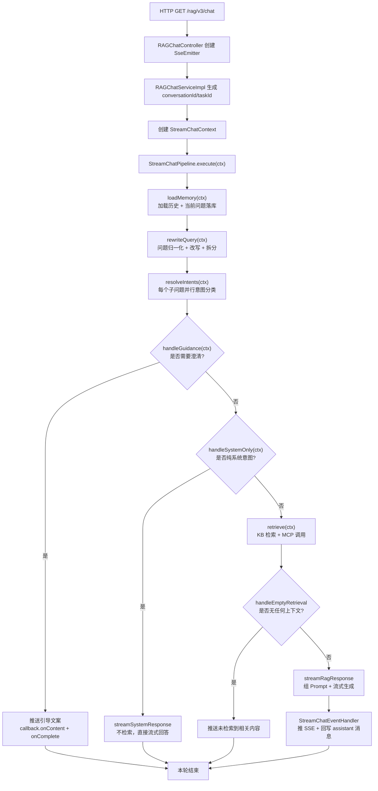
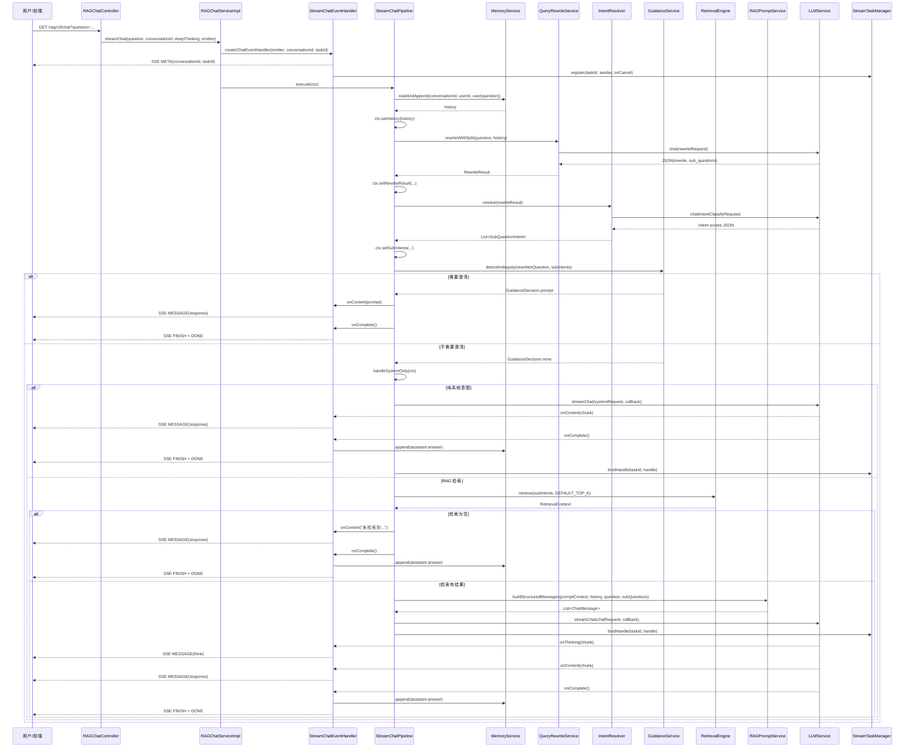

# StreamChatPipeline 完整链路深度解析

本文专门拆解 `StreamChatPipeline.execute(StreamChatContext ctx)` 这一条流式 RAG 问答主链路。

它不是单纯的“检索 + 生成”，而是一条带记忆、改写、意图识别、歧义澄清、系统直答、KB/MCP 检索、空结果兜底、Prompt 组装、SSE 流式输出、答案回写的完整编排链路。

这篇和 [Ragent全项目串联总览](D:/develop/RAgent/ragent/Ragent全项目串联总览.md)、[全链路追踪](D:/develop/RAgent/ragent/全链路追踪.md) 是配套关系：前者看项目全貌，后者看可观测与回放，这篇只负责把主链路掰开揉细。

核心入口代码如下：

```java
public void execute(StreamChatContext ctx) {
    loadMemory(ctx);
    rewriteQuery(ctx);
    resolveIntents(ctx);

    if (handleGuidance(ctx)) {
        return;
    }
    if (handleSystemOnly(ctx)) {
        return;
    }

    RetrievalContext retrievalCtx = retrieve(ctx);
    if (handleEmptyRetrieval(ctx, retrievalCtx)) {
        return;
    }

    streamRagResponse(ctx, retrievalCtx);
}
```

这 8 个方法分别对应 8 个阶段：

1. `loadMemory(ctx)`：加载会话记忆，并把当前用户问题写入记忆。
2. `rewriteQuery(ctx)`：结合历史做问题改写和多问题拆分。
3. `resolveIntents(ctx)`：对每个子问题做意图识别。
4. `handleGuidance(ctx)`：如果意图歧义明显，先向用户澄清并短路。
5. `handleSystemOnly(ctx)`：如果是纯系统问题，不走检索，直接流式回答。
6. `retrieve(ctx)`：根据意图执行 KB 检索和 MCP 工具调用。
7. `handleEmptyRetrieval(ctx, retrievalCtx)`：如果没有任何证据，直接兜底返回。
8. `streamRagResponse(ctx, retrievalCtx)`：组装 Prompt，调用大模型流式生成，并绑定取消句柄。

---

## 一、整体入口链路

用户请求不是直接进入 `execute(ctx)`，真实入口在 Controller：

```text
GET /rag/v3/chat
  -> RAGChatController.chat(...)
  -> RAGChatServiceImpl.streamChat(...)
  -> StreamChatPipeline.execute(ctx)
```

### 1. Controller 入口

入口方法：

```java
@GetMapping(value = "/rag/v3/chat", produces = "text/event-stream;charset=UTF-8")
public SseEmitter chat(@RequestParam String question,
                       @RequestParam(required = false) String conversationId,
                       @RequestParam(required = false, defaultValue = "false") Boolean deepThinking) {
    SseEmitter emitter = new SseEmitter(ragDefaultProperties.getSseTimeoutMs());
    ragChatService.streamChat(question, conversationId, deepThinking, emitter);
    return emitter;
}
```

输入：

| 参数 | 来源 | 含义 |
| --- | --- | --- |
| `question` | HTTP query param | 用户本轮问题 |
| `conversationId` | HTTP query param | 会话 ID，可以为空 |
| `deepThinking` | HTTP query param | 是否开启深度思考 |
| `emitter` | Controller 创建 | SSE 流式响应通道 |

输出：

| 输出 | 含义 |
| --- | --- |
| `SseEmitter` | 返回给前端的 SSE 连接 |

主要逻辑：

1. 创建 `SseEmitter`，超时时间来自 `ragDefaultProperties.getSseTimeoutMs()`。
2. 调用 `ragChatService.streamChat(...)`。
3. 立即返回 `SseEmitter`，后续内容通过 SSE 异步推送。

这一层只负责 HTTP 和 SSE，不负责 RAG 业务判断。

### 2. Service 入口

入口方法：

```java
public void streamChat(String question, String conversationId, Boolean deepThinking, SseEmitter emitter) {
    String actualConversationId = StrUtil.isBlank(conversationId) ? IdUtil.getSnowflakeNextIdStr() : conversationId;
    String taskId = StrUtil.isBlank(RagTraceContext.getTaskId())
            ? IdUtil.getSnowflakeNextIdStr()
            : RagTraceContext.getTaskId();
    boolean thinkingEnabled = Boolean.TRUE.equals(deepThinking);

    StreamCallback callback = callbackFactory.createChatEventHandler(emitter, actualConversationId, taskId);

    StreamChatContext ctx = StreamChatContext.builder()
            .question(question)
            .conversationId(actualConversationId)
            .taskId(taskId)
            .deepThinking(thinkingEnabled)
            .userId(UserContext.getUserId())
            .callback(callback)
            .build();

    try {
        chatPipeline.execute(ctx);
    } catch (Exception e) {
        callback.onError(e);
    }
}
```

输入：

| 参数 | 含义 |
| --- | --- |
| `question` | 用户问题 |
| `conversationId` | 前端传入的会话 ID，可以为空 |
| `deepThinking` | 是否深度思考 |
| `emitter` | SSE 通道 |

输出：

| 输出 | 含义 |
| --- | --- |
| 无直接返回 | 后续通过 `StreamCallback` 推 SSE |

主要逻辑：

1. 如果 `conversationId` 为空，生成新的雪花 ID。
2. 如果 trace 上下文中没有 `taskId`，生成新的雪花 ID。
3. 创建 `StreamCallback`，实际类型是 `StreamChatEventHandler`。
4. 构造 `StreamChatContext`，把一次对话需要的输入全部打包。
5. 调用 `chatPipeline.execute(ctx)`。
6. 如果 pipeline 抛异常，统一转成 `callback.onError(e)`。

这里最重要的是 `StreamChatContext`。它是整条 pipeline 的上下文容器，前半部分是不可变输入，后半部分是 pipeline 一步步填充的中间状态。

```java
@Getter
@Builder
public class StreamChatContext {
    private final String question;
    private final String conversationId;
    private final String taskId;
    private final boolean deepThinking;
    private final String userId;
    private final StreamCallback callback;

    @Setter
    private List<ChatMessage> history;

    @Setter
    private RewriteResult rewriteResult;

    @Setter
    private List<SubQuestionIntent> subIntents;
}
```

可以把 `StreamChatContext` 理解成一张流水线工单：

| 字段 | 初始是否存在 | 由谁写入 | 用途 |
| --- | --- | --- | --- |
| `question` | 是 | `RAGChatServiceImpl` | 原始用户问题 |
| `conversationId` | 是 | `RAGChatServiceImpl` | 会话维度读写记忆 |
| `taskId` | 是 | `RAGChatServiceImpl` | 流式任务取消 |
| `deepThinking` | 是 | `RAGChatServiceImpl` | 控制最终生成是否开启 thinking |
| `userId` | 是 | `RAGChatServiceImpl` | 用户维度隔离记忆 |
| `callback` | 是 | `StreamCallbackFactory` | SSE 输出通道 |
| `history` | 否 | `loadMemory` | 历史上下文 |
| `rewriteResult` | 否 | `rewriteQuery` | 改写结果和子问题 |
| `subIntents` | 否 | `resolveIntents` | 子问题对应的意图候选 |

---

## 二、主链路流程图



这张图里有三个短路点：

1. `handleGuidance(ctx)`：歧义澄清短路。
2. `handleSystemOnly(ctx)`：系统直答短路。
3. `handleEmptyRetrieval(ctx, retrievalCtx)`：空检索结果兜底短路。

只要任何一个短路点返回 `true`，`execute(ctx)` 就会 `return`，后续阶段不会执行。

---

## 三、阶段一：`loadMemory(ctx)`

源码：

```java
private void loadMemory(StreamChatContext ctx) {
    List<ChatMessage> history = memoryService.loadAndAppend(
            ctx.getConversationId(),
            ctx.getUserId(),
            ChatMessage.user(ctx.getQuestion())
    );
    ctx.setHistory(history);
}
```

### 1. 方法输入

| 输入 | 来源 | 示例 |
| --- | --- | --- |
| `ctx.question` | 用户原始问题 | `OA 系统怎么申请年假？` |
| `ctx.conversationId` | 前端传入或后端生成 | `1891234567890` |
| `ctx.userId` | `UserContext.getUserId()` | `10001` |

### 2. 方法输出

| 输出 | 写入位置 | 含义 |
| --- | --- | --- |
| `history` | `ctx.setHistory(history)` | 当前问题写入之前的历史消息列表 |

注意这里的输出不是 return，而是写回 `ctx.history`。

### 3. 主逻辑

`loadMemory(ctx)` 调用了：

```java
memoryService.loadAndAppend(conversationId, userId, ChatMessage.user(question))
```

`loadAndAppend(...)` 的默认实现是：

```java
default List<ChatMessage> loadAndAppend(String conversationId, String userId, ChatMessage message) {
    List<ChatMessage> history = load(conversationId, userId);
    append(conversationId, userId, message);
    return history;
}
```

也就是说，它固定做三件事：

1. 先 `load(...)` 加载历史。
2. 再 `append(...)` 把当前用户问题落库。
3. 返回的是“当前用户问题写入之前”的历史。

这个顺序很关键。

如果先 append 再 load，那么 `ctx.history` 里会包含当前用户问题，后面 `RAGPromptService.buildStructuredMessages(...)` 又会把当前问题作为最后一条 `user` 消息加入，导致当前问题重复出现。

所以这里刻意采用“先读旧历史，再写当前问题”的顺序。

### 4. `DefaultConversationMemoryService.load(...)`

真实加载逻辑在 `DefaultConversationMemoryService`：

```java
public List<ChatMessage> load(String conversationId, String userId) {
    if (StrUtil.isBlank(conversationId) || StrUtil.isBlank(userId)) {
        return List.of();
    }

    CompletableFuture<ChatMessage> summaryFuture = CompletableFuture.supplyAsync(
            () -> loadSummaryWithFallback(conversationId, userId), memoryLoadExecutor
    );
    CompletableFuture<List<ChatMessage>> historyFuture = CompletableFuture.supplyAsync(
            () -> loadHistoryWithFallback(conversationId, userId), memoryLoadExecutor
    );

    return CompletableFuture.allOf(summaryFuture, historyFuture)
            .thenApply(v -> {
                ChatMessage summary = summaryFuture.join();
                List<ChatMessage> history = historyFuture.join();
                return attachSummary(summary, history);
            })
            .join();
}
```

输入：

| 输入 | 含义 |
| --- | --- |
| `conversationId` | 会话 ID |
| `userId` | 用户 ID |

输出：

| 输出 | 含义 |
| --- | --- |
| `List<ChatMessage>` | 摘要消息 + 近期历史消息 |

主要逻辑：

1. 参数为空就直接返回空列表。
2. 并行加载摘要：`loadSummaryWithFallback(...)`。
3. 并行加载历史：`loadHistoryWithFallback(...)`。
4. 等两个任务都结束后，调用 `attachSummary(summary, history)` 合并。
5. 任何异常都兜底成空列表，不让记忆失败拖垮主问答链路。

### 5. `loadSummaryWithFallback(...)`

输入：

| 输入 | 含义 |
| --- | --- |
| `conversationId` | 会话 ID |
| `userId` | 用户 ID |

输出：

| 输出 | 含义 |
| --- | --- |
| `ChatMessage` 或 `null` | 最新摘要消息 |

主要逻辑：

1. 调用 `summaryService.loadLatestSummary(conversationId, userId)`。
2. 成功则返回摘要。
3. 异常则返回 `null`。

这里的策略是：摘要只是增强上下文，不是主流程必需品。摘要失败不应该让问答失败。

### 6. `loadHistoryWithFallback(...)`

输入：

| 输入 | 含义 |
| --- | --- |
| `conversationId` | 会话 ID |
| `userId` | 用户 ID |

输出：

| 输出 | 含义 |
| --- | --- |
| `List<ChatMessage>` | 近期历史消息 |

主要逻辑：

1. 调用 `memoryStore.loadHistory(conversationId, userId)`。
2. 如果返回 `null`，兜底成空列表。
3. 如果异常，也兜底成空列表。

历史失败会比摘要失败更严重一些，但当前实现仍然选择“继续本轮问答”，避免用户请求直接失败。

### 7. `append(...)`

输入：

| 输入 | 含义 |
| --- | --- |
| `conversationId` | 会话 ID |
| `userId` | 用户 ID |
| `message` | 当前用户消息 |

输出：

| 输出 | 含义 |
| --- | --- |
| `messageId` | 持久化后的消息 ID |

主要逻辑：

1. 参数为空则返回 `null`。
2. 调用 `memoryStore.append(...)` 写消息。
3. 调用 `summaryService.compressIfNeeded(...)` 检查是否需要压缩摘要。

这里当前写入的是 `ChatMessage.user(ctx.getQuestion())`，所以落库的是用户本轮原始问题。

### 8. `attachSummary(summary, history)`

输入：

| 输入 | 含义 |
| --- | --- |
| `summary` | 最新摘要，可以为空 |
| `history` | 近期历史 |

输出：

| 输出 | 含义 |
| --- | --- |
| `List<ChatMessage>` | 合并后的上下文 |

主要逻辑：

1. 如果历史为空，直接返回空列表。
2. 如果摘要为空，直接返回历史。
3. 如果摘要和历史都有，就把装饰后的摘要放在第一条，再追加历史。

因此 `ctx.history` 的结构通常是：

```text
[
  SYSTEM(summary),
  USER(previous question),
  ASSISTANT(previous answer),
  ...
]
```

---

## 四、阶段二：`rewriteQuery(ctx)`

源码：

```java
private void rewriteQuery(StreamChatContext ctx) {
    RewriteResult rewriteResult = queryRewriteService.rewriteWithSplit(ctx.getQuestion(), ctx.getHistory());
    ctx.setRewriteResult(rewriteResult);
}
```

### 1. 方法输入

| 输入 | 来源 | 示例 |
| --- | --- | --- |
| `ctx.question` | 用户原始问题 | `那 OA 怎么申请年假？` |
| `ctx.history` | `loadMemory(ctx)` 写入 | 上一轮提到了“集团内部系统” |

### 2. 方法输出

| 输出 | 写入位置 | 示例 |
| --- | --- | --- |
| `RewriteResult` | `ctx.rewriteResult` | `rewrittenQuestion=OA 系统年假申请流程是什么？` |

`RewriteResult` 是一个 record：

```java
public record RewriteResult(String rewrittenQuestion, List<String> subQuestions) {
}
```

字段含义：

| 字段 | 含义 |
| --- | --- |
| `rewrittenQuestion` | 改写后的整体问题 |
| `subQuestions` | 拆分后的子问题列表 |

### 3. 主逻辑

真实实现是 `MultiQuestionRewriteService.rewriteWithSplit(userQuestion, history)`：

```java
public RewriteResult rewriteWithSplit(String userQuestion, List<ChatMessage> history) {
    if (!ragConfigProperties.getQueryRewriteEnabled()) {
        String normalized = queryTermMappingService.normalize(userQuestion);
        List<String> subs = ruleBasedSplit(normalized);
        return new RewriteResult(normalized, subs);
    }

    String normalizedQuestion = queryTermMappingService.normalize(userQuestion);

    return callLLMRewriteAndSplit(normalizedQuestion, userQuestion, history);
}
```

它分两种路径：

| 条件 | 路径 | 输出 |
| --- | --- | --- |
| `queryRewriteEnabled=false` | 术语归一化 + 规则拆分 | `RewriteResult(normalized, subs)` |
| `queryRewriteEnabled=true` | 术语归一化 + LLM 改写拆分 | `RewriteResult(rewrite, subQuestions)` |

### 4. 术语归一化

第一步总是：

```java
String normalizedQuestion = queryTermMappingService.normalize(userQuestion);
```

它的作用是把用户口语里的别名、简称、同义词统一成系统更容易识别和检索的表达。

例如：

| 用户表达 | 归一化后 |
| --- | --- |
| `OA` | `OA 系统` |
| `请假` | `年假申请` 或配置里的标准术语 |
| `报销系统` | 对应业务系统标准名 |

这一步发生在 LLM 改写前，原因是：先把词对齐，再让模型改写，结果更稳定。

### 5. `buildRewriteRequest(...)`

LLM 改写请求构造方法：

```java
private ChatRequest buildRewriteRequest(String systemPrompt,
                                        String question,
                                        List<ChatMessage> history) {
    List<ChatMessage> messages = new ArrayList<>();
    if (StrUtil.isNotBlank(systemPrompt)) {
        messages.add(ChatMessage.system(systemPrompt));
    }

    if (CollUtil.isNotEmpty(history)) {
        List<ChatMessage> recentHistory = history.stream()
                .filter(msg -> msg.getRole() == ChatMessage.Role.USER
                        || msg.getRole() == ChatMessage.Role.ASSISTANT)
                .skip(Math.max(0, history.size() - 4))
                .toList();
        messages.addAll(recentHistory);
    }

    messages.add(ChatMessage.user(question));

    return ChatRequest.builder()
            .messages(messages)
            .temperature(0.1D)
            .topP(0.3D)
            .thinking(false)
            .build();
}
```

输入：

| 输入 | 含义 |
| --- | --- |
| `systemPrompt` | `prompt/user-question-rewrite.st` 模板内容 |
| `question` | 归一化后的当前问题 |
| `history` | 会话历史 |

输出：

| 输出 | 含义 |
| --- | --- |
| `ChatRequest` | 发给 LLM 的改写请求 |

主要逻辑：

1. 先加入改写系统提示词。
2. 从历史中只保留 `USER` 和 `ASSISTANT`。
3. 最多保留最近 4 条消息，也就是约 2 轮对话。
4. 过滤掉 `SYSTEM` 摘要，避免摘要干扰改写阶段。
5. 最后加入当前问题。
6. 使用低温度、低 topP、关闭 thinking，让改写更稳定。

改写阶段的消息结构大概是：

```text
SYSTEM: user-question-rewrite.st
USER: 上一轮用户问题
ASSISTANT: 上一轮回答
USER: 当前归一化问题
```

### 6. `callLLMRewriteAndSplit(...)`

输入：

| 输入 | 含义 |
| --- | --- |
| `normalizedQuestion` | 归一化后的问题 |
| `originalQuestion` | 原始用户问题，用于日志 |
| `history` | 历史消息 |

输出：

| 输出 | 含义 |
| --- | --- |
| `RewriteResult` | 改写和拆分结果 |

主要逻辑：

1. 加载改写模板：`promptTemplateLoader.load(QUERY_REWRITE_AND_SPLIT_PROMPT_PATH)`。
2. 调用 `buildRewriteRequest(...)` 构造 `ChatRequest`。
3. 调用 `llmService.chat(req)` 同步获取模型结果。
4. 调用 `parseRewriteAndSplit(raw)` 解析 JSON。
5. 如果解析成功，返回模型结果。
6. 如果调用失败或解析失败，降级成 `new RewriteResult(normalizedQuestion, List.of(normalizedQuestion))`。

### 7. `parseRewriteAndSplit(raw)`

输入：

| 输入 | 含义 |
| --- | --- |
| `raw` | LLM 原始返回 |

输出：

| 输出 | 含义 |
| --- | --- |
| `RewriteResult` 或 `null` | 解析后的改写结果 |

期望模型返回：

```json
{
  "rewrite": "OA 系统年假申请流程是什么？",
  "sub_questions": [
    "OA 系统年假申请入口在哪里？",
    "OA 系统年假申请审批流程是什么？"
  ]
}
```

主要逻辑：

1. 先通过 `LLMResponseCleaner.stripMarkdownCodeFence(raw)` 去掉 Markdown 代码块。
2. 解析 JSON。
3. 读取 `rewrite` 字段。
4. 读取 `sub_questions` 数组。
5. 如果 `rewrite` 为空，返回 `null`。
6. 如果 `sub_questions` 为空，则用 `rewrite` 作为唯一子问题。

### 8. `ruleBasedSplit(question)`

当 query rewrite 关闭时使用：

```java
private List<String> ruleBasedSplit(String question) {
    List<String> parts = Arrays.stream(question.split("[?？。；;\\n]+"))
            .map(String::trim)
            .filter(StrUtil::isNotBlank)
            .collect(Collectors.toList());

    if (CollUtil.isEmpty(parts)) {
        return List.of(question);
    }
    return parts.stream()
            .map(s -> s.endsWith("？") || s.endsWith("?") ? s : s + "？")
            .toList();
}
```

输入：

| 输入 | 含义 |
| --- | --- |
| `question` | 归一化后的问题 |

输出：

| 输出 | 含义 |
| --- | --- |
| `List<String>` | 按标点拆出的子问题 |

主要逻辑：

1. 按 `?`、`？`、`。`、`；`、`;`、换行拆分。
2. 去空白。
3. 如果拆不出来，就返回原问题。
4. 每个子问题补上问号。

---

## 五、阶段三：`resolveIntents(ctx)`

源码：

```java
private void resolveIntents(StreamChatContext ctx) {
    List<SubQuestionIntent> subIntents = intentResolver.resolve(ctx.getRewriteResult());
    ctx.setSubIntents(subIntents);
}
```

### 1. 方法输入

| 输入 | 来源 | 示例 |
| --- | --- | --- |
| `ctx.rewriteResult` | `rewriteQuery(ctx)` | `rewrittenQuestion=OA 系统年假申请流程是什么？` |

### 2. 方法输出

| 输出 | 写入位置 | 含义 |
| --- | --- | --- |
| `List<SubQuestionIntent>` | `ctx.subIntents` | 每个子问题对应的意图候选 |

`SubQuestionIntent` 结构：

```java
public record SubQuestionIntent(String subQuestion, List<NodeScore> nodeScores) {
}
```

字段含义：

| 字段 | 含义 |
| --- | --- |
| `subQuestion` | 子问题文本 |
| `nodeScores` | 这个子问题命中的意图节点和分数 |

### 3. `IntentResolver.resolve(...)`

核心代码：

```java
public List<SubQuestionIntent> resolve(RewriteResult rewriteResult) {
    List<String> subQuestions = CollUtil.isNotEmpty(rewriteResult.subQuestions())
            ? rewriteResult.subQuestions()
            : List.of(rewriteResult.rewrittenQuestion());
    List<CompletableFuture<SubQuestionIntent>> tasks = subQuestions.stream()
            .map(q -> CompletableFuture.supplyAsync(
                    () -> {
                        try {
                            return new SubQuestionIntent(q, classifyIntents(q));
                        } catch (Exception e) {
                            return new SubQuestionIntent(q, List.of());
                        }
                    },
                    intentClassifyExecutor
            ))
            .toList();
    List<SubQuestionIntent> subIntents = tasks.stream()
            .map(CompletableFuture::join)
            .toList();
    return capTotalIntents(subIntents);
}
```

输入：

| 输入 | 含义 |
| --- | --- |
| `RewriteResult` | 改写后的整体问题和子问题 |

输出：

| 输出 | 含义 |
| --- | --- |
| `List<SubQuestionIntent>` | 子问题意图列表 |

主要逻辑：

1. 如果 `rewriteResult.subQuestions()` 非空，使用子问题列表。
2. 如果子问题为空，使用 `rewrittenQuestion` 兜底成单子问题。
3. 每个子问题并行执行 `classifyIntents(q)`。
4. 单个子问题分类失败时，降级成空意图，不影响其他子问题。
5. 汇总后调用 `capTotalIntents(...)` 做全局意图数量封顶。

### 4. `classifyIntents(question)`

```java
private List<NodeScore> classifyIntents(String question) {
    List<NodeScore> scores = intentClassifier.classifyTargets(question);
    return scores.stream()
            .filter(ns -> ns.getScore() >= INTENT_MIN_SCORE)
            .limit(MAX_INTENT_COUNT)
            .toList();
}
```

输入：

| 输入 | 示例 |
| --- | --- |
| `question` | `OA 系统年假申请流程是什么？` |

输出：

| 输出 | 示例 |
| --- | --- |
| `List<NodeScore>` | `[OA-年假申请: 0.91, OA-系统介绍: 0.42]` |

主要逻辑：

1. 调用 `intentClassifier.classifyTargets(question)` 获取原始打分。
2. 过滤低于 `INTENT_MIN_SCORE=0.35` 的候选。
3. 最多保留 `MAX_INTENT_COUNT=3` 个。

### 5. `DefaultIntentClassifier.classifyTargets(question)`

这是真正调用 LLM 做意图分类的方法。

输入：

| 输入 | 含义 |
| --- | --- |
| `question` | 当前子问题 |

输出：

| 输出 | 含义 |
| --- | --- |
| `List<NodeScore>` | 按分数降序排列的意图候选 |

主要逻辑：

1. 调用 `loadIntentTreeData()` 加载意图树。
2. 调用 `buildPrompt(data.leafNodes)` 构造分类系统提示词。
3. 发送消息：

```text
SYSTEM: 意图分类规则 + 所有叶子节点清单
USER: 当前子问题
```

4. 调用 `llmService.chat(request)` 同步获取分类结果。
5. 清理 Markdown code fence。
6. 解析 JSON 数组或 `{ "results": [...] }` 包装结构。
7. 每个返回项通过 `id` 查回真实 `IntentNode`。
8. 未知 ID 跳过。
9. 按 score 降序排序。

模型期望返回：

```json
[
  {"id": "oa_leave_apply", "score": 0.91, "reason": "用户询问年假申请流程"},
  {"id": "oa_intro", "score": 0.42, "reason": "问题提到 OA 系统"}
]
```

程序最终保留的是：

```text
NodeScore(IntentNode(id=oa_leave_apply), 0.91)
NodeScore(IntentNode(id=oa_intro), 0.42)
```

### 6. `loadIntentTreeData()`

输入：

| 输入 | 含义 |
| --- | --- |
| 无显式参数 | 从缓存或数据库加载意图树 |

输出：

| 输出 | 含义 |
| --- | --- |
| `IntentTreeData` | 包含 `allNodes`、`leafNodes`、`id2Node` |

主要逻辑：

1. 先从 Redis 缓存读取意图树：`intentTreeCacheManager.getIntentTreeFromCache()`。
2. 如果 Redis 没有，就从数据库加载：`loadIntentTreeFromDB()`。
3. 如果 DB 加载成功，再写回 Redis。
4. 把树拍平成 `allNodes`。
5. 过滤出所有叶子节点 `leafNodes`。
6. 建立 `id -> IntentNode` 映射。

为什么只把叶子节点发给 LLM：

1. 叶子节点一般代表可执行的最终意图。
2. 节点更少，Prompt 更紧凑。
3. 下游可以直接拿叶子节点上的 `kind`、`collectionName`、`mcpToolId`、`promptTemplate` 等配置执行。

### 7. `buildPrompt(leafNodes)`

输入：

| 输入 | 含义 |
| --- | --- |
| `leafNodes` | 所有叶子意图节点 |

输出：

| 输出 | 含义 |
| --- | --- |
| `String systemPrompt` | 给 LLM 的意图分类规则 |

每个节点会被拼成类似：

```text
- id=oa_leave_apply
  path=业务系统 > OA系统 > 年假申请
  description=查询 OA 系统年假申请入口、流程、规则
  type=KB
  examples=怎么申请年假 / OA 年假审批流程
```

如果是 MCP 节点：

```text
  type=MCP
  toolId=leave_balance_query
```

如果是 SYSTEM 节点：

```text
  type=SYSTEM
```

之后模板渲染：

```java
promptTemplateLoader.render(INTENT_CLASSIFIER_PROMPT_PATH, Map.of("intent_list", sb.toString()))
```

### 8. `capTotalIntents(subIntents)`

这个方法解决的是“多个子问题加起来意图太多”的问题。

输入：

| 输入 | 含义 |
| --- | --- |
| `List<SubQuestionIntent>` | 每个子问题自己的候选意图 |

输出：

| 输出 | 含义 |
| --- | --- |
| `List<SubQuestionIntent>` | 全局封顶后的候选意图 |

主要逻辑：

1. 统计所有子问题的意图总数。
2. 如果总数不超过 `MAX_INTENT_COUNT`，原样返回。
3. 如果超过，先调用 `collectAllCandidates(...)` 把候选拍平。
4. 调用 `selectTopIntentPerSubQuestion(...)`，保证每个子问题至少保留一个最高分意图。
5. 计算剩余名额。
6. 调用 `selectAdditionalIntents(...)`，按全局分数从高到低补充。
7. 调用 `rebuildSubIntents(...)`，按原子问题结构重建结果。

举例：

```text
子问题 1: A=0.91, B=0.72
子问题 2: C=0.88, D=0.81
MAX_INTENT_COUNT = 3
```

处理结果：

```text
先保证每个子问题一个:
子问题 1 保留 A
子问题 2 保留 C

剩余 1 个名额:
B=0.72, D=0.81，选择 D

最终:
子问题 1: A
子问题 2: C, D
```

这保证了多问题场景下不会只有一个子问题占满全部意图名额。

---

## 六、阶段四：`handleGuidance(ctx)`

源码：

```java
private boolean handleGuidance(StreamChatContext ctx) {
    GuidanceDecision decision = guidanceService.detectAmbiguity(
            ctx.getRewriteResult().rewrittenQuestion(),
            ctx.getSubIntents()
    );
    if (!decision.isPrompt()) {
        return false;
    }
    StreamCallback callback = ctx.getCallback();
    callback.onContent(decision.getPrompt());
    callback.onComplete();
    return true;
}
```

### 1. 方法输入

| 输入 | 来源 | 含义 |
| --- | --- | --- |
| `ctx.rewriteResult.rewrittenQuestion()` | 改写阶段 | 当前整体问题 |
| `ctx.subIntents` | 意图识别阶段 | 子问题意图候选 |
| `ctx.callback` | Service 创建 | SSE 输出回调 |

### 2. 方法输出

| 输出 | 含义 |
| --- | --- |
| `false` | 不需要澄清，继续后续流程 |
| `true` | 已经向用户发出澄清问题，主链路短路结束 |

### 3. 主逻辑

1. 调用 `guidanceService.detectAmbiguity(question, subIntents)`。
2. 如果返回 `GuidanceDecision.none()`，说明不需要引导，返回 `false`。
3. 如果返回 `GuidanceDecision.prompt(prompt)`，说明需要引导。
4. 通过 `callback.onContent(prompt)` 把引导文案推给用户。
5. 调用 `callback.onComplete()` 结束本轮 SSE。
6. 返回 `true`，让 `execute(ctx)` 直接 `return`。

### 4. `IntentGuidanceService.detectAmbiguity(...)`

输入：

| 输入 | 含义 |
| --- | --- |
| `question` | 改写后的问题 |
| `subIntents` | 子问题意图候选 |

输出：

| 输出 | 含义 |
| --- | --- |
| `GuidanceDecision.none()` | 不需要澄清 |
| `GuidanceDecision.prompt(prompt)` | 需要澄清，prompt 是要发给用户的文案 |

主要逻辑：

1. 如果配置 `guidanceProperties.enabled` 不是 `true`，直接返回 `none`。
2. 调用 `findAmbiguityGroup(question, subIntents)` 找歧义候选组。
3. 如果没有歧义组，返回 `none`。
4. 如果有歧义组，调用 `buildPrompt(topicName, ranked)` 渲染引导文案。
5. 返回 `GuidanceDecision.prompt(prompt)`。

### 5. `findAmbiguityGroup(question, subIntents)`

输入：

| 输入 | 含义 |
| --- | --- |
| `question` | 改写后的问题 |
| `subIntents` | 子问题意图候选 |

输出：

| 输出 | 含义 |
| --- | --- |
| `AmbiguityGroup` | 存在歧义，需要引导 |
| `null` | 不需要引导 |

主要逻辑：

1. 只有 `subIntents.size() == 1` 才进入歧义判断。
2. 调用 `filterCandidates(...)` 只保留 KB 意图，并过滤低分。
3. 如果候选少于 2 个，不引导。
4. 对候选按系统级别归并，避免给用户展示一堆很细的叶子节点。
5. 每个系统只保留最高分节点。
6. 按分数降序排序。
7. 如果归并后少于 2 个，不引导。
8. 调用 `shouldSkipGuidance(question, ranked)` 做快速跳过。
9. 调用 `confirmAmbiguity(question, ranked)` 正式确认歧义。
10. 裁剪最多展示选项数。
11. 构造 `AmbiguityGroup`。

这一段只处理“单问题、多候选、候选之间很接近”的情况。

多子问题场景不触发歧义引导，因为多子问题本身就应该并行处理，贸然把多个问题混成一个引导会让交互变复杂。

### 6. `filterCandidates(scores)`

输入：

| 输入 | 含义 |
| --- | --- |
| `scores` | 当前子问题的意图候选 |

输出：

| 输出 | 含义 |
| --- | --- |
| `List<NodeScore>` | KB 类型且达到最低分的候选 |

主要逻辑：

1. 空列表直接返回空。
2. 使用 `NodeScoreFilters.kb(scores, RAGConstant.INTENT_MIN_SCORE)`。
3. 只保留 KB 意图，不处理 MCP 和 SYSTEM。

为什么只看 KB：

1. 歧义引导主要解决“应该查哪个知识域”的问题。
2. MCP 是工具调用，通常参数和工具意图更明确。
3. SYSTEM 是直答场景，不需要引导用户选择知识库。

### 7. `resolveSystemNodeId(node)`

输入：

| 输入 | 含义 |
| --- | --- |
| `IntentNode node` | 某个叶子意图节点 |

输出：

| 输出 | 含义 |
| --- | --- |
| `String` | 用于归并歧义选项的上层节点 ID |

主要逻辑：

1. 从当前叶子节点开始往父节点回溯。
2. 如果当前节点是 `CATEGORY`，且父节点为空或父节点是 `DOMAIN`，就停在这里。
3. 如果没有父节点，也用当前节点。
4. 返回这个节点的 ID。

这个方法的意义是把叶子节点归并成人能理解的选项。

比如命中的叶子是：

```text
业务系统 > OA系统 > 年假申请
业务系统 > HR系统 > 年假余额
```

用户真正需要选择的可能是：

```text
1. 业务系统 > OA系统
2. 业务系统 > HR系统
```

而不是两个非常细的叶子意图。

### 8. `shouldSkipGuidance(question, ranked)`

输入：

| 输入 | 含义 |
| --- | --- |
| `question` | 改写后的问题 |
| `ranked` | 排序后的候选系统 |

输出：

| 输出 | 含义 |
| --- | --- |
| `true` | 明显不需要引导，跳过 |
| `false` | 需要继续判断 |

主要逻辑：

1. 取第一名分数 `top`。
2. 如果 `top <= 0`，跳过。
3. 计算 `ratio = second / top`。
4. 读取阈值 `ambiguityScoreRatio` 和边界 `ambiguityMargin`。
5. 如果 `ratio < threshold - margin`，说明第二名和第一名差距足够大，跳过。
6. 如果用户问题里显式包含系统名或领域名，也跳过。

举例：

```text
候选:
OA系统 = 0.92
HR系统 = 0.40

ratio = 0.40 / 0.92 = 0.43
```

如果阈值是 `0.8`，margin 是 `0.15`，那么 `threshold - margin = 0.65`。

`0.43 < 0.65`，说明 OA 系统明显领先，不需要问用户。

另一个例子：

```text
问题: OA 系统怎么申请年假？
候选:
OA系统 = 0.86
HR系统 = 0.80
```

虽然分数接近，但问题里明确出现了 `OA系统`，也会跳过引导。

### 9. `confirmAmbiguity(question, ranked)`

输入：

| 输入 | 含义 |
| --- | --- |
| `question` | 改写后的问题 |
| `ranked` | 排序后的候选系统 |

输出：

| 输出 | 含义 |
| --- | --- |
| `true` | 确认歧义，需要引导 |
| `false` | 不歧义，继续主流程 |

主要逻辑：

1. 计算 `ratio = second / top`。
2. 如果 `ratio >= threshold`，直接判定歧义。
3. 如果 `ratio >= threshold - margin`，进入灰色地带，调用 `ambiguityLLMChecker.checkAmbiguity(question, ranked)` 二次确认。
4. 否则不歧义。

这是一套三区间策略：

| 区间 | 判断 | 行为 |
| --- | --- | --- |
| `ratio >= threshold` | 前两名非常接近 | 直接引导 |
| `threshold - margin <= ratio < threshold` | 边界情况 | 交给 LLM 二次确认 |
| `ratio < threshold - margin` | 第一名明显领先 | 不引导 |

### 10. `buildPrompt(topicName, ranked)`

输入：

| 输入 | 含义 |
| --- | --- |
| `topicName` | 当前歧义主题名 |
| `ranked` | 展示给用户的候选项 |

输出：

| 输出 | 含义 |
| --- | --- |
| `String prompt` | 最终推给用户的澄清文案 |

主要逻辑：

1. 调用 `renderOptions(ranked)` 生成选项列表。
2. 调用 `promptTemplateLoader.render(GUIDANCE_PROMPT_PATH, Map.of(...))` 渲染模板。

选项格式类似：

```text
1) 业务系统 > OA系统
2) 业务系统 > HR系统
```

最终用户看到的不是模型自由生成的随机文本，而是模板化、可控的引导文案。

---

## 七、阶段五：`handleSystemOnly(ctx)`

源码：

```java
private boolean handleSystemOnly(StreamChatContext ctx) {
    List<SubQuestionIntent> subIntents = ctx.getSubIntents();
    boolean allSystemOnly = subIntents.stream()
            .allMatch(si -> intentResolver.isSystemOnly(si.nodeScores()));
    if (!allSystemOnly) {
        return false;
    }
    String customPrompt = subIntents.stream()
            .flatMap(si -> si.nodeScores().stream())
            .map(ns -> ns.getNode().getPromptTemplate())
            .filter(StrUtil::isNotBlank)
            .findFirst()
            .orElse(null);
    StreamCancellationHandle handle = streamSystemResponse(
            ctx.getRewriteResult().rewrittenQuestion(),
            ctx.getHistory(),
            customPrompt,
            ctx.getCallback()
    );
    taskManager.bindHandle(ctx.getTaskId(), handle);
    return true;
}
```

### 1. 方法输入

| 输入 | 来源 | 含义 |
| --- | --- | --- |
| `ctx.subIntents` | 意图识别阶段 | 判断是否全部是 SYSTEM |
| `ctx.rewriteResult.rewrittenQuestion()` | 改写阶段 | 系统直答的问题 |
| `ctx.history` | 记忆阶段 | 历史上下文 |
| `ctx.callback` | Service 创建 | SSE 输出 |
| `ctx.taskId` | Service 创建 | 绑定取消句柄 |

### 2. 方法输出

| 输出 | 含义 |
| --- | --- |
| `false` | 不是纯系统问题，继续检索 |
| `true` | 已经走系统直答，主链路短路 |

### 3. 主逻辑

1. 遍历每个 `SubQuestionIntent`。
2. 对每个子问题调用 `intentResolver.isSystemOnly(si.nodeScores())`。
3. 只有所有子问题都是 system-only，才进入系统直答。
4. 从命中的 SYSTEM 节点里取第一个非空 `promptTemplate` 作为自定义系统提示词。
5. 调用 `streamSystemResponse(...)`。
6. 把返回的 `StreamCancellationHandle` 绑定到 `taskManager`。
7. 返回 `true`，主流程结束。

### 4. `intentResolver.isSystemOnly(nodeScores)`

源码：

```java
public boolean isSystemOnly(List<NodeScore> nodeScores) {
    return nodeScores.size() == 1
            && nodeScores.get(0).getNode() != null
            && nodeScores.get(0).getNode().getKind() == SYSTEM;
}
```

输入：

| 输入 | 含义 |
| --- | --- |
| `nodeScores` | 某个子问题的候选意图 |

输出：

| 输出 | 含义 |
| --- | --- |
| `true` | 这个子问题只有一个 SYSTEM 意图 |
| `false` | 不是纯 SYSTEM |

判断非常严格：

1. 候选数量必须等于 1。
2. 节点不能为空。
3. 节点 `kind` 必须是 `SYSTEM`。

只要混入 KB 或 MCP，就不会走系统直答。

### 5. `streamSystemResponse(...)`

源码：

```java
private StreamCancellationHandle streamSystemResponse(String question, List<ChatMessage> history,
                                                      String customPrompt, StreamCallback callback) {
    String systemPrompt = StrUtil.isNotBlank(customPrompt)
            ? customPrompt
            : promptTemplateLoader.load(CHAT_SYSTEM_PROMPT_PATH);

    List<ChatMessage> messages = new ArrayList<>();
    messages.add(ChatMessage.system(systemPrompt));
    if (CollUtil.isNotEmpty(history)) {
        messages.addAll(history);
    }
    messages.add(ChatMessage.user(question));

    ChatRequest req = ChatRequest.builder()
            .messages(messages)
            .temperature(0.7D)
            .thinking(false)
            .build();
    return llmService.streamChat(req, callback);
}
```

输入：

| 输入 | 含义 |
| --- | --- |
| `question` | 改写后的问题 |
| `history` | 历史消息 |
| `customPrompt` | SYSTEM 节点自定义模板，可以为空 |
| `callback` | SSE 回调 |

输出：

| 输出 | 含义 |
| --- | --- |
| `StreamCancellationHandle` | 用于取消模型流式生成 |

主要逻辑：

1. 如果 `customPrompt` 非空，使用它作为 system prompt。
2. 否则加载默认系统对话模板 `CHAT_SYSTEM_PROMPT_PATH`。
3. 组装消息：

```text
SYSTEM: 系统直答模板
历史消息...
USER: 当前问题
```

4. 构造 `ChatRequest`：

```text
temperature = 0.7
thinking = false
```

5. 调用 `llmService.streamChat(req, callback)` 流式生成。

为什么系统直答不检索：

1. 它对应的是打招呼、能力介绍、系统说明等问题。
2. 这些问题不需要 KB 文档证据。
3. 如果强行检索，反而会拉入无关上下文。

---

## 八、阶段六：`retrieve(ctx)`

源码：

```java
private RetrievalContext retrieve(StreamChatContext ctx) {
    return retrievalEngine.retrieve(ctx.getSubIntents(), DEFAULT_TOP_K);
}
```

### 1. 方法输入

| 输入 | 来源 | 含义 |
| --- | --- | --- |
| `ctx.subIntents` | 意图识别阶段 | 子问题及候选意图 |
| `DEFAULT_TOP_K` | 常量 | 默认返回 TopK，当前为 10 |

### 2. 方法输出

| 输出 | 含义 |
| --- | --- |
| `RetrievalContext` | KB 上下文、MCP 上下文、意图到 chunk 的映射 |

`RetrievalContext` 结构：

```java
@Data
@Builder
public class RetrievalContext {
    private String mcpContext;
    private String kbContext;
    private Map<String, List<RetrievedChunk>> intentChunks;

    public boolean hasMcp() {
        return StrUtil.isNotBlank(mcpContext);
    }

    public boolean hasKb() {
        return StrUtil.isNotBlank(kbContext);
    }

    public boolean isEmpty() {
        return !hasMcp() && !hasKb();
    }
}
```

字段含义：

| 字段 | 含义 |
| --- | --- |
| `mcpContext` | MCP 工具返回的动态数据上下文 |
| `kbContext` | 知识库检索后的文档上下文 |
| `intentChunks` | 意图 ID 到文档片段列表的映射 |

### 3. `RetrievalEngine.retrieve(subIntents, topK)`

核心代码：

```java
public RetrievalContext retrieve(List<SubQuestionIntent> subIntents, int topK) {
    if (CollUtil.isEmpty(subIntents)) {
        return RetrievalContext.builder()
                .intentChunks(Map.of())
                .build();
    }

    int finalTopK = topK > 0 ? topK : DEFAULT_TOP_K;
    List<CompletableFuture<SubQuestionContext>> tasks = subIntents.stream()
            .map(si -> CompletableFuture.supplyAsync(
                    () -> {
                        try {
                            return buildSubQuestionContext(
                                    si,
                                    resolveSubQuestionTopK(si, finalTopK)
                            );
                        } catch (Exception e) {
                            return new SubQuestionContext(si.subQuestion(), "", "", Map.of());
                        }
                    },
                    ragContextExecutor
            ))
            .toList();
    List<SubQuestionContext> contexts = tasks.stream()
            .map(CompletableFuture::join)
            .toList();

    StringBuilder kbBuilder = new StringBuilder();
    StringBuilder mcpBuilder = new StringBuilder();
    Map<String, List<RetrievedChunk>> mergedIntentChunks = new HashMap<>();

    for (SubQuestionContext context : contexts) {
        if (StrUtil.isNotBlank(context.kbContext())) {
            appendSection(kbBuilder, context.question(), context.kbContext());
        }
        if (StrUtil.isNotBlank(context.mcpContext())) {
            appendSection(mcpBuilder, context.question(), context.mcpContext());
        }
        if (CollUtil.isNotEmpty(context.intentChunks())) {
            mergedIntentChunks.putAll(context.intentChunks());
        }
    }

    return RetrievalContext.builder()
            .mcpContext(mcpBuilder.toString().trim())
            .kbContext(kbBuilder.toString().trim())
            .intentChunks(mergedIntentChunks)
            .build();
}
```

输入：

| 输入 | 含义 |
| --- | --- |
| `subIntents` | 子问题意图列表 |
| `topK` | 默认检索条数 |

输出：

| 输出 | 含义 |
| --- | --- |
| `RetrievalContext` | 合并后的检索上下文 |

主要逻辑：

1. 如果没有子问题意图，返回空 `RetrievalContext`。
2. 计算 `finalTopK`。
3. 每个子问题并行执行 `buildSubQuestionContext(...)`。
4. 单个子问题检索失败，降级成空上下文，不影响其他子问题。
5. 汇总所有子问题的 KB 上下文。
6. 汇总所有子问题的 MCP 上下文。
7. 合并所有 `intentChunks`。
8. 返回统一 `RetrievalContext`。

### 4. `buildSubQuestionContext(intent, topK)`

源码：

```java
private SubQuestionContext buildSubQuestionContext(SubQuestionIntent intent, int topK) {
    List<NodeScore> kbIntents = NodeScoreFilters.kb(intent.nodeScores());
    List<NodeScore> mcpIntents = NodeScoreFilters.mcp(intent.nodeScores());

    KbResult kbResult = retrieveAndRerank(intent, kbIntents, topK);

    String mcpContext = CollUtil.isNotEmpty(mcpIntents)
            ? executeMcpAndMerge(intent.subQuestion(), mcpIntents)
            : "";

    return new SubQuestionContext(intent.subQuestion(), kbResult.groupedContext(), mcpContext, kbResult.intentChunks());
}
```

输入：

| 输入 | 含义 |
| --- | --- |
| `intent` | 当前子问题及意图 |
| `topK` | 当前子问题实际检索条数 |

输出：

| 输出 | 含义 |
| --- | --- |
| `SubQuestionContext` | 当前子问题的 KB/MCP 上下文 |

主要逻辑：

1. 用 `NodeScoreFilters.kb(...)` 筛出 KB 意图。
2. 用 `NodeScoreFilters.mcp(...)` 筛出 MCP 意图。
3. KB 意图走 `retrieveAndRerank(...)`。
4. MCP 意图走 `executeMcpAndMerge(...)`。
5. 返回当前子问题的上下文对象。

`SubQuestionContext` 是内部 record：

```java
private record SubQuestionContext(String question,
                                  String kbContext,
                                  String mcpContext,
                                  Map<String, List<RetrievedChunk>> intentChunks) {
}
```

### 5. `resolveSubQuestionTopK(intent, fallbackTopK)`

输入：

| 输入 | 含义 |
| --- | --- |
| `intent` | 当前子问题意图 |
| `fallbackTopK` | 默认 TopK |

输出：

| 输出 | 含义 |
| --- | --- |
| `int` | 当前子问题实际使用的 TopK |

主要逻辑：

1. 从当前子问题的 KB 意图中读取每个节点配置的 `topK`。
2. 过滤空值和非正数。
3. 取最大值。
4. 如果没有任何节点配置 topK，则使用默认值。

为什么取最大值：

如果一个问题命中多个 KB 意图，其中某个意图配置了更大的召回需求，那么当前子问题需要给这个意图足够的检索空间。

### 6. KB 路径：`retrieveAndRerank(intent, kbIntents, topK)`

源码：

```java
private KbResult retrieveAndRerank(SubQuestionIntent intent, List<NodeScore> kbIntents, int topK) {
    List<SubQuestionIntent> subIntents = List.of(intent);
    List<RetrievedChunk> chunks = multiChannelRetrievalEngine.retrieveKnowledgeChannels(subIntents, topK);

    if (CollUtil.isEmpty(chunks)) {
        return KbResult.empty();
    }

    Map<String, List<RetrievedChunk>> intentChunks = new HashMap<>();

    if (CollUtil.isNotEmpty(kbIntents)) {
        for (NodeScore ns : kbIntents) {
            intentChunks.put(ns.getNode().getId(), chunks);
        }
    } else {
        intentChunks.put(MULTI_CHANNEL_KEY, chunks);
    }

    String groupedContext = contextFormatter.formatKbContext(kbIntents, intentChunks, topK);
    return new KbResult(groupedContext, intentChunks);
}
```

输入：

| 输入 | 含义 |
| --- | --- |
| `intent` | 当前子问题 |
| `kbIntents` | 当前子问题命中的 KB 意图 |
| `topK` | 检索条数 |

输出：

| 输出 | 含义 |
| --- | --- |
| `KbResult` | 格式化后的 KB 上下文和 chunk 映射 |

主要逻辑：

1. 把当前子问题包装成单元素列表。
2. 调用 `multiChannelRetrievalEngine.retrieveKnowledgeChannels(...)`。
3. 如果没有 chunk，返回 `KbResult.empty()`。
4. 如果有 KB 意图，把同一批 chunks 分配给每个意图 ID。
5. 如果没有 KB 意图，用 `MULTI_CHANNEL_KEY` 占位。
6. 调用 `contextFormatter.formatKbContext(...)` 格式化成 Prompt 可用文本。
7. 返回 `KbResult(groupedContext, intentChunks)`。

这里有一个实现细节：

多通道检索返回的 chunks 不是严格标注“来自哪个意图”的，所以当前代码把同一批 chunks 分配给每个 KB 意图。后面 Prompt 规划时只需要知道某个意图是否有可用 chunks。

### 7. `MultiChannelRetrievalEngine.retrieveKnowledgeChannels(...)`

输入：

| 输入 | 含义 |
| --- | --- |
| `subIntents` | 当前检索上下文中的子问题意图 |
| `topK` | 期望返回条数 |

输出：

| 输出 | 含义 |
| --- | --- |
| `List<RetrievedChunk>` | 后处理后的最终文档片段 |

主要逻辑：

1. 构建 `SearchContext`。
2. 执行所有启用的 `SearchChannel`。
3. 合并通道结果。
4. 执行后处理器链。
5. 返回最终 chunks。

### 8. `buildSearchContext(subIntents, topK)`

输入：

| 输入 | 含义 |
| --- | --- |
| `subIntents` | 子问题意图 |
| `topK` | 检索条数 |

输出：

| 输出 | 含义 |
| --- | --- |
| `SearchContext` | 检索通道统一上下文 |

主要逻辑：

1. 取第一个子问题作为 `originalQuestion` 和 `rewrittenQuestion`。
2. 放入 `intents`。
3. 放入 `topK`。

虽然字段叫 `originalQuestion` 和 `rewrittenQuestion`，在当前调用里它们都用当前子问题文本。

### 9. `executeSearchChannels(context)`

输入：

| 输入 | 含义 |
| --- | --- |
| `SearchContext` | 检索上下文 |

输出：

| 输出 | 含义 |
| --- | --- |
| `List<SearchChannelResult>` | 每个检索通道的结果 |

主要逻辑：

1. 从 Spring 注入的 `searchChannels` 中筛选 `channel.isEnabled(context)` 为 true 的通道。
2. 按 `channel.getPriority()` 排序。
3. 每个通道并行执行 `channel.search(context)`。
4. 通道异常时返回空结果，不中断整体检索。
5. 汇总每个通道耗时和 chunk 数量。

常见通道：

| 通道 | 作用 |
| --- | --- |
| `IntentDirectedSearchChannel` | 根据命中的 KB 意图做定向检索 |
| `VectorGlobalSearchChannel` | 在意图不够明确时做全局向量检索补底 |

### 10. `executePostProcessors(results, context)`

输入：

| 输入 | 含义 |
| --- | --- |
| `results` | 多个检索通道的原始结果 |
| `context` | 检索上下文 |

输出：

| 输出 | 含义 |
| --- | --- |
| `List<RetrievedChunk>` | 去重、重排、截断后的最终结果 |

主要逻辑：

1. 筛选启用的 `SearchResultPostProcessor`。
2. 按 `processor.getOrder()` 排序。
3. 把所有通道 chunks 合并成初始列表。
4. 依次执行处理器。
5. 单个处理器异常时跳过，不中断后续处理器。

常见后处理器：

| 处理器 | 作用 |
| --- | --- |
| `DeduplicationPostProcessor` | 去掉重复或近似重复 chunk |
| `RerankPostProcessor` | 对候选片段做重排序，保留更相关内容 |

### 11. MCP 路径：`executeMcpAndMerge(question, mcpIntents)`

源码：

```java
private String executeMcpAndMerge(String question, List<NodeScore> mcpIntents) {
    if (CollUtil.isEmpty(mcpIntents)) {
        return "";
    }

    List<MCPResponse> responses = executeMcpTools(question, mcpIntents);
    if (responses.isEmpty() || responses.stream().noneMatch(MCPResponse::isSuccess)) {
        return "";
    }

    return contextFormatter.formatMcpContext(responses, mcpIntents);
}
```

输入：

| 输入 | 含义 |
| --- | --- |
| `question` | 当前子问题 |
| `mcpIntents` | MCP 类型意图 |

输出：

| 输出 | 含义 |
| --- | --- |
| `String` | 格式化后的 MCP 上下文 |

主要逻辑：

1. 如果没有 MCP 意图，返回空字符串。
2. 调用 `executeMcpTools(...)` 执行工具。
3. 如果没有成功响应，返回空字符串。
4. 调用 `contextFormatter.formatMcpContext(...)` 格式化工具结果。

### 12. `executeMcpTools(question, mcpIntentScores)`

输入：

| 输入 | 含义 |
| --- | --- |
| `question` | 当前子问题 |
| `mcpIntentScores` | MCP 意图节点 |

输出：

| 输出 | 含义 |
| --- | --- |
| `List<MCPResponse>` | 每个 MCP 工具的执行结果 |

主要逻辑：

1. 对每个 MCP 意图并行执行。
2. 每个意图先调用 `buildMcpRequest(question, ns.getNode())`。
3. 如果 request 为空，跳过。
4. 调用 `executeSingleMcpTool(request)`。
5. 工具异常时包装成 `MCPResponse.error(...)`。
6. 过滤掉 `null` 结果。

### 13. `buildMcpRequest(question, intentNode)`

输入：

| 输入 | 含义 |
| --- | --- |
| `question` | 当前子问题 |
| `intentNode` | MCP 意图节点 |

输出：

| 输出 | 含义 |
| --- | --- |
| `MCPRequest` 或 `null` | 工具调用请求 |

主要逻辑：

1. 从意图节点读取 `mcpToolId`。
2. 从 `mcpToolRegistry` 查找对应执行器。
3. 如果执行器不存在，返回 `null`。
4. 读取工具定义 `MCPTool`。
5. 读取意图节点上的 `paramPromptTemplate`。
6. 调用 `mcpParameterExtractor.extractParameters(...)` 从自然语言中抽取结构化参数。
7. 构造 `MCPRequest(toolId, userQuestion, parameters)`。

这一段把“用户自然语言”转成“工具可执行请求”。

### 14. `executeSingleMcpTool(request)`

输入：

| 输入 | 含义 |
| --- | --- |
| `MCPRequest` | 工具调用请求 |

输出：

| 输出 | 含义 |
| --- | --- |
| `MCPResponse` | 工具调用结果 |

主要逻辑：

1. 根据 `toolId` 从 `mcpToolRegistry` 找执行器。
2. 找不到时返回 `TOOL_NOT_FOUND` 错误响应。
3. 找到后调用 `executor.execute(request)`。
4. 执行异常时返回 `EXECUTION_ERROR` 错误响应。

### 15. `appendSection(builder, question, context)`

输入：

| 输入 | 含义 |
| --- | --- |
| `builder` | KB 或 MCP 上下文拼接器 |
| `question` | 子问题 |
| `context` | 当前子问题对应上下文 |

输出：

| 输出 | 含义 |
| --- | --- |
| 无返回 | 直接追加到 `StringBuilder` |

拼接结构：

```markdown
---
**子问题**：OA 系统年假申请流程是什么？

**相关文档**：
...
```

这样最终 Prompt 里可以区分不同子问题对应的证据。

---

## 九、阶段七：`handleEmptyRetrieval(ctx, retrievalCtx)`

源码：

```java
private boolean handleEmptyRetrieval(StreamChatContext ctx, RetrievalContext retrievalCtx) {
    if (!retrievalCtx.isEmpty()) {
        return false;
    }
    StreamCallback callback = ctx.getCallback();
    callback.onContent("未检索到与问题相关的文档内容。");
    callback.onComplete();
    return true;
}
```

### 1. 方法输入

| 输入 | 来源 | 含义 |
| --- | --- | --- |
| `ctx.callback` | Service 创建 | SSE 输出 |
| `retrievalCtx` | `retrieve(ctx)` | 检索结果上下文 |

### 2. 方法输出

| 输出 | 含义 |
| --- | --- |
| `false` | 有 KB 或 MCP 上下文，继续生成 |
| `true` | 没有任何上下文，已经兜底返回 |

### 3. 判断逻辑

`RetrievalContext.isEmpty()`：

```java
public boolean isEmpty() {
    return !hasMcp() && !hasKb();
}
```

也就是：

| `mcpContext` | `kbContext` | 是否为空 |
| --- | --- | --- |
| 空 | 空 | 是 |
| 非空 | 空 | 否 |
| 空 | 非空 | 否 |
| 非空 | 非空 | 否 |

只要 KB 或 MCP 任意一边有上下文，就继续生成。

### 4. 主逻辑

1. 如果 `retrievalCtx` 不为空，返回 `false`。
2. 如果为空，通过 `callback.onContent(...)` 推送兜底文案。
3. 调用 `callback.onComplete()` 结束 SSE。
4. 返回 `true`，主流程短路。

这个短路点的价值是：没有证据就不让模型硬答。

如果检索为空还继续组 Prompt，模型很容易基于常识编造答案。当前实现选择直接告诉用户没有检索到相关内容。

---

## 十、阶段八：`streamRagResponse(ctx, retrievalCtx)`

源码：

```java
private void streamRagResponse(StreamChatContext ctx, RetrievalContext retrievalCtx) {
    IntentGroup mergedGroup = intentResolver.mergeIntentGroup(ctx.getSubIntents());

    StreamCancellationHandle handle = streamLLMResponse(
            ctx.getRewriteResult(),
            retrievalCtx,
            mergedGroup,
            ctx.getHistory(),
            ctx.isDeepThinking(),
            ctx.getCallback()
    );
    taskManager.bindHandle(ctx.getTaskId(), handle);
}
```

### 1. 方法输入

| 输入 | 来源 | 含义 |
| --- | --- | --- |
| `ctx.subIntents` | 意图识别阶段 | 用于合并 KB/MCP 意图 |
| `ctx.rewriteResult` | 改写阶段 | 最终问题和子问题 |
| `retrievalCtx` | 检索阶段 | KB/MCP 上下文 |
| `ctx.history` | 记忆阶段 | 历史上下文 |
| `ctx.deepThinking` | 请求参数 | 控制最终模型 thinking |
| `ctx.callback` | Service 创建 | SSE 回调 |
| `ctx.taskId` | Service 创建 | 绑定取消句柄 |

### 2. 方法输出

| 输出 | 含义 |
| --- | --- |
| 无直接返回 | 开始流式生成，内容经 callback 推送 |

### 3. 主逻辑

1. 调用 `intentResolver.mergeIntentGroup(ctx.getSubIntents())`。
2. 调用 `streamLLMResponse(...)` 开始最终模型流式生成。
3. 返回 `StreamCancellationHandle`。
4. 调用 `taskManager.bindHandle(ctx.getTaskId(), handle)`，让 `/rag/v3/stop` 可以取消本轮生成。

### 4. `mergeIntentGroup(subIntents)`

源码：

```java
public IntentGroup mergeIntentGroup(List<SubQuestionIntent> subIntents) {
    List<NodeScore> mcpIntents = new ArrayList<>();
    List<NodeScore> kbIntents = new ArrayList<>();
    for (SubQuestionIntent si : subIntents) {
        mcpIntents.addAll(NodeScoreFilters.mcp(si.nodeScores()));
        kbIntents.addAll(NodeScoreFilters.kb(si.nodeScores()));
    }
    return new IntentGroup(mcpIntents, kbIntents);
}
```

输入：

| 输入 | 含义 |
| --- | --- |
| `subIntents` | 所有子问题意图 |

输出：

| 输出 | 含义 |
| --- | --- |
| `IntentGroup` | 合并后的 MCP 意图和 KB 意图 |

`IntentGroup`：

```java
public record IntentGroup(List<NodeScore> mcpIntents, List<NodeScore> kbIntents) {
}
```

主要逻辑：

1. 遍历每个子问题。
2. 把所有 MCP 意图放进 `mcpIntents`。
3. 把所有 KB 意图放进 `kbIntents`。
4. SYSTEM 意图不会放入最终 RAG Prompt 规划。

### 5. `streamLLMResponse(...)`

源码：

```java
private StreamCancellationHandle streamLLMResponse(RewriteResult rewriteResult, RetrievalContext ctx,
                                                   IntentGroup intentGroup, List<ChatMessage> history,
                                                   boolean deepThinking, StreamCallback callback) {
    PromptContext promptContext = PromptContext.builder()
            .question(rewriteResult.rewrittenQuestion())
            .mcpContext(ctx.getMcpContext())
            .kbContext(ctx.getKbContext())
            .mcpIntents(intentGroup.mcpIntents())
            .kbIntents(intentGroup.kbIntents())
            .intentChunks(ctx.getIntentChunks())
            .build();

    List<ChatMessage> messages = promptBuilder.buildStructuredMessages(
            promptContext,
            history,
            rewriteResult.rewrittenQuestion(),
            rewriteResult.subQuestions()
    );
    ChatRequest chatRequest = ChatRequest.builder()
            .messages(messages)
            .thinking(deepThinking)
            .temperature(ctx.hasMcp() ? 0.3D : 0D)
            .topP(ctx.hasMcp() ? 0.8D : 1D)
            .build();

    return llmService.streamChat(chatRequest, callback);
}
```

输入：

| 输入 | 含义 |
| --- | --- |
| `rewriteResult` | 改写结果 |
| `ctx` | 检索上下文，这里变量名是 `ctx`，实际类型是 `RetrievalContext` |
| `intentGroup` | 合并后的 KB/MCP 意图 |
| `history` | 历史消息 |
| `deepThinking` | 是否开启 thinking |
| `callback` | SSE 回调 |

输出：

| 输出 | 含义 |
| --- | --- |
| `StreamCancellationHandle` | 取消句柄 |

主要逻辑：

1. 构造 `PromptContext`。
2. 调用 `promptBuilder.buildStructuredMessages(...)` 生成最终消息列表。
3. 构造 `ChatRequest`。
4. 如果有 MCP 上下文，使用 `temperature=0.3`、`topP=0.8`。
5. 如果纯 KB，上下文更偏事实问答，使用 `temperature=0`、`topP=1`。
6. 调用 `llmService.streamChat(chatRequest, callback)`。

### 6. `PromptContext`

结构：

```java
@Data
@Builder
public class PromptContext {
    private String question;
    private String mcpContext;
    private String kbContext;
    private List<NodeScore> mcpIntents;
    private List<NodeScore> kbIntents;
    private Map<String, List<RetrievedChunk>> intentChunks;
}
```

字段含义：

| 字段 | 含义 |
| --- | --- |
| `question` | 改写后的最终问题 |
| `mcpContext` | MCP 动态数据 |
| `kbContext` | KB 文档内容 |
| `mcpIntents` | 命中的 MCP 意图 |
| `kbIntents` | 命中的 KB 意图 |
| `intentChunks` | 意图到 chunks 的映射 |

`PromptContext` 是 Prompt 组装层的输入对象，它把前面所有阶段的结果收拢起来。

---

## 十一、Prompt 组装细节

真正把 `PromptContext` 变成 `List<ChatMessage>` 的是 `RAGPromptService.buildStructuredMessages(...)`。

### 1. `buildStructuredMessages(...)`

源码：

```java
public List<ChatMessage> buildStructuredMessages(PromptContext context,
                                                 List<ChatMessage> history,
                                                 String question,
                                                 List<String> subQuestions) {
    List<ChatMessage> messages = new ArrayList<>();
    String systemPrompt = buildSystemPrompt(context);
    if (StrUtil.isNotBlank(systemPrompt)) {
        messages.add(ChatMessage.system(systemPrompt));
    }
    if (StrUtil.isNotBlank(context.getMcpContext())) {
        messages.add(ChatMessage.system(formatEvidence(MCP_CONTEXT_HEADER, context.getMcpContext())));
    }
    if (StrUtil.isNotBlank(context.getKbContext())) {
        messages.add(ChatMessage.user(formatEvidence(KB_CONTEXT_HEADER, context.getKbContext())));
    }
    if (CollUtil.isNotEmpty(history)) {
        messages.addAll(history);
    }

    if (CollUtil.isNotEmpty(subQuestions) && subQuestions.size() > 1) {
        StringBuilder userMessage = new StringBuilder();
        userMessage.append("请基于上述文档内容，回答以下问题：\n\n");
        for (int i = 0; i < subQuestions.size(); i++) {
            userMessage.append(i + 1).append(". ").append(subQuestions.get(i)).append("\n");
        }
        messages.add(ChatMessage.user(userMessage.toString().trim()));
    } else if (StrUtil.isNotBlank(question)) {
        messages.add(ChatMessage.user(question));
    }

    return messages;
}
```

输入：

| 输入 | 含义 |
| --- | --- |
| `context` | Prompt 上下文 |
| `history` | 历史消息 |
| `question` | 改写后的问题 |
| `subQuestions` | 子问题列表 |

输出：

| 输出 | 含义 |
| --- | --- |
| `List<ChatMessage>` | 最终发给模型的消息列表 |

消息顺序非常关键：

```text
1. SYSTEM: 场景模板
2. SYSTEM: MCP 动态数据片段，如果存在
3. USER: KB 文档内容，如果存在
4. 历史消息
5. USER: 当前问题或编号后的多个子问题
```

为什么 MCP 用 `system`，KB 用 `user`：

1. MCP 常常是动态工具结果，更像执行环境给模型的事实状态。
2. KB 是文档证据，用 `user` 消息包起来让模型作为本轮回答材料。
3. 这是一种提示词组织策略，目的是让模型同时看到规则、证据和问题。

### 2. `buildSystemPrompt(context)`

输入：

| 输入 | 含义 |
| --- | --- |
| `PromptContext` | 当前 Prompt 上下文 |

输出：

| 输出 | 含义 |
| --- | --- |
| `String` | 最终 system prompt |

主要逻辑：

1. 调用 `plan(context)` 判断当前场景。
2. 如果 plan 中有节点自定义模板，用自定义模板。
3. 否则使用场景默认模板。
4. 调用 `PromptTemplateUtils.cleanupPrompt(template)` 清理模板格式。

### 3. `plan(context)`

输入：

| 输入 | 含义 |
| --- | --- |
| `PromptContext` | 当前上下文 |

输出：

| 输出 | 含义 |
| --- | --- |
| `PromptBuildPlan` | Prompt 构建计划 |

分支：

| 条件 | 方法 | 场景 |
| --- | --- | --- |
| 有 MCP，无 KB | `planMcpOnly(context)` | `MCP_ONLY` |
| 无 MCP，有 KB | `planKbOnly(context)` | `KB_ONLY` |
| 有 MCP，有 KB | `planMixed(context)` | `MIXED` |
| 都没有 | 抛异常 | 不应该发生，因为前面空结果已短路 |

### 4. `planKbOnly(context)`

输入：

| 输入 | 含义 |
| --- | --- |
| `context.kbIntents` | KB 意图 |
| `context.intentChunks` | 意图对应 chunks |

输出：

| 输出 | 含义 |
| --- | --- |
| `PromptBuildPlan` | KB 场景构建计划 |

主要逻辑：

1. 调用 `planPrompt(kbIntents, intentChunks)`。
2. 如果单个 KB 意图有自定义 `promptTemplate`，优先使用。
3. 如果多个 KB 意图，使用默认 KB 模板。
4. 场景设为 `KB_ONLY`。

### 5. `planPrompt(intents, intentChunks)`

输入：

| 输入 | 含义 |
| --- | --- |
| `intents` | KB 意图 |
| `intentChunks` | 检索结果映射 |

输出：

| 输出 | 含义 |
| --- | --- |
| `PromptPlan` | 保留下来的意图和基础模板 |

主要逻辑：

1. 过滤掉没有命中 chunks 的意图。
2. 如果过滤后没有意图，返回空 plan。
3. 如果只剩一个意图，且节点有 `promptTemplate`，使用该模板。
4. 如果多个意图，统一使用默认模板。

这个方法的作用是：只有真正检索到内容的意图才有资格影响 Prompt 模板选择。

### 6. `planMcpOnly(context)`

输入：

| 输入 | 含义 |
| --- | --- |
| `context.mcpIntents` | MCP 意图 |

输出：

| 输出 | 含义 |
| --- | --- |
| `PromptBuildPlan` | MCP-only 构建计划 |

主要逻辑：

1. 如果只有一个 MCP 意图，且节点有自定义模板，就使用它。
2. 否则使用默认 MCP-only 模板。
3. 场景设为 `MCP_ONLY`。

### 7. `planMixed(context)`

输入：

| 输入 | 含义 |
| --- | --- |
| `context` | 同时包含 MCP 和 KB |

输出：

| 输出 | 含义 |
| --- | --- |
| `PromptBuildPlan` | Mixed 场景计划 |

主要逻辑：

1. 场景设为 `MIXED`。
2. 不使用单节点自定义模板。
3. 使用默认混合模板 `MCP_KB_MIXED_PROMPT_PATH`。

混合场景更复杂，因为模型需要综合静态文档和动态工具结果，所以统一走专门模板更稳。

### 8. `defaultTemplate(scene)`

场景到模板的映射：

| 场景 | 模板路径 |
| --- | --- |
| `KB_ONLY` | `prompt/answer-chat-kb.st` |
| `MCP_ONLY` | `prompt/answer-chat-mcp.st` |
| `MIXED` | `prompt/answer-chat-mcp-kb-mixed.st` |
| `EMPTY` | 空字符串 |

---

## 十二、上下文格式化细节

检索结果不是原样塞进 Prompt，而是先通过 `DefaultContextFormatter` 格式化。

### 1. `formatKbContext(kbIntents, rerankedByIntent, topK)`

输入：

| 输入 | 含义 |
| --- | --- |
| `kbIntents` | KB 意图 |
| `rerankedByIntent` | 意图 ID 到 chunks 的映射 |
| `topK` | 最多使用多少条 chunk |

输出：

| 输出 | 含义 |
| --- | --- |
| `String` | KB 文档上下文 |

主要逻辑：

1. 如果没有 chunks，返回空。
2. 如果没有 KB 意图，走 `formatChunksWithoutIntent(...)`。
3. 如果多个 KB 意图，走 `formatMultiIntentContext(...)`。
4. 如果单个 KB 意图，走 `formatSingleIntentContext(...)`。

### 2. `formatSingleIntentContext(...)`

输入：

| 输入 | 含义 |
| --- | --- |
| `nodeScore` | 单个 KB 意图 |
| `rerankedByIntent` | chunks 映射 |
| `topK` | 最大条数 |

输出：

| 输出 | 含义 |
| --- | --- |
| `String` | 单意图上下文 |

主要逻辑：

1. 根据意图节点 ID 取 chunks。
2. 读取节点上的 `promptSnippet`。
3. 如果有 `promptSnippet`，先放回答规则。
4. 再放知识库片段。

格式大概是：

```markdown
#### 回答规则
请按照 OA 年假申请流程说明，不要扩展到其他系统。

#### 知识库片段
````text
片段 1
片段 2
````
```

### 3. `formatMultiIntentContext(...)`

输入：

| 输入 | 含义 |
| --- | --- |
| `kbIntents` | 多个 KB 意图 |
| `rerankedByIntent` | chunks 映射 |
| `topK` | 最大条数 |

输出：

| 输出 | 含义 |
| --- | --- |
| `String` | 多意图上下文 |

主要逻辑：

1. 收集多个意图的 `promptSnippet`。
2. 去重后编号展示。
3. 合并所有 chunks。
4. 对 chunks 去重。
5. 最多保留 `topK` 条。

### 4. `formatMcpContext(responses, mcpIntents)`

输入：

| 输入 | 含义 |
| --- | --- |
| `responses` | MCP 工具响应 |
| `mcpIntents` | MCP 意图 |

输出：

| 输出 | 含义 |
| --- | --- |
| `String` | MCP 动态数据上下文 |

主要逻辑：

1. 如果没有成功响应，返回空。
2. 按 `toolId` 把工具响应分组。
3. 根据 MCP 意图节点找到对应工具结果。
4. 如果节点有 `promptSnippet`，先写意图规则。
5. 再写动态数据片段。
6. 如果部分工具失败，也会把错误信息整理进去。

---

## 十三、SSE 流式输出与回写闭环

最终生成不是返回一个字符串，而是通过 `StreamCallback` 持续推给前端。

实际回调类是 `StreamChatEventHandler`。

### 1. 初始化

构造函数中调用：

```java
initialize();
```

初始化逻辑：

```java
private void initialize() {
    sender.sendEvent(SSEEventType.META.value(), new MetaPayload(conversationId, taskId));
    taskManager.register(taskId, sender, this::buildCompletionPayloadOnCancel);
}
```

输入：

| 输入 | 含义 |
| --- | --- |
| `conversationId` | 当前会话 ID |
| `taskId` | 当前任务 ID |
| `sender` | SSE 发送器 |

输出：

| 输出 | 含义 |
| --- | --- |
| `META` SSE 事件 | 前端拿到 conversationId/taskId |

主要逻辑：

1. 先发送 `META` 事件。
2. 注册任务到 `StreamTaskManager`。
3. 注册取消时如何构造完成 payload。

前端第一时间能拿到：

```json
{
  "conversationId": "...",
  "taskId": "..."
}
```

### 2. `onThinking(chunk)`

输入：

| 输入 | 含义 |
| --- | --- |
| `chunk` | 模型输出的 thinking 增量 |

输出：

| 输出 | 含义 |
| --- | --- |
| `MESSAGE` SSE 事件 | 类型为 `think` |

主要逻辑：

1. 如果任务已取消，直接返回。
2. 空 chunk 直接忽略。
3. 第一次收到 thinking 时记录开始时间。
4. 累加到 `thinking`。
5. 调用 `sendChunked("think", chunk)` 分块发送。

### 3. `onContent(chunk)`

输入：

| 输入 | 含义 |
| --- | --- |
| `chunk` | 模型回答正文增量 |

输出：

| 输出 | 含义 |
| --- | --- |
| `MESSAGE` SSE 事件 | 类型为 `response` |

主要逻辑：

1. 如果任务已取消，直接返回。
2. 空 chunk 直接忽略。
3. 如果之前有 thinking，计算 thinking 持续时间。
4. 把 chunk 追加到 `answer`。
5. 调用 `sendChunked("response", chunk)` 分块发送。

### 4. `sendChunked(type, content)`

输入：

| 输入 | 含义 |
| --- | --- |
| `type` | `think` 或 `response` |
| `content` | 本次增量内容 |

输出：

| 输出 | 含义 |
| --- | --- |
| 一个或多个 `MESSAGE` 事件 | 按配置拆分后的内容 |

主要逻辑：

1. 按 Unicode code point 遍历内容。
2. 每累计 `messageChunkSize` 个字符发送一次。
3. 剩余内容最后再发送一次。

这里按 code point 处理，而不是简单按 char 截断，可以避免把某些 Unicode 字符拆坏。

### 5. `onComplete()`

输入：

| 输入 | 含义 |
| --- | --- |
| 无显式输入 | 使用内部累计的 `answer` 和 `thinking` |

输出：

| 输出 | 含义 |
| --- | --- |
| `FINISH` SSE 事件 | 携带 messageId 和 title |
| `DONE` SSE 事件 | 告诉前端流结束 |

主要逻辑：

1. 如果任务已取消，直接返回。
2. 构造 `ChatMessage.assistant(answer, thinkingContent, thinkingDuration)`。
3. 调用 `memoryService.append(conversationId, userId, message)` 把 assistant 回复写入记忆。
4. 计算标题。
5. 发送 `FINISH` 事件。
6. 发送 `DONE` 事件。
7. 调用 `taskManager.unregister(taskId)` 清理任务。
8. 调用 `sender.complete()` 关闭 SSE。

这一步让对话形成闭环：

```text
本轮用户问题已在 loadMemory 阶段写入
本轮 assistant 回答在 onComplete 阶段写入
下一轮 loadMemory 就能读到这一轮完整问答
```

### 6. `onError(t)`

输入：

| 输入 | 含义 |
| --- | --- |
| `Throwable t` | 异常 |

输出：

| 输出 | 含义 |
| --- | --- |
| SSE 失败事件 | 由 `sender.fail(t)` 处理 |

主要逻辑：

1. 如果任务已取消，直接返回。
2. 注销任务。
3. 调用 `sender.fail(t)`。

### 7. 取消链路

取消入口：

```text
POST /rag/v3/stop?taskId=xxx
  -> RAGChatController.stop(...)
  -> RAGChatServiceImpl.stopTask(taskId)
  -> StreamTaskManager.cancel(taskId)
```

`StreamTaskManager.cancel(taskId)` 做两件事：

1. 在 Redis 写取消标记。
2. 向 Redis topic 发布取消消息。

本机或其他节点收到取消消息后调用 `cancelLocal(taskId)`：

1. 标记任务已取消。
2. 如果已经绑定模型取消句柄，调用 `handle.cancel()`。
3. 如果已经有 SSE sender，发送 `CANCEL` 和 `DONE`。
4. 如果已经生成了部分回答，会通过 `buildCompletionPayloadOnCancel()` 尝试把部分回答落库。

---

## 十四、完整时序图



---

## 十五、用一个例子串完整流程

假设用户发起请求：

```text
GET /rag/v3/chat?question=OA 系统怎么申请年假？&conversationId=conv_001&deepThinking=false
```

### 1. Controller 阶段

输入：

```text
question = OA 系统怎么申请年假？
conversationId = conv_001
deepThinking = false
```

Controller 创建：

```text
SseEmitter(timeout = 配置值)
```

然后调用：

```text
ragChatService.streamChat(question, conversationId, false, emitter)
```

### 2. Service 阶段

`RAGChatServiceImpl` 得到：

```text
actualConversationId = conv_001
taskId = 生成或从 trace 获取
thinkingEnabled = false
```

创建 `StreamChatEventHandler` 后，前端会先收到：

```text
event: meta
data: {"conversationId":"conv_001","taskId":"task_001"}
```

然后构造：

```text
StreamChatContext {
  question = "OA 系统怎么申请年假？"
  conversationId = "conv_001"
  taskId = "task_001"
  deepThinking = false
  userId = "当前登录用户"
  callback = StreamChatEventHandler
  history = null
  rewriteResult = null
  subIntents = null
}
```

进入：

```text
chatPipeline.execute(ctx)
```

### 3. `loadMemory(ctx)`

调用：

```text
memoryService.loadAndAppend(
  "conv_001",
  "user_001",
  ChatMessage.user("OA 系统怎么申请年假？")
)
```

假设这是第二轮对话，历史里有：

```text
USER: 我想了解公司内部系统
ASSISTANT: 可以，我可以帮你查询 OA、HR、财务等系统的使用说明。
```

那么返回：

```text
ctx.history = [
  USER: 我想了解公司内部系统
  ASSISTANT: 可以，我可以帮你查询 OA、HR、财务等系统的使用说明。
]
```

同时当前用户问题已经写入数据库：

```text
USER: OA 系统怎么申请年假？
```

### 4. `rewriteQuery(ctx)`

调用：

```text
queryRewriteService.rewriteWithSplit(
  "OA 系统怎么申请年假？",
  ctx.history
)
```

术语归一化可能保持不变：

```text
normalizedQuestion = OA 系统怎么申请年假？
```

LLM 改写返回：

```json
{
  "rewrite": "OA 系统年假申请流程是什么？",
  "sub_questions": [
    "OA 系统年假申请入口在哪里？",
    "OA 系统年假申请审批流程是什么？"
  ]
}
```

写入：

```text
ctx.rewriteResult = RewriteResult(
  rewrittenQuestion = "OA 系统年假申请流程是什么？",
  subQuestions = [
    "OA 系统年假申请入口在哪里？",
    "OA 系统年假申请审批流程是什么？"
  ]
)
```

### 5. `resolveIntents(ctx)`

调用：

```text
intentResolver.resolve(ctx.rewriteResult)
```

因为有两个子问题，所以并行分类：

```text
子问题 1: OA 系统年假申请入口在哪里？
子问题 2: OA 系统年假申请审批流程是什么？
```

假设分类结果：

```text
子问题 1:
  NodeScore(node=oa_leave_entry, kind=KB, score=0.93)
  NodeScore(node=oa_intro, kind=KB, score=0.41)

子问题 2:
  NodeScore(node=oa_leave_process, kind=KB, score=0.95)
```

全局封顶后得到：

```text
ctx.subIntents = [
  SubQuestionIntent(
    subQuestion = "OA 系统年假申请入口在哪里？",
    nodeScores = [oa_leave_entry, oa_intro]
  ),
  SubQuestionIntent(
    subQuestion = "OA 系统年假申请审批流程是什么？",
    nodeScores = [oa_leave_process]
  )
]
```

### 6. `handleGuidance(ctx)`

歧义引导只处理 `subIntents.size() == 1` 的情况。

当前有两个子问题：

```text
subIntents.size() = 2
```

所以：

```text
guidanceService.detectAmbiguity(...) -> GuidanceDecision.none()
handleGuidance(ctx) -> false
```

继续往后走。

### 7. `handleSystemOnly(ctx)`

检查每个子问题是不是纯 SYSTEM。

当前命中的是 KB：

```text
oa_leave_entry.kind = KB
oa_intro.kind = KB
oa_leave_process.kind = KB
```

所以：

```text
allSystemOnly = false
handleSystemOnly(ctx) -> false
```

继续进入检索。

### 8. `retrieve(ctx)`

调用：

```text
retrievalEngine.retrieve(ctx.subIntents, DEFAULT_TOP_K)
```

对两个子问题并行构建上下文。

#### 子问题 1

```text
subQuestion = OA 系统年假申请入口在哪里？
kbIntents = [oa_leave_entry, oa_intro]
mcpIntents = []
```

走 KB 检索：

```text
multiChannelRetrievalEngine.retrieveKnowledgeChannels([子问题1], 10)
```

可能启用：

```text
IntentDirectedSearchChannel
VectorGlobalSearchChannel
```

通道返回 chunks 后，后处理：

```text
DeduplicationPostProcessor
RerankPostProcessor
```

最终得到：

```text
chunk1: 年假申请入口位于 OA 首页 > 人事流程 > 请假申请...
chunk2: 员工选择假期类型为年假后，需要填写开始时间和结束时间...
```

格式化为：

```markdown
#### 回答规则
请基于 OA 年假申请文档回答。

#### 知识库片段
````text
年假申请入口位于 OA 首页 > 人事流程 > 请假申请...
员工选择假期类型为年假后，需要填写开始时间和结束时间...
````
```

#### 子问题 2

```text
subQuestion = OA 系统年假申请审批流程是什么？
kbIntents = [oa_leave_process]
mcpIntents = []
```

检索得到：

```text
chunk3: 年假申请提交后，先由直属上级审批...
chunk4: 超过 3 天的年假需要部门负责人二次审批...
```

最终 `RetrievalContext`：

```text
retrievalCtx.kbContext =
---
**子问题**：OA 系统年假申请入口在哪里？

**相关文档**：
#### 回答规则
...
#### 知识库片段
...

---
**子问题**：OA 系统年假申请审批流程是什么？

**相关文档**：
#### 回答规则
...
#### 知识库片段
...

retrievalCtx.mcpContext = ""
retrievalCtx.intentChunks = {
  "oa_leave_entry": [chunk1, chunk2],
  "oa_intro": [chunk1, chunk2],
  "oa_leave_process": [chunk3, chunk4]
}
```

### 9. `handleEmptyRetrieval(ctx, retrievalCtx)`

判断：

```text
retrievalCtx.hasKb() = true
retrievalCtx.hasMcp() = false
retrievalCtx.isEmpty() = false
```

所以：

```text
handleEmptyRetrieval(...) -> false
```

继续生成。

### 10. `streamRagResponse(ctx, retrievalCtx)`

先合并意图：

```text
intentResolver.mergeIntentGroup(ctx.subIntents)
```

得到：

```text
IntentGroup {
  mcpIntents = []
  kbIntents = [oa_leave_entry, oa_intro, oa_leave_process]
}
```

构造 `PromptContext`：

```text
PromptContext {
  question = "OA 系统年假申请流程是什么？"
  mcpContext = ""
  kbContext = retrievalCtx.kbContext
  mcpIntents = []
  kbIntents = [oa_leave_entry, oa_intro, oa_leave_process]
  intentChunks = retrievalCtx.intentChunks
}
```

### 11. Prompt 组装

因为：

```text
hasKb = true
hasMcp = false
```

所以场景是：

```text
KB_ONLY
```

模板选择：

```text
如果单意图且有自定义 promptTemplate -> 用节点模板
当前是多 KB 意图 -> 使用默认 KB 模板 prompt/answer-chat-kb.st
```

最终 messages 大概是：

```text
SYSTEM:
  默认 KB 问答模板，要求基于文档回答，不要编造。

USER:
  ## 文档内容
  ---
  **子问题**：OA 系统年假申请入口在哪里？
  **相关文档**：
  ...
  ---
  **子问题**：OA 系统年假申请审批流程是什么？
  **相关文档**：
  ...

USER:
  我想了解公司内部系统

ASSISTANT:
  可以，我可以帮你查询 OA、HR、财务等系统的使用说明。

USER:
  请基于上述文档内容，回答以下问题：

  1. OA 系统年假申请入口在哪里？
  2. OA 系统年假申请审批流程是什么？
```

构造模型请求：

```text
thinking = false
temperature = 0
topP = 1
```

调用：

```text
llmService.streamChat(chatRequest, callback)
```

并绑定取消句柄：

```text
taskManager.bindHandle(taskId, handle)
```

### 12. 流式输出

模型逐步输出：

```text
OA 系统申请年假一般分为入口填写和审批两个部分...
```

每个 chunk 进入：

```text
StreamChatEventHandler.onContent(chunk)
```

前端收到多个事件：

```text
event: message
data: {"type":"response","content":"OA 系统"}

event: message
data: {"type":"response","content":"申请年假"}

event: message
data: {"type":"response","content":"一般分为..."}
```

模型结束后：

```text
StreamChatEventHandler.onComplete()
```

它会把完整回答写入记忆：

```text
ASSISTANT: OA 系统申请年假一般分为入口填写和审批两个部分...
```

然后前端收到：

```text
event: finish
data: {"messageId":"msg_001","title":null}

event: done
data: [DONE]
```

至此，一轮完整 RAG 问答结束。

下一轮用户如果问：

```text
那超过 3 天呢？
```

`loadMemory(ctx)` 会读到上一轮完整问答，`rewriteQuery(ctx)` 就有机会把它补全成：

```text
OA 系统年假申请超过 3 天的审批流程是什么？
```

这就是记忆、改写、检索、生成闭环带来的多轮能力。

---

## 十六、三个短路分支的例子

### 1. 歧义澄清短路

用户问：

```text
怎么申请权限？
```

意图识别结果：

```text
OA 权限申请 = 0.83
财务系统权限申请 = 0.81
HR 系统权限申请 = 0.79
```

因为问题没有明确说哪个系统，且分数很接近。

流程：

```text
loadMemory -> rewriteQuery -> resolveIntents -> handleGuidance 返回 true
```

输出：

```text
你想咨询哪个系统的权限申请？
1) OA 系统
2) 财务系统
3) HR 系统
```

后面的 `handleSystemOnly`、`retrieve`、`streamRagResponse` 都不会执行。

### 2. 系统直答短路

用户问：

```text
你是谁？
```

意图识别结果：

```text
system_self_intro = 0.96, kind = SYSTEM
```

流程：

```text
loadMemory -> rewriteQuery -> resolveIntents -> handleGuidance(false) -> handleSystemOnly(true)
```

输出：

```text
我是企业知识助手，可以帮你查询公司制度、业务系统说明和相关流程。
```

不会执行 KB/MCP 检索。

### 3. 空检索兜底短路

用户问：

```text
公司火星基地差旅政策是什么？
```

意图识别可能命中：

```text
travel_policy = 0.58, kind = KB
```

但检索没有任何 chunk：

```text
retrievalCtx.kbContext = ""
retrievalCtx.mcpContext = ""
```

流程：

```text
loadMemory -> rewriteQuery -> resolveIntents -> handleGuidance(false) -> handleSystemOnly(false) -> retrieve -> handleEmptyRetrieval(true)
```

输出：

```text
未检索到与问题相关的文档内容。
```

不会进入最终大模型生成，避免模型凭空编造。

---

## 十七、数据在 ctx 里的变化

用一张表看 `ctx` 在每个阶段如何被填充：

| 阶段 | `ctx.history` | `ctx.rewriteResult` | `ctx.subIntents` | 是否可能短路 |
| --- | --- | --- | --- | --- |
| 初始 | `null` | `null` | `null` | 否 |
| `loadMemory` 后 | 有值 | `null` | `null` | 否 |
| `rewriteQuery` 后 | 有值 | 有值 | `null` | 否 |
| `resolveIntents` 后 | 有值 | 有值 | 有值 | 否 |
| `handleGuidance` | 有值 | 有值 | 有值 | 是 |
| `handleSystemOnly` | 有值 | 有值 | 有值 | 是 |
| `retrieve` 后 | 有值 | 有值 | 有值 | 否，返回 `retrievalCtx` |
| `handleEmptyRetrieval` | 有值 | 有值 | 有值 | 是 |
| `streamRagResponse` | 有值 | 有值 | 有值 | 最终流式生成 |

注意 `retrievalCtx` 没有写回 `StreamChatContext`，它是 `execute(...)` 的局部变量：

```java
RetrievalContext retrievalCtx = retrieve(ctx);
```

后续直接传给：

```java
handleEmptyRetrieval(ctx, retrievalCtx)
streamRagResponse(ctx, retrievalCtx)
```

---

## 十八、这条链路的设计重点

### 1. 每个阶段只做一类判断

| 阶段 | 解决的问题 |
| --- | --- |
| 记忆 | 这轮问题需要哪些历史上下文 |
| 改写 | 用户口语如何变成可检索表达 |
| 意图 | 这条问题应该走哪个知识域或工具 |
| 引导 | 当前是否还不够明确 |
| 系统直答 | 是否根本不需要检索 |
| 检索 | 如何找到证据 |
| 空结果兜底 | 没证据时是否停止 |
| Prompt 生成 | 如何基于证据回答 |

这让整条链路虽然长，但职责比较清楚。

### 2. 失败降级贯穿全链路

| 位置 | 失败策略 |
| --- | --- |
| 加载摘要失败 | 返回 `null`，继续 |
| 加载历史失败 | 返回空历史，继续 |
| 改写失败 | 使用归一化问题兜底 |
| 单个子问题意图识别失败 | 该子问题空意图，其他子问题继续 |
| 检索子任务失败 | 当前子问题空上下文，其他子问题继续 |
| 单个检索通道失败 | 当前通道空结果，其他通道继续 |
| 单个后处理器失败 | 跳过该处理器，后续继续 |
| MCP 工具失败 | 转成错误响应，不直接抛垮主链路 |

这条链路的稳定性来自大量局部兜底。

### 3. 三个地方避免模型胡答

1. `handleGuidance`：不确定意图时先问清楚。
2. `handleEmptyRetrieval`：没有证据时不继续生成。
3. KB Prompt 默认低温度：纯文档问答时 `temperature=0`。

### 4. 记忆闭环很完整

一轮问答里：

```text
loadMemory 阶段写入 USER
onComplete 阶段写入 ASSISTANT
summaryService 在 append 后检查是否需要压缩
下一轮 loadMemory 再读出摘要 + 近期历史
```

所以模型本身没有长期记忆，长期记忆是后端不断把历史重新注入 Prompt 实现的。

### 5. 检索和生成之间有明确边界

`RetrievalEngine` 的输出是 `RetrievalContext`。

`RAGPromptService` 只消费 `PromptContext`。

两者通过结构化对象衔接，而不是靠拼接好的最终 Prompt 字符串硬传递。这让检索层和 Prompt 层可以分别演进。

---

## 十九、一句话总括

`StreamChatPipeline.execute(ctx)` 的本质，是把一次用户问题从“原始自然语言”逐步加工成“可理解、可路由、可检索、可生成、可回写”的完整任务。

它的核心不是某一个单点方法，而是这几个动作的顺序：

```text
先拿历史
再改准问题
再判清意图
不清楚就问
能直答就直答
该检索就检索
没证据就停止
有证据才生成
生成完再写回记忆
```

这就是整条链路的闭环。

如果再把视角拉回去看，这条主链路只是总项目里最核心的一段：它向上接前端和限流，向下接知识库、MCP、模型路由和 Trace，真正把“问答”变成了“工程化流程”。
