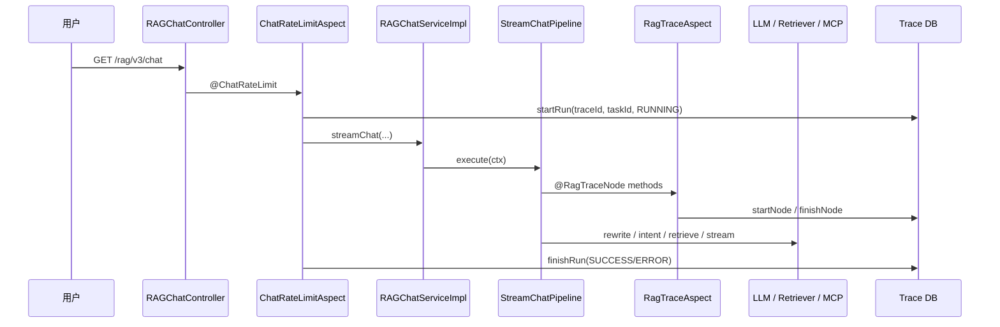

# 全链路追踪

这部分属于增强式能力，不影响核心问答链路本身，但它决定了这条链路能不能被看见、被定位、被复盘。

如果你想把它和业务主链路对照着看，建议配合 [StreamChatPipeline完整链路深度解析](D:/develop/RAgent/ragent/StreamChatPipeline完整链路深度解析.md) 一起读；那篇负责“请求怎么跑”，这篇负责“这条请求怎么被看见”。

## 1. 它到底在追什么

一次用户请求会跨过多个线程池、多个 AOP 切面、多个服务层和多个模型调用点。全链路追踪要解决的不是“记一条日志”这么简单，而是把下面这些事串起来：

| 能力 | 作用 |
| --- | --- |
| `traceId` | 标识一次完整请求 |
| `taskId` | 标识一次可取消的流式任务 |
| 节点栈 | 记录父子调用关系 |
| 耗时 | 记录每个环节的时延 |
| 状态 | 记录 `RUNNING / SUCCESS / ERROR` |
| 后台查询 | 让管理员能回看整条链路 |

## 2. 这条链路里最关键的 9 个线程池

按这套项目里最常见的追踪/处理场景，可以先记住这 9 个专用线程池：

| 线程池 Bean | 主要场景 |
| --- | --- |
| `mcpBatchThreadPoolExecutor` | MCP 批量调用 |
| `ragContextThreadPoolExecutor` | RAG 上下文组装 |
| `ragRetrievalThreadPoolExecutor` | RAG 通道检索 |
| `ragInnerRetrievalThreadPoolExecutor` | RAG 内部检索 |
| `intentClassifyThreadPoolExecutor` | 意图分类 |
| `memorySummaryThreadPoolExecutor` | 记忆摘要 |
| `modelStreamExecutor` | 模型流式输出 |
| `chatEntryExecutor` | SSE 排队入口 |
| `knowledgeChunkExecutor` | 知识库文档分块 |

补一句：代码里还单独保留了 `memoryLoadThreadPoolExecutor`，用于会话记忆的并行加载。

## 3. Trace 上下文怎么跨线程透传

真正的关键点在 `RagTraceContext`。

它用阿里 TTL 的 `TransmittableThreadLocal` 保存：

| 字段 | 含义 |
| --- | --- |
| `traceId` | 当前请求的链路 ID |
| `taskId` | 当前流式任务 ID |
| `nodeStack` | 当前调用栈 |

所有线程池都被 `TtlExecutors.getTtlExecutor(...)` 包装过。这样父线程把任务丢给子线程时，`traceId` 和节点栈会自动拷贝过去。

如果少了这层包装，子线程里看到的上下文就会是空的。

## 4. 谁创建 trace run

当前聊天主链路的 run 记录，是由 `ChatRateLimitAspect` 创建和收尾的。

它做的事很直接：

1. 先拿到 SSE 入参和 `conversationId`。
2. 生成 `traceId` 和 `taskId`。
3. 写入一条 `RUNNING` 状态的 `RagTraceRunDO`。
4. 把 `traceId`、`taskId` 写进 `RagTraceContext`。
5. 执行业务方法。
6. 成功后更新为 `SUCCESS`，失败后更新为 `ERROR`。
7. 最后清理上下文。

`RagTraceProperties.enabled` 控制这套能力是否启用，`maxErrorLength` 控制错误信息落库长度。

## 5. `@RagTraceNode` 做了什么

`@RagTraceNode` 是方法级子节点标记，AOP 切面会在方法前后自动补齐节点记录。

切面做的事是：

1. 读取当前 `traceId`。
2. 生成 `nodeId`。
3. 记录 `parentNodeId` 和 `depth`。
4. 方法执行前 `pushNode(...)`。
5. 方法执行后 `popNode()`。
6. 成功或失败都写入节点耗时和状态。

项目里常见的标记点有这些：

| 节点 | 所在位置 |
| --- | --- |
| `query-rewrite` | 问题改写 |
| `query-rewrite-and-split` | 问题改写 + 拆分 |
| `intent-resolve` | 意图识别 |
| `retrieval-engine` | 检索引擎 |
| `multi-channel-retrieval` | 多通道检索 |
| `llm-chat-routing` | LLM 路由 |
| `llm-stream-routing` | LLM 流式路由 |
| `bailian-chat / ollama-chat / siliconflow-chat` | 具体模型客户端 |

## 6. Trace 记录的生命周期

可以把它记成一条很短的闭环：

```text
创建 RUNNING trace run
  -> 进入业务链路
  -> AOP 记录子节点
  -> 模型 / 检索 / MCP / 回写各自落点
  -> 更新 trace run 为 SUCCESS 或 ERROR
  -> 后台页面查询
```

更具体一点：

| 阶段 | 责任方 |
| --- | --- |
| 创建 run | `ChatRateLimitAspect` |
| 写子节点 | `RagTraceAspect` + `@RagTraceNode` |
| 透传上下文 | `RagTraceContext` + TTL |
| 查询 run | `RagTraceController` |
| 查询节点 | `RagTraceQueryServiceImpl` |

## 7. 后台怎么把它查出来

后台的 Trace 查询接口在 `RagTraceController`，对应服务是 `RagTraceQueryServiceImpl`。

| 接口 | 作用 |
| --- | --- |
| `GET /rag/traces/runs` | 分页查 run |
| `GET /rag/traces/runs/{traceId}` | 查 run 详情 + 节点 |
| `GET /rag/traces/runs/{traceId}/nodes` | 只查节点 |

前端管理页会把这些数据展示成列表和时间线，便于直接看一次请求在哪一步慢了、哪一步错了。

## 8. 一次请求里的 Trace 长什么样



## 9. 这一层最值得记住的点

1. `ChatRateLimitAspect` 负责创建和收尾 run。
2. `@RagTraceNode` 负责记录子节点。
3. `RagTraceContext` 负责把 traceId 和节点栈跨线程传下去。
4. 所有业务线程池都要走 TTL 包装，否则子线程上下文会丢。
5. Trace 的价值不在“有日志”，而在“能回放整条链路”。

所以这篇文档其实是在给主链路补“显微镜”：[StreamChatPipeline完整链路深度解析](D:/develop/RAgent/ragent/StreamChatPipeline完整链路深度解析.md) 讲业务怎么编排，这篇讲它如何被记录、查询和回放。
